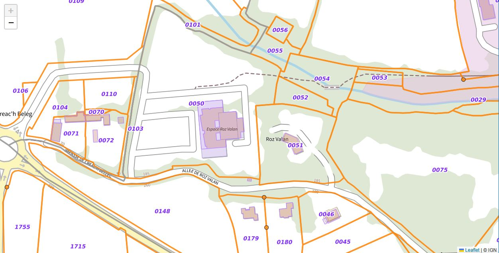
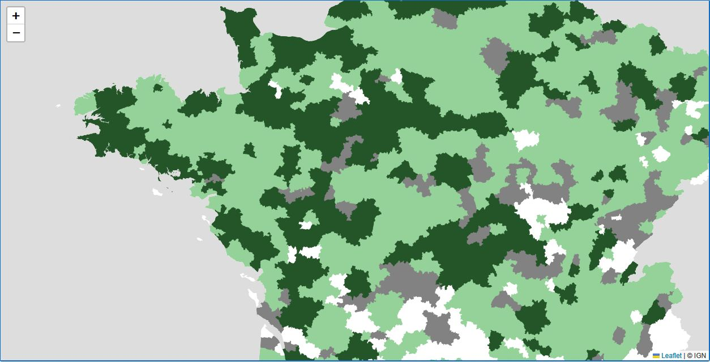

# Intégration des cartes IGN (France) dans le composant Blazorise.Map

Cet article présente un guide rapide pour intégrer des fonds de carte IGN (Institut national de l'information géographique et forestière) dans des composants Map de Blazorise. 
Le service fournit également un service de géocodage pour résoudre des adresses en coordonnées géographiques (latitude / longitude). Nous allons pouvoir également utiliser ce service pour centrer la carte sur une adresse donnée.

## Présentation rapide du service IGN

L'IGN fournit des fonds de carte, orthophotos et jeux de données thématiques accessibles via des services web (WMTS, WMS, géocodage). Ces services permettent de :

- afficher des fonds cartographiques multi‑résolution (plans, orthophotos),
- superposer des couches thématiques (parcelles, cours d'eau, infrastructures),
- effectuer du géocodage (obtenir des coordonnées à partir d'une adresse),
- contrôler l'affichage via des paramètres de tuile (TileMatrixSet) et de format d'image.

## Récupération d'une tuile IGN

Le principe consiste à construire une URL de tuile en fonction de la couche IGN souhaitée, du format d'image et de la grille de tuiles (TileMatrixSet). L'envoi de la requête ainsi construite permet de récupérer l'image de la tuile correspondante.

Une requête est de la forme : `https://data.geopf.fr/wmts?SERVICE=WMTS&amp;VERSION=1.0.0&amp;REQUEST=GetTile&amp;LAYER=GEOGRAPHICALGRIDSYSTEMS.PLANIGNV2&amp;STYLE=normal&amp;FORMAT=image/png&amp;TILEMATRIXSET=PM_0_19&amp;TILEMATRIX={z}&amp;TILEROW={y}&amp;TILECOL={x}`

Nous allons dans un premier temps créer une liste de couches de tuiles IGN "de référence", c'est à dire les plus communément utilisées pour des applications web. Ces couches sont exposées par l'enum `IgnLayers`.
Une méthode `GetIgnMap(IgnLayers layer)` permet de récupérer l'URL de tuile correspondante à la couche IGN demandée.

```csharp
    private record IgnMapInfo(IgnLayers Layer, string LayerName, ImageFormats ImageFormat, TileMatrixSets TileMatrixSet, string Style = "normal");
    private static List<IgnMapInfo> IgnMapsList { get; } =
    [
        new(IgnLayers.PlanIgn,"GEOGRAPHICALGRIDSYSTEMS.PLANIGNV2",ImageFormats.Png,TileMatrixSets.PM_0_19),
        new(IgnLayers.PhotosAeriennes,"ORTHOIMAGERY.ORTHOPHOTOS",ImageFormats.Jpeg,TileMatrixSets.PM_0_19),
        new(IgnLayers.ParcellesCadastrales,"CADASTRALPARCELS.PARCELLAIRE_EXPRESS",ImageFormats.Png,TileMatrixSets.PM_0_19),
        new(IgnLayers.Hydrographie,"HYDROGRAPHY.HYDROGRAPHY",ImageFormats.Png,TileMatrixSets.PM_6_18),
        new(IgnLayers.CartesScan1000,"IGNF_CARTES_SCAN-1000",ImageFormats.Jpeg,TileMatrixSets.PM_0_10, "SCAN1000"),
        new(IgnLayers.Haies,"IGNF_BD-HAIE-V1_2020",ImageFormats.Png,TileMatrixSets.PM_4_18),
        new(IgnLayers.LimitesAdministratives,"LIMITES_ADMINISTRATIVES_EXPRESS.LATEST",ImageFormats.Png,TileMatrixSets.PM_6_16),
        new(IgnLayers.Routes,"TRANSPORTNETWORKS.ROADS",ImageFormats.Png,TileMatrixSets.PM_6_18),
        new(IgnLayers.TransportsExceptionnels,"SECUROUTE.TE.1TE",ImageFormats.Png,TileMatrixSets.PM_7_17,"RESEAU ROUTIER 1TE"),
        new(IgnLayers.Altitude,"ELEVATION.SLOPES",ImageFormats.Jpeg,TileMatrixSets.PM_6_14),
        new(IgnLayers.ForetsPubliques,"FORETS.PUBLIQUES",ImageFormats.Png,TileMatrixSets.PM_3_16,"FORETS PUBLIQUES ONF"),
        new(IgnLayers.Sols,"INRA.CARTE.SOLS",ImageFormats.Png,TileMatrixSets.PM_6_16,"CARTE DES SOLS"),
        new(IgnLayers.Forets,"LANDCOVER.FORESTINVENTORY.V2",ImageFormats.Png,TileMatrixSets.PM_6_16),
        new(IgnLayers.RegistreParcellaireGraphique,"LANDUSE.AGRICULTURE.LATEST",ImageFormats.Png,TileMatrixSets.PM_6_16),
        new(IgnLayers.CoursEau,"HYDROGRAPHY.BCAE.2026",ImageFormats.Png,TileMatrixSets.PM_6_17),
        new(IgnLayers.HaiesLineraires,"hedge.hedge",ImageFormats.Png,TileMatrixSets.PM_7_18),
        new(IgnLayers.CourbesNiveau,"ELEVATION.CONTOUR.LINE",ImageFormats.Png,TileMatrixSets.PM_6_18),
        new(IgnLayers.SeuilsPentesAgriculture,"ELEVATION.ELEVATIONGRIDCOVERAGE.THRESHOLD",ImageFormats.Png,TileMatrixSets.PM_3_17, "ELEVATION.ELEVATIONGRIDCOVERAGE.THRESHOLD"),
        new(IgnLayers.Aeroports,"TRANSPORTNETWORKS.RUNWAYS",ImageFormats.Png,TileMatrixSets.PM_6_18)
    ];

    private static string GetIgnMapUrl(IgnMapInfo map) => $"{IgnServiceUrl}?SERVICE=WMTS&VERSION=1.0.0&REQUEST=GetTile&LAYER={map.LayerName}&STYLE={map.Style}&FORMAT={(map.ImageFormat == ImageFormats.Png ? "image/png" : "image/jpeg")}&TILEMATRIXSET={map.TileMatrixSet}&TILEMATRIX={{z}}&TILEROW={{y}}&TILECOL={{x}}";

    // For maps in the IgnLayers enum
    public static string GetIgnMap(IgnLayers layer)
    {
        return GetIgnMapUrl(IgnMapsList.FirstOrDefault(m => m.Layer == layer)!);
    }

    // For custom maps not in the IgnLayers enum
    public static string GetIgnMap(string layer, ImageFormats imageFormat, TileMatrixSets tileMatrixSet, string style = "normal")
    {
        return $"{IgnServiceUrl}?SERVICE=WMTS&VERSION=1.0.0&REQUEST=GetTile&LAYER={layer}&STYLE={style}&FORMAT={(imageFormat == ImageFormats.Png ? "image/png" : "image/jpeg")}&TILEMATRIXSET={tileMatrixSet}&TILEMATRIX={{z}}&TILEROW={{y}}&TILECOL={{x}}";
    }
```

Le format d'image retourné par l'API IGN peut être `image/png` ou `image/jpeg`. En général, les tuiles au format png peuvent servir de couche (ou calque) du fait de leur transparence. Celles au format jpg ne servent souvent que de fonds de carte.
Le paramètre `TileMatrixSet` définit la grille de tuiles utilisée pour la couche (ex : PM_0_19 pour les plans IGN, PM_6_18 pour les cours d'eau). C'est une donnée qui est propre à chaque couche IGN et qui est documentée dans l'API IGN.

Voici les trois enumérations qui seront utilisées pour les formats d'image, les grilles de tuiles et les noms des couches :
```csharp
    public enum ImageFormats
    {
        Png,
        Jpeg
    }
```
```csharp
    public enum TileMatrixSets
    {
        PM_0_10,
        PM_0_18,
        PM_0_19,
        PM_3_16,
        PM_3_17,
        PM_4_18,
        PM_6_14,
        PM_6_16,
        PM_6_17,
        PM_6_18,
        PM_7_17,
        PM_7_18
    }
```
```csharp
    public enum IgnLayers
    {
        PlanIgn,
        PhotosAeriennes,
        ParcellesCadastrales,
        Hydrographie,
        CartesScan1000,
        Haies,
        HaiesLineraires,
        LimitesAdministratives,
        Routes,
        TransportsExceptionnels,
        Altitude,
        ForetsPubliques,
        Sols,
        Forets,
        RegistreParcellaireGraphique,
        CoursEau,
        CourbesNiveau,
        SeuilsPentesAgriculture,
        Aeroports
    }
```

## Exemples d'usage

### 1) Couches prédéfinies via l'enum IgnLayers

<!-- Images d'exemple : remplacer par de vraies illustrations dans /wwwroot/images ou dossier docs -->



```razor
@using static Cge.Blazorise.IgnMaps

<Map View="@view" Height="Height.Is100">
	<MapTileLayer Source="@GetIgnMap(IgnLayers.PlanIgn)"
				  Attribution="© IGN"
				  Opacity="1"
				  ZIndex="0" />
	<MapTileLayer Source="@GetIgnMap(IgnLayers.ParcellesCadastrales)"
				  Attribution="© IGN"
				  Opacity="0.85"
				  ZIndex="10" />
	<MapTileLayer Source="@GetIgnMap(IgnLayers.CoursEau)"
				  Attribution="© IGN"
				  Opacity="0.85"
				  ZIndex="20"/>
	<MapTileLayer Source="@GetIgnMap(IgnLayers.Aeroports)"
				  Attribution="© IGN"
				  Opacity="0.85"
				  ZIndex="30" />
</Map>
```

Explication :
- `GetIgnMap(IgnLayers.xxx)` retourne le template d'URL pour la couche IGN demandée.
- On peut empiler plusieurs `MapTileLayer` avec des `ZIndex` différents pour composer la carte (fond, couches intermédiaires, surcouches d'éléments vectoriels).
- `Opacity` permet d'ajuster la visibilité d'une couche sans changer sa source.

### 2) Couches personnalisées (non pré-définies)

<!-- Image d'exemple pour une couche thématique personnalisée -->


```razor
<MapTileLayer Source="@GetIgnMap("ACCES.BIOMETHANE", ImageFormats.Png, TileMatrixSets.PM_6_16, "ACCES.BIOMETHANE")"
			  Attribution="© IGN"
			  Opacity="1.00"
			  ZIndex="0" />
```

Explication :
- Lorsque la couche IGN n'est pas dans l'enum `IgnLayers`, utilisez la surcharge qui accepte un `layerId` explicite, le format d'image et la grille de tuiles.
- Ceci est utile pour des couches métier spécifiques exposées par l'API IGN (ex : jeux de données thématiques).

### 3) Résolution d'adresses : GetCoordinatesFromAddressAsync

The Blazorise Map component can be centered on a specific address given GPS latitude and longitude data. The IGN service also provides a geocoding API to resolve addresses into coordinates, so let's see how to use it.

The following method `GetCoordinatesFromAddressAsync` takes a free-form address string (e.g., "2 rue du coteau, 89113 charbuy", "68000", "Brest") and returns a list of coordinates (latitude / longitude). The list may contain multiple results; the first one is usually the most relevant.

The service has a dedicated zip code search endpoint, so if the input string is a 5-digit postal code (french style zip code), the method will use that endpoint to improve accuracy. Otherwise, it will use the general search endpoint.


```csharp
    private readonly HttpClient _http = http ?? throw new ArgumentNullException(nameof(http));
    private readonly JsonSerializerOptions _jsonOptions = new() { PropertyNameCaseInsensitive = true };

    // DTOs pour désérialisation de la réponse de api-adresse.data.gouv.fr
    internal class GeoResponse
    {
        public Feature[]? Features { get; set; }
    }

    internal class Feature
    {
        public Geometry? Geometry { get; set; }
    }

    internal class Geometry
    {
        public double[]? Coordinates { get; set; }
    }

public async Task<List<(double Latitude, double Longitude)>> GetCoordinatesFromAddressAsync(string adresse, int maxResults = 5, CancellationToken ct = default)
    {
        if (string.IsNullOrWhiteSpace(adresse) || maxResults <= 0)
        {
            return new List<(double Latitude, double Longitude)>();
        }

        ct.ThrowIfCancellationRequested();

        var trimmed = adresse.Trim().ToUpperInvariant();
        bool isPostalCode = trimmed.Length == 5 && trimmed.All(char.IsDigit);
        var relative = isPostalCode
            ? $"search/?q={Uri.EscapeDataString(trimmed)}&type=municipality"
            : $"search/?q={Uri.EscapeDataString(trimmed)}";

        using var response = await _http.GetAsync(relative, HttpCompletionOption.ResponseHeadersRead, ct).ConfigureAwait(false);

        if (!response.IsSuccessStatusCode)
        {
            return new List<(double Latitude, double Longitude)>();
        }

        ct.ThrowIfCancellationRequested();
        using var stream = await response.Content.ReadAsStreamAsync(ct).ConfigureAwait(false);
        ct.ThrowIfCancellationRequested();

        var geo = await JsonSerializer.DeserializeAsync<GeoResponse?>(stream, _jsonOptions, ct).ConfigureAwait(false);

        var result = new List<(double Latitude, double Longitude)>();

        if (geo?.Features is { Length: > 0 } features)
        {
            foreach (var f in features)
            {
                ct.ThrowIfCancellationRequested();
                var coords = f?.Geometry?.Coordinates;
                if (coords is { Length: >= 2 })
                {
                    // Retour de l'API : [longitude, latitude], Blazorise.MapCoordinate attend (latitude, longitude)
                    result.Add((Latitude: coords[1], Longitude: coords[0]));

                    if (result.Count >= maxResults)
                    {
                        break;
                    }
                }
            }
        }

        return result;
    }

public static class IgnMapsServiceCollectionExtensions
{
    public static IServiceCollection AddIgnMaps(this IServiceCollection services, Action<HttpClient>? configureClient = null)
    {
        services.AddHttpClient<IgnMaps>(client =>
        {
            client.BaseAddress = new Uri("https://api-adresse.data.gouv.fr/");
            client.Timeout = TimeSpan.FromSeconds(10);
            configureClient?.Invoke(client);
        });

        return services;
    }
}
```

## Usage in Blazor

First, we need to register the `IgnMaps` service in the DI container. In `Program.cs` (or `Startup.cs`), add:
```csharp
builder.Services.AddIgnMaps();
```

Then we can create the razor page :

```razor
@using static Cge.Blazorise.IgnMaps;
@page "/carte"

<PageTitle>Carte</PageTitle>

<Row Height="Height.Px(640)">
    <Column ColumnSize="ColumnSize.Is6">
        <Card Border="Border.Is2.Primary" Height="Height.Is100">
            <Map View="@view" Height="Height.Is100">
                <MapTileLayer Source="@GetIgnMap(IgnLayers.PlanIgn)"
                              Attribution="© IGN"
                              Opacity="1"
                              ZIndex="0" />
                <MapTileLayer Source="@GetIgnMap(IgnLayers.ParcellesCadastrales)"
                              Attribution="© IGN"
                              Opacity="0.85"
                              ZIndex="10" />
                <MapTileLayer Source="@GetIgnMap(IgnLayers.CoursEau)"
                              Attribution="© IGN"
                              Opacity="0.85"
                              ZIndex="20"/>
                <MapTileLayer Source="@GetIgnMap(IgnLayers.Aeroports)"
                              Attribution="© IGN"
                              Opacity="0.85"
                              ZIndex="30" />
            </Map>
        </Card>
    </Column>
    <Column ColumnSize="ColumnSize.Is6">
        <Card Border="Border.Is2.Primary" Height="Height.Is100">
            <Map View="@view" Height="Height.Is100">
                <MapTileLayer Source="@GetIgnMap(IgnLayers.PhotosAeriennes)"
                              Attribution="© IGN"
                              Opacity="1.00"
                              ZIndex="0" />
                <MapTileLayer Source="@GetIgnMap(IgnLayers.Aeroports)"
                              Attribution="© IGN"
                              Opacity="0.85"
                              ZIndex="10" />
            </Map>
        </Card>
    </Column>
</Row>

@*Examples with custom parameters for maps not in the IgnLayers enum*@ 
<Row Height="Height.Px(640)">
    <Column ColumnSize="ColumnSize.Is6">
        <Card Border="Border.Is2.Primary" Height="Height.Is100">
            <Map View="@view" Height="Height.Is100">
                <MapTileLayer Source="@GetIgnMap("ACCES.BIOMETHANE", ImageFormats.Png, TileMatrixSets.PM_6_16, "ACCES.BIOMETHANE")"
                              Attribution="© IGN"
                              Opacity="1.00"
                              ZIndex="0" />
            </Map>
        </Card>
    </Column>
    <Column ColumnSize="ColumnSize.Is6">
        <Card Border="Border.Is2.Primary" Height="Height.Is100">
            <Map View="@view" Height="Height.Is100">
                <MapTileLayer Source="@GetIgnMap("BESOIN.CHALEUR.INDUSTRIEL", ImageFormats.Png, TileMatrixSets.PM_6_18, "BESOIN.CHALEUR.INDUSTRIEL")"
                              Attribution="© IGN"
                              Opacity="1.00"
                              ZIndex="0" />
            </Map>
        </Card>
    </Column>
</Row>
```
This page contains two rows of maps, each with two columns. 
The first row shows a map with the IGN plan, cadastral parcels, hydrography and airports, and a map with aerial photos and airports.
The second row demonstrates how to use custom layers not defined in the `IgnLayers` enum.


## All together
The IgnMaps class :
```csharp
public class IgnMaps(HttpClient http)
{
    private readonly HttpClient _http = http ?? throw new ArgumentNullException(nameof(http));
    private readonly JsonSerializerOptions _jsonOptions = new() { PropertyNameCaseInsensitive = true };

    // DTOs 
    internal class GeoResponse
    {
        public Feature[]? Features { get; set; }
    }

    internal class Feature
    {
        public Geometry? Geometry { get; set; }
    }

    internal class Geometry
    {
        public double[]? Coordinates { get; set; }
    }
    /// <summary>
    /// Enum representing the different image formats available for map layers
    /// </summary>
    public enum ImageFormats
    {
        Png,
        Jpeg
    }

    /// <summary>
    /// Enum representing the different tile matrix sets available for map layers
    /// </summary>
    public enum TileMatrixSets
    {
        PM_0_10,
        PM_0_18,
        PM_0_19,
        PM_3_16,
        PM_3_17,
        PM_4_18,
        PM_6_14,
        PM_6_16,
        PM_6_17,
        PM_6_18,
        PM_7_17,
        PM_7_18
    }

    /// <summary>
    /// Enum representing the different IGN map layers available for use
    /// </summary>
    public enum IgnLayers
    {
        PlanIgn,
        PhotosAeriennes,
        ParcellesCadastrales,
        Hydrographie,
        CartesScan1000,
        Haies,
        HaiesLineraires,
        LimitesAdministratives,
        Routes,
        TransportsExceptionnels,
        Altitude,
        ForetsPubliques,
        Sols,
        Forets,
        RegistreParcellaireGraphique,
        CoursEau,
        CourbesNiveau,
        SeuilsPentesAgriculture,
        Aeroports
    }

    private const string IgnServiceUrl = "https://data.geopf.fr/wmts";
    private record IgnMapInfo(IgnLayers Layer, string LayerName, ImageFormats ImageFormat, TileMatrixSets TileMatrixSet, string Style = "normal");
    private static List<IgnMapInfo> IgnMapsList { get; } =
    [
        new(IgnLayers.PlanIgn,"GEOGRAPHICALGRIDSYSTEMS.PLANIGNV2",ImageFormats.Png,TileMatrixSets.PM_0_19),
        new(IgnLayers.PhotosAeriennes,"ORTHOIMAGERY.ORTHOPHOTOS",ImageFormats.Jpeg,TileMatrixSets.PM_0_19),
        new(IgnLayers.ParcellesCadastrales,"CADASTRALPARCELS.PARCELLAIRE_EXPRESS",ImageFormats.Png,TileMatrixSets.PM_0_19),
        new(IgnLayers.Hydrographie,"HYDROGRAPHY.HYDROGRAPHY",ImageFormats.Png,TileMatrixSets.PM_6_18),
        new(IgnLayers.CartesScan1000,"IGNF_CARTES_SCAN-1000",ImageFormats.Jpeg,TileMatrixSets.PM_0_10, "SCAN1000"),
        new(IgnLayers.Haies,"IGNF_BD-HAIE-V1_2020",ImageFormats.Png,TileMatrixSets.PM_4_18),
        new(IgnLayers.LimitesAdministratives,"LIMITES_ADMINISTRATIVES_EXPRESS.LATEST",ImageFormats.Png,TileMatrixSets.PM_6_16),
        new(IgnLayers.Routes,"TRANSPORTNETWORKS.ROADS",ImageFormats.Png,TileMatrixSets.PM_6_18),
        new(IgnLayers.TransportsExceptionnels,"SECUROUTE.TE.1TE",ImageFormats.Png,TileMatrixSets.PM_7_17,"RESEAU ROUTIER 1TE"),
        new(IgnLayers.Altitude,"ELEVATION.SLOPES",ImageFormats.Jpeg,TileMatrixSets.PM_6_14),
        new(IgnLayers.ForetsPubliques,"FORETS.PUBLIQUES",ImageFormats.Png,TileMatrixSets.PM_3_16,"FORETS PUBLIQUES ONF"),
        new(IgnLayers.Sols,"INRA.CARTE.SOLS",ImageFormats.Png,TileMatrixSets.PM_6_16,"CARTE DES SOLS"),
        new(IgnLayers.Forets,"LANDCOVER.FORESTINVENTORY.V2",ImageFormats.Png,TileMatrixSets.PM_6_16),
        new(IgnLayers.RegistreParcellaireGraphique,"LANDUSE.AGRICULTURE.LATEST",ImageFormats.Png,TileMatrixSets.PM_6_16),
        new(IgnLayers.CoursEau,"HYDROGRAPHY.BCAE.2026",ImageFormats.Png,TileMatrixSets.PM_6_17),
        new(IgnLayers.HaiesLineraires,"hedge.hedge",ImageFormats.Png,TileMatrixSets.PM_7_18),
        new(IgnLayers.CourbesNiveau,"ELEVATION.CONTOUR.LINE",ImageFormats.Png,TileMatrixSets.PM_6_18),
        new(IgnLayers.SeuilsPentesAgriculture,"ELEVATION.ELEVATIONGRIDCOVERAGE.THRESHOLD",ImageFormats.Png,TileMatrixSets.PM_3_17, "ELEVATION.ELEVATIONGRIDCOVERAGE.THRESHOLD"),
        new(IgnLayers.Aeroports,"TRANSPORTNETWORKS.RUNWAYS",ImageFormats.Png,TileMatrixSets.PM_6_18)
    ];

    private static string GetIgnMapUrl(IgnMapInfo map) => $"{IgnServiceUrl}?SERVICE=WMTS&VERSION=1.0.0&REQUEST=GetTile&LAYER={map.LayerName}&STYLE={map.Style}&FORMAT={(map.ImageFormat == ImageFormats.Png ? "image/png" : "image/jpeg")}&TILEMATRIXSET={map.TileMatrixSet}&TILEMATRIX={{z}}&TILEROW={{y}}&TILECOL={{x}}";

    /// <summary>
    /// Get the URL for the specified IGN map layer.
    /// </summary>
    /// <param name="layer">The IGN map layer.</param>
    /// <returns>The URL of the specified IGN map layer.</returns>
    /// <example>
    /// <code>
    /// var url = IgnMaps.GetIgnMap(IgnMaps.IgnLayers.PlanIgn);
    /// // Example output: https://data.geopf.fr/wmts?SERVICE=WMTS&amp;VERSION=1.0.0&amp;REQUEST=GetTile&amp;LAYER=GEOGRAPHICALGRIDSYSTEMS.PLANIGNV2&amp;STYLE=normal&amp;FORMAT=image/png&amp;TILEMATRIXSET=PM_0_19&amp;TILEMATRIX={z}&amp;TILEROW={y}&amp;TILECOL={x}
    /// </code>
    /// </example>
    public static string GetIgnMap(IgnLayers layer)
    {
        return GetIgnMapUrl(IgnMapsList.FirstOrDefault(m => m.Layer == layer)!);
    }

    /// <summary>
    /// Builds a WMTS URL for the specified IGN layer using the provided parameters.
    /// </summary>
    /// <param name="layer">The layer name to request from the IGN WMTS service.</param>
    /// <param name="imageFormat">The image format to request for the tile.</param>
    /// <param name="tileMatrixSet">The tile matrix set used for the requested tiles.</param>
    /// <param name="style">The style to apply to the WMTS request. Defaults to <c>normal</c>.</param>
    /// <returns>A WMTS GetTile URL for the requested IGN layer.</returns>
    /// <example>
    /// <code>
    /// var url = IgnMaps.GetIgnMap(
    ///     "MY.LAYER",
    ///     IgnMaps.ImageFormats.Png,
    ///     IgnMaps.TileMatrixSets.PM_6_18,
    ///     "normal");
    /// </code>
    /// </example>
    public static string GetIgnMap(string layer, ImageFormats imageFormat, TileMatrixSets tileMatrixSet, string style = "normal")
    {
        return $"{IgnServiceUrl}?SERVICE=WMTS&VERSION=1.0.0&REQUEST=GetTile&LAYER={layer}&STYLE={style}&FORMAT={(imageFormat == ImageFormats.Png ? "image/png" : "image/jpeg")}&TILEMATRIXSET={tileMatrixSet}&TILEMATRIX={{z}}&TILEROW={{y}}&TILECOL={{x}}";
    }

    /// <summary>
    /// Queries the API https://api-adresse.data.gouv.fr to retrieve up to <paramref name="maxResults"/>
    /// GPS coordinates (latitude, longitude) corresponding to the provided address.
    /// </summary>
    /// <param name="adresse">Free-form address or postal code to search for. If the provided value is a postal code (5 digits),
    /// the request uses the "municipality" type filter to improve results.</param>
    /// <param name="maxResults">Maximum number of coordinates to return. Must be strictly greater than 0.</param>
    /// <param name="ct">Optional cancellation token. The operation respects cancellation and throws <see cref="OperationCanceledException"/> if canceled.</param>
    /// <returns>
    /// A list of tuples (Latitude, Longitude) in decimal degrees (WGS84).
    /// The list is empty if no coordinates are found, if the HTTP request fails, or in case of an unhandled error.
    /// </returns>
    /// <remarks>
    /// - Uses the instance of <see cref="System.Net.Http.HttpClient"/> provided to the class constructor.
    /// - The method reads the response as a stream and deserializes the JSON using <see cref="System.Text.Json.JsonSerializer"/>.
    /// - Cancellation is frequently checked to allow for quick interruption.
    /// </remarks>
    /// <exception cref="OperationCanceledException">If <paramref name="ct"/> is canceled during the operation.</exception>
    public async Task<List<(double Latitude, double Longitude)>> GetCoordinatesFromAddressAsync(string adresse, int maxResults = 5, CancellationToken ct = default)
    {
        if (string.IsNullOrWhiteSpace(adresse) || maxResults <= 0)
        {
            return new List<(double Latitude, double Longitude)>();
        }

        ct.ThrowIfCancellationRequested();

        var trimmed = adresse.Trim().ToUpperInvariant();
        bool isPostalCode = trimmed.Length == 5 && trimmed.All(char.IsDigit);
        var relative = isPostalCode
            ? $"search/?q={Uri.EscapeDataString(trimmed)}&type=municipality"
            : $"search/?q={Uri.EscapeDataString(trimmed)}";

        using var response = await _http.GetAsync(relative, HttpCompletionOption.ResponseHeadersRead, ct).ConfigureAwait(false);

        if (!response.IsSuccessStatusCode)
        {
            return new List<(double Latitude, double Longitude)>();
        }

        ct.ThrowIfCancellationRequested();
        using var stream = await response.Content.ReadAsStreamAsync(ct).ConfigureAwait(false);
        ct.ThrowIfCancellationRequested();

        var geo = await JsonSerializer.DeserializeAsync<GeoResponse?>(stream, _jsonOptions, ct).ConfigureAwait(false);

        var result = new List<(double Latitude, double Longitude)>();

        if (geo?.Features is { Length: > 0 } features)
        {
            foreach (var f in features)
            {
                ct.ThrowIfCancellationRequested();
                var coords = f?.Geometry?.Coordinates;
                if (coords is { Length: >= 2 })
                {
                    // Retour de l'API : [longitude, latitude], Blazorise.MapCoordinate attend (latitude, longitude)
                    result.Add((Latitude: coords[1], Longitude: coords[0]));

                    if (result.Count >= maxResults)
                    {
                        break;
                    }
                }
            }
        }

        return result;
    }
}

public static class IgnMapsServiceCollectionExtensions
{
    /// <summary>
    /// Record IgnMaps as typed HttpClient with default configuration for the IGN Maps API. Optionally allows further configuration of the HttpClient.
    /// </summary>
    public static IServiceCollection AddIgnMaps(this IServiceCollection services, Action<HttpClient>? configureClient = null)
    {
        services.AddHttpClient<IgnMaps>(client =>
        {
            client.BaseAddress = new Uri("https://api-adresse.data.gouv.fr/");
            client.Timeout = TimeSpan.FromSeconds(10);
            configureClient?.Invoke(client);
        });

        return services;
    }
}
```
In Program.cs, register the IgnMaps service in the DI container:
```csharp
builder.Services.AddIgnMaps();
```
And then the Blazor page :
```razor
@using static Cge.Blazorise.IgnMaps;
@page "/carte"

<PageTitle>Carte</PageTitle>

<Row Height="Height.Px(640)">
    <Column ColumnSize="ColumnSize.Is6">
        <Card Border="Border.Is2.Primary" Height="Height.Is100">
            <Map View="@view" Height="Height.Is100">
                <MapTileLayer Source="@GetIgnMap(IgnLayers.PlanIgn)"
                              Attribution="© IGN"
                              Opacity="1"
                              ZIndex="0" />
                <MapTileLayer Source="@GetIgnMap(IgnLayers.ParcellesCadastrales)"
                              Attribution="© IGN"
                              Opacity="0.85"
                              ZIndex="10" />
                <MapTileLayer Source="@GetIgnMap(IgnLayers.CoursEau)"
                              Attribution="© IGN"
                              Opacity="0.85"
                              ZIndex="20"/>
                <MapTileLayer Source="@GetIgnMap(IgnLayers.Aeroports)"
                              Attribution="© IGN"
                              Opacity="0.85"
                              ZIndex="30" />
            </Map>
        </Card>
    </Column>
    <Column ColumnSize="ColumnSize.Is6">
        <Card Border="Border.Is2.Primary" Height="Height.Is100">
            <Map View="@view" Height="Height.Is100">
                <MapTileLayer Source="@GetIgnMap(IgnLayers.PhotosAeriennes)"
                              Attribution="© IGN"
                              Opacity="1.00"
                              ZIndex="0" />
                <MapTileLayer Source="@GetIgnMap(IgnLayers.Aeroports)"
                              Attribution="© IGN"
                              Opacity="0.85"
                              ZIndex="10" />
            </Map>
        </Card>
    </Column>
</Row>

@*Examples with custom parameters for maps not in the IgnLayers enum*@ 
<Row Height="Height.Px(640)">
    <Column ColumnSize="ColumnSize.Is6">
        <Card Border="Border.Is2.Primary" Height="Height.Is100">
            <Map View="@view" Height="Height.Is100">
                <MapTileLayer Source="@GetIgnMap("ACCES.BIOMETHANE", ImageFormats.Png, TileMatrixSets.PM_6_16, "ACCES.BIOMETHANE")"
                              Attribution="© IGN"
                              Opacity="1.00"
                              ZIndex="0" />
            </Map>
        </Card>
    </Column>
    <Column ColumnSize="ColumnSize.Is6">
        <Card Border="Border.Is2.Primary" Height="Height.Is100">
            <Map View="@view" Height="Height.Is100">
                <MapTileLayer Source="@GetIgnMap("BESOIN.CHALEUR.INDUSTRIEL", ImageFormats.Png, TileMatrixSets.PM_6_18, "BESOIN.CHALEUR.INDUSTRIEL")"
                              Attribution="© IGN"
                              Opacity="1.00"
                              ZIndex="0" />
            </Map>
        </Card>
    </Column>
</Row>
```


## Final notice
It's important to note that the IGN service has usage limits and may require an API key for higher request volumes. Always check the IGN documentation for the latest information on usage policies and authentication requirements.