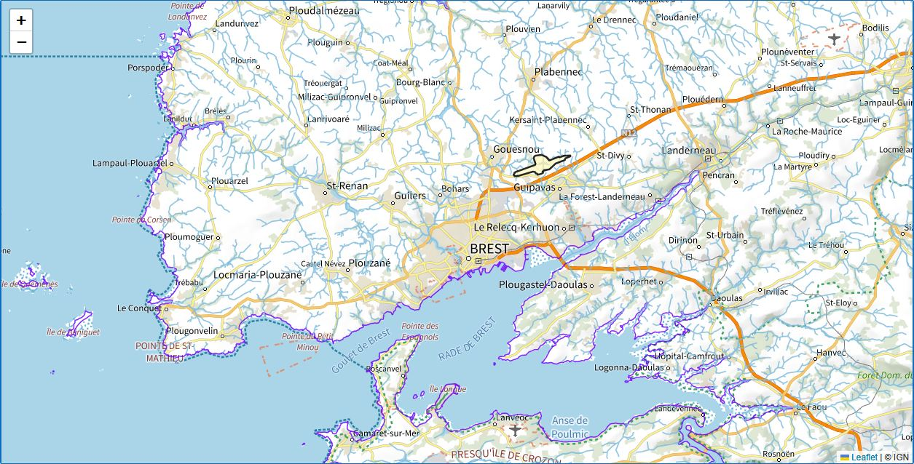

The [French National Institute of Geographic and Forest Information (IGN)](https://www.ign.fr/) publishes base maps, aerial photography, and thematic datasets through the Géoplateforme web services. This guide shows how to use the raster WMTS service with the Blazorise `Map` component and how to center the map by geocoding a French address.

The examples use Blazorise Maps 2.3 or later and the public IGN services available at the time of publication.

## Install and register Blazorise Maps

Add the Maps extension to an existing Blazorise application:

```text
dotnet add package Blazorise.Maps
```

Add the Maps extension to your existing Blazorise registration in `Program.cs`:

```csharp
builder.Services
    .AddBlazorise()
    .AddBlazoriseMaps();
```

Import its components in `_Imports.razor`, or directly in the page that uses them:

```razor
@using Blazorise.Maps
```

## How IGN raster tiles work

IGN exposes raster tiles through the OGC Web Map Tile Service (WMTS) standard. A tile request specifies:

- a layer identifier, such as `GEOGRAPHICALGRIDSYSTEMS.PLANIGNV2`,
- a style,
- an image format,
- a tile matrix set,
- the zoom level, row, and column of the requested tile.

For example, the Plan IGN URL template is:

```text
https://data.geopf.fr/wmts?SERVICE=WMTS&VERSION=1.0.0&REQUEST=GetTile&LAYER=GEOGRAPHICALGRIDSYSTEMS.PLANIGNV2&STYLE=normal&FORMAT=image/png&TILEMATRIXSET=PM_0_19&TILEMATRIX={z}&TILEROW={y}&TILECOL={x}
```

Blazorise `MapTileLayer` uses the usual `{z}`, `{x}`, and `{y}` placeholders. They correspond to the WMTS tile matrix, tile column, and tile row respectively.

Each IGN layer advertises its supported style, format, and matrix set in the [live WMTS capabilities document](https://data.geopf.fr/wmts?SERVICE=WMTS&VERSION=1.0.0&REQUEST=GetCapabilities). Do not assume that every layer supports the same values.

## Create an IGN maps service

The following class provides:

- a checked collection of commonly useful IGN layers,
- an overload for other layers advertised by the WMTS service,
- address geocoding through the current Géoplateforme endpoint.

Replace the example `MyApp.Maps` namespace with your application's namespace.

```csharp
using System;
using System.Collections.Generic;
using System.Net.Http;
using System.Text.Json;
using System.Threading;
using System.Threading.Tasks;
using Microsoft.Extensions.DependencyInjection;

namespace MyApp.Maps;

public sealed class IgnMaps
{
    private const string IgnWmtsUrl = "https://data.geopf.fr/wmts";

    private readonly HttpClient httpClient;
    private readonly JsonSerializerOptions jsonOptions = new()
    {
        PropertyNameCaseInsensitive = true,
    };

    public IgnMaps(HttpClient httpClient)
    {
        this.httpClient = httpClient
            ?? throw new ArgumentNullException(nameof(httpClient));
    }

    public enum ImageFormats
    {
        Png,
        Jpeg,
    }

    public enum TileMatrixSets
    {
        PM_0_10,
        PM_0_18,
        PM_0_19,
        PM_3_16,
        PM_3_17,
        PM_4_18,
        PM_6_14,
        PM_6_16,
        PM_6_17,
        PM_6_18,
        PM_7_17,
        PM_7_18,
    }

    public enum IgnLayers
    {
        PlanIgn,
        PhotosAeriennes,
        ParcellesCadastrales,
        Hydrographie,
        CartesScan1000,
        Haies,
        HaiesLineaires,
        LimitesAdministratives,
        Routes,
        TransportsExceptionnels,
        Pentes,
        ForetsPubliques,
        Sols,
        Forets,
        RegistreParcellaireGraphique,
        CoursEau,
        CourbesNiveau,
        SeuilsPentesAgriculture,
        Aeroports,
    }

    private sealed record IgnMapInfo(
        string LayerName,
        ImageFormats ImageFormat,
        TileMatrixSets TileMatrixSet,
        string Style = "normal");

    private static readonly IReadOnlyDictionary<IgnLayers, IgnMapInfo> Maps =
        new Dictionary<IgnLayers, IgnMapInfo>
        {
            [IgnLayers.PlanIgn] = new(
                "GEOGRAPHICALGRIDSYSTEMS.PLANIGNV2",
                ImageFormats.Png,
                TileMatrixSets.PM_0_19),
            [IgnLayers.PhotosAeriennes] = new(
                "ORTHOIMAGERY.ORTHOPHOTOS",
                ImageFormats.Jpeg,
                TileMatrixSets.PM_0_19),
            [IgnLayers.ParcellesCadastrales] = new(
                "CADASTRALPARCELS.PARCELLAIRE_EXPRESS",
                ImageFormats.Png,
                TileMatrixSets.PM_0_19),
            [IgnLayers.Hydrographie] = new(
                "HYDROGRAPHY.HYDROGRAPHY",
                ImageFormats.Png,
                TileMatrixSets.PM_6_18),
            [IgnLayers.CartesScan1000] = new(
                "IGNF_CARTES_SCAN-1000",
                ImageFormats.Jpeg,
                TileMatrixSets.PM_0_10,
                "SCAN1000"),
            [IgnLayers.Haies] = new(
                "IGNF_BD-HAIE-V1_2020",
                ImageFormats.Png,
                TileMatrixSets.PM_4_18),
            [IgnLayers.HaiesLineaires] = new(
                "hedge.hedge",
                ImageFormats.Png,
                TileMatrixSets.PM_7_18),
            [IgnLayers.LimitesAdministratives] = new(
                "LIMITES_ADMINISTRATIVES_EXPRESS.LATEST",
                ImageFormats.Png,
                TileMatrixSets.PM_6_16),
            [IgnLayers.Routes] = new(
                "TRANSPORTNETWORKS.ROADS",
                ImageFormats.Png,
                TileMatrixSets.PM_6_18),
            [IgnLayers.TransportsExceptionnels] = new(
                "SECUROUTE.TE.1TE",
                ImageFormats.Png,
                TileMatrixSets.PM_7_17,
                "RESEAU ROUTIER 1TE"),
            [IgnLayers.Pentes] = new(
                "ELEVATION.SLOPES",
                ImageFormats.Jpeg,
                TileMatrixSets.PM_6_14),
            [IgnLayers.ForetsPubliques] = new(
                "FORETS.PUBLIQUES",
                ImageFormats.Png,
                TileMatrixSets.PM_3_16,
                "FORETS PUBLIQUES ONF"),
            [IgnLayers.Sols] = new(
                "INRA.CARTE.SOLS",
                ImageFormats.Png,
                TileMatrixSets.PM_6_16,
                "CARTE DES SOLS"),
            [IgnLayers.Forets] = new(
                "LANDCOVER.FORESTINVENTORY.V2",
                ImageFormats.Png,
                TileMatrixSets.PM_6_16),
            [IgnLayers.RegistreParcellaireGraphique] = new(
                "LANDUSE.AGRICULTURE.LATEST",
                ImageFormats.Png,
                TileMatrixSets.PM_6_16),
            [IgnLayers.CoursEau] = new(
                "HYDROGRAPHY.BCAE.2026",
                ImageFormats.Png,
                TileMatrixSets.PM_6_17),
            [IgnLayers.CourbesNiveau] = new(
                "ELEVATION.CONTOUR.LINE",
                ImageFormats.Png,
                TileMatrixSets.PM_6_18),
            [IgnLayers.SeuilsPentesAgriculture] = new(
                "ELEVATION.ELEVATIONGRIDCOVERAGE.THRESHOLD",
                ImageFormats.Png,
                TileMatrixSets.PM_3_17,
                "ELEVATION.ELEVATIONGRIDCOVERAGE.THRESHOLD"),
            [IgnLayers.Aeroports] = new(
                "TRANSPORTNETWORKS.RUNWAYS",
                ImageFormats.Png,
                TileMatrixSets.PM_6_18),
        };

    public static string GetIgnMap(IgnLayers layer)
    {
        if (!Maps.TryGetValue(layer, out var map))
        {
            throw new ArgumentOutOfRangeException(
                nameof(layer),
                layer,
                "The IGN layer is not configured.");
        }

        return BuildTileUrl(
            map.LayerName,
            map.ImageFormat,
            map.TileMatrixSet,
            map.Style);
    }

    public static string GetIgnMap(
        string layer,
        ImageFormats imageFormat,
        TileMatrixSets tileMatrixSet,
        string style = "normal")
    {
        if (string.IsNullOrWhiteSpace(layer))
        {
            throw new ArgumentException(
                "A WMTS layer identifier is required.",
                nameof(layer));
        }

        if (string.IsNullOrWhiteSpace(style))
        {
            throw new ArgumentException(
                "A WMTS style is required.",
                nameof(style));
        }

        return BuildTileUrl(layer, imageFormat, tileMatrixSet, style);
    }

    private static string BuildTileUrl(
        string layer,
        ImageFormats imageFormat,
        TileMatrixSets tileMatrixSet,
        string style)
    {
        var format = imageFormat switch
        {
            ImageFormats.Png => "image/png",
            ImageFormats.Jpeg => "image/jpeg",
            _ => throw new ArgumentOutOfRangeException(
                nameof(imageFormat),
                imageFormat,
                "The image format is not supported."),
        };

        if (!Enum.IsDefined(typeof(TileMatrixSets), tileMatrixSet))
        {
            throw new ArgumentOutOfRangeException(
                nameof(tileMatrixSet),
                tileMatrixSet,
                "The tile matrix set is not supported.");
        }

        return $"{IgnWmtsUrl}?SERVICE=WMTS"
            + "&VERSION=1.0.0"
            + "&REQUEST=GetTile"
            + $"&LAYER={Uri.EscapeDataString(layer)}"
            + $"&STYLE={Uri.EscapeDataString(style)}"
            + $"&FORMAT={format}"
            + $"&TILEMATRIXSET={tileMatrixSet}"
            + "&TILEMATRIX={z}"
            + "&TILEROW={y}"
            + "&TILECOL={x}";
    }

    public async Task<List<(double Latitude, double Longitude)>>
        GetCoordinatesFromAddressAsync(
            string address,
            int maxResults = 5,
            CancellationToken cancellationToken = default)
    {
        if (string.IsNullOrWhiteSpace(address))
        {
            return new List<(double Latitude, double Longitude)>();
        }

        if (maxResults is < 1 or > 20)
        {
            throw new ArgumentOutOfRangeException(
                nameof(maxResults),
                maxResults,
                "The result limit must be between 1 and 20.");
        }

        var trimmedAddress = address.Trim();
        var query = Uri.EscapeDataString(trimmedAddress);
        var isPostalCode = trimmedAddress.Length == 5
            && IsAsciiDigits(trimmedAddress);

        var relativeUrl = $"search?q={query}&limit={maxResults}";

        if (isPostalCode)
        {
            relativeUrl += "&type=municipality";
        }

        using var response = await httpClient.GetAsync(
            relativeUrl,
            HttpCompletionOption.ResponseHeadersRead,
            cancellationToken);

        response.EnsureSuccessStatusCode();

        using var stream = await response.Content.ReadAsStreamAsync(
            cancellationToken);

        var geocodingResponse = await JsonSerializer.DeserializeAsync<GeoResponse>(
            stream,
            jsonOptions,
            cancellationToken);

        var result = new List<(double Latitude, double Longitude)>();

        if (geocodingResponse?.Features is not { Length: > 0 } features)
        {
            return result;
        }

        foreach (var feature in features)
        {
            cancellationToken.ThrowIfCancellationRequested();

            var coordinates = feature.Geometry?.Coordinates;

            if (coordinates is not { Length: >= 2 }
                || !double.IsFinite(coordinates[0])
                || !double.IsFinite(coordinates[1]))
            {
                continue;
            }

            // GeoJSON uses [longitude, latitude].
            result.Add((
                Latitude: coordinates[1],
                Longitude: coordinates[0]));

            if (result.Count >= maxResults)
            {
                break;
            }
        }

        return result;
    }

    private static bool IsAsciiDigits(string value)
    {
        foreach (var character in value)
        {
            if (character is < '0' or > '9')
            {
                return false;
            }
        }

        return true;
    }

    private sealed class GeoResponse
    {
        public Feature[]? Features { get; set; }
    }

    private sealed class Feature
    {
        public Geometry? Geometry { get; set; }
    }

    private sealed class Geometry
    {
        public double[]? Coordinates { get; set; }
    }
}

public static class IgnMapsServiceCollectionExtensions
{
    public static IServiceCollection AddIgnMaps(
        this IServiceCollection services,
        Action<HttpClient>? configureClient = null)
    {
        services.AddHttpClient<IgnMaps>(client =>
        {
            client.BaseAddress = new Uri(
                "https://data.geopf.fr/geocodage/");
            client.Timeout = TimeSpan.FromSeconds(10);
            configureClient?.Invoke(client);
        });

        return services;
    }
}
```

Register this typed client in `Program.cs`:

```csharp
builder.Services.AddIgnMaps();
```

The method deliberately lets HTTP errors, timeouts, invalid JSON, and cancellation propagate to the caller. An empty list means that the request succeeded but no matching coordinates were found.

## Display predefined IGN layers

The matrix-set suffix describes the supported zoom range. For example, `PM_6_17` supports zoom levels 6 through 17. Set the matching `MinZoom` and `MaxZoom` on `MapTileLayer` so the map does not request unavailable tiles.




```razor
@using Blazorise
@using Blazorise.Maps
@using static MyApp.Maps.IgnMaps

<Map View="@view" Height="Height.Rem(36)">
    <MapTileLayer Source="@GetIgnMap(IgnLayers.PlanIgn)"
                  Attribution="© IGN / Géoplateforme"
                  MinZoom="0"
                  MaxZoom="19"
                  Opacity="1"
                  ZIndex="0" />
    <MapTileLayer Source="@GetIgnMap(IgnLayers.ParcellesCadastrales)"
                  Attribution="© IGN / Géoplateforme"
                  MinZoom="0"
                  MaxZoom="19"
                  Opacity="0.85"
                  ZIndex="10" />
    <MapTileLayer Source="@GetIgnMap(IgnLayers.CoursEau)"
                  Attribution="© IGN / Géoplateforme"
                  MinZoom="6"
                  MaxZoom="17"
                  Opacity="0.85"
                  ZIndex="20" />
</Map>

@code {
    private MapView view = new()
    {
        Center = new MapCoordinate(48.8566, 2.3522),
        Zoom = 12,
    };
}
```

These are raster layers, even when the source dataset contains vector features. PNG is normally used for transparent overlays, while JPEG is commonly used for opaque base maps such as aerial photography.

## Display another WMTS layer

Use the overload that accepts the layer identifier, format, matrix set, and style when a layer is not included in `IgnLayers`.


```razor
<MapTileLayer Source="@GetIgnMap("ACCES.BIOMETHANE", ImageFormats.Png, TileMatrixSets.PM_6_16, "ACCES.BIOMETHANE")"
              Attribution="© IGN / Géoplateforme"
              MinZoom="6"
              MaxZoom="16"
              Opacity="1"
              ZIndex="10" />
```

The style is not always `normal`; it must match the value advertised for that layer by the WMTS capabilities document.

## Center the map on a French address

The [current Géoplateforme geocoding service](https://adresse.data.gouv.fr/outils/api-doc/adresse) returns GeoJSON coordinates in `[longitude, latitude]` order. `MapCoordinate` expects latitude first, so `GetCoordinatesFromAddressAsync` reverses the values before returning them.

The method uses the same `search` endpoint for every query. For a five-digit French postal code, it adds `type=municipality`; this is a filter, not a separate postal-code endpoint.

Here is a complete page that displays an IGN map and centers it on the first matching address:

```razor
@page "/ign-map"
@using Blazorise
@using Blazorise.Maps
@using MyApp.Maps
@using static MyApp.Maps.IgnMaps
@using System.Net.Http
@using System.Text.Json
@using System.Threading.Tasks
@using Microsoft.AspNetCore.Components.Web
@inject IgnMaps IgnMapsService

<PageTitle>IGN map</PageTitle>

<Row>
    <Column ColumnSize="ColumnSize.Is8">
        <TextInput @bind-Value="@address"
                   Placeholder="Enter a French address or postal code" />
    </Column>
    <Column ColumnSize="ColumnSize.Is4">
        <Button Color="Color.Primary" Clicked="CenterOnAddressAsync">
            Center map
        </Button>
    </Column>
</Row>

@if (!string.IsNullOrWhiteSpace(statusMessage))
{
    <p>@statusMessage</p>
}

<Map View="@view" Height="Height.Rem(36)">
    <MapTileLayer Source="@GetIgnMap(IgnLayers.PlanIgn)"
                  Attribution="© IGN / Géoplateforme"
                  MinZoom="0"
                  MaxZoom="19" />
    <MapTileLayer Source="@GetIgnMap(IgnLayers.ParcellesCadastrales)"
                  Attribution="© IGN / Géoplateforme"
                  MinZoom="0"
                  MaxZoom="19"
                  Opacity="0.8"
                  ZIndex="10" />
</Map>

@code {
    private string address = "2 rue du Coteau, 89113 Charbuy";
    private string? statusMessage;

    private MapView view = new()
    {
        Center = new MapCoordinate(48.8566, 2.3522),
        Zoom = 12,
    };

    private async Task CenterOnAddressAsync()
    {
        statusMessage = null;

        try
        {
            var coordinates = await IgnMapsService
                .GetCoordinatesFromAddressAsync(address, maxResults: 1);

            if (coordinates.Count == 0)
            {
                statusMessage = "No matching address was found.";
                return;
            }

            var first = coordinates[0];

            view = new MapView
            {
                Center = new MapCoordinate(
                    first.Latitude,
                    first.Longitude),
                Zoom = 15,
            };
        }
        catch (HttpRequestException)
        {
            statusMessage = "The geocoding service could not be reached.";
        }
        catch (TaskCanceledException)
        {
            statusMessage = "The geocoding request timed out.";
        }
        catch (JsonException)
        {
            statusMessage = "The geocoding service returned an invalid response.";
        }
    }
}
```

## Service limits and changing layers

At the time of publication, the public WMTS service is not subject to a fair-use request limit. The public geocoding service is limited to 50 requests per second per IP address. These policies can change, so consult the [Géoplateforme terms and fair-use limits](https://cartes.gouv.fr/cgu/#article-3-2-limite-d-usage-fair-use) before deploying a high-traffic application.

Public layers such as `LIMITES_ADMINISTRATIVES_EXPRESS.LATEST` can change over time, and year-specific layers such as `HYDROGRAPHY.BCAE.2026` may be replaced by newer editions. Check the [live WMTS capabilities document](https://data.geopf.fr/wmts?SERVICE=WMTS&VERSION=1.0.0&REQUEST=GetCapabilities) when adding or updating layers.