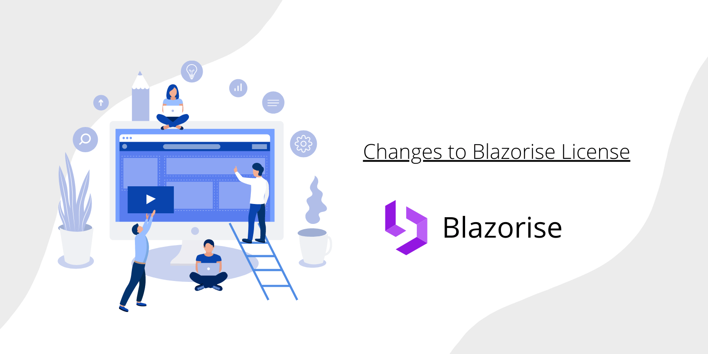

# Changes to Blazorise License

## Tl;Dr

I have been working on the Blazorise code-base for more than 2 years. In 2021 I will be making some important changes regarding the Blazorise licensing.

Here is why I’m doing this.

## History

In December of 2018 when I first released Blazorise as an open-source project it was mostly a proof of concept. I wanted to create a component library not bound to any CSS framework, in particular, have an easy and flexible syntax, and be able to expand with any new feature that would naturally come. For the most part, that goal was met, but since Blazor was fairly new at the time there were some limitations. Over the period of two years a lot of breaking changes and constant upgrades with both Blazor and Blazorise, I have finally come to the realization that almost all of my initial goals are now done.

Initially, there was only a small number of users working with Blazorise. Today, the number of users can be counted in thousands. As the result of Blazorise popularity, the work I put into Blazorise has also increased a lot. Every day I get a new feature and bug-fix requests from the community, and every day I have less and less time to really focus on improving Blazorise even more. From just a few users at the beginning to today several thousand, more and more pressure is on my back.

## Blazorise and Open Source

Open-sourcing Blazorise has proven to be one of the best choices in my life. I chose the MIT license because I didn’t want Blazorise users to be limited.

It is well-known that the more popular an OSS project becomes, the harder it is to manage it. Some OSS project maintainers burn out, while others get offered jobs where they can continue to maintain the project (or not). Some manage to make the jump from a hobby project to a real business. This is where we are now — ready to make a jump.

From the very beginning, I kept funding the Blazorise domain and servers from my own pocket. Living in a small country like Croatia with a somewhat smaller salary than it is in other parts of the world can make a bigger impact on monthly expenses. But I liked what I was doing and I decided it is worth it. To make it easier I have added donation links and they helped a lot. But relying solely on donations is not always the most reliable way of funding.

I have also considered sponsorship from GitHub, but until today there is still no support for all countries. And Croatia is still off the list.

Ultimately, I think sponsorship just isn’t sustainable in long term. Although I appreciate very much all individual sponsors, I feel the companies that use and depend on Blazorise should be the ones to sponsor it. Unfortunately, most companies are not set up for sponsoring open source.

## The Future

After going so far with self-funding and donations, I decided to find a different way to operate. I asked myself what would be the goals moving forward and I developed a list:

- Spend more time on the Blazorise code-base to implement new features
- Add more Blazorise extensions
- Create better documentation and samples
- Do a better job of supporting people who use Blazorise
- Give companies the assurances they need when they decide to base their core UI infrastructure on Blazorise components
- Implement a business continuity plan

To reach these goals I have decided to start a real company.

To continue work I have formed a new company “Megabit”, and Blazorise will be moved to its GitHub organization instead of being under my personal GitHub account.

Blazorise will stay free just as before, but it will move under the Apache 2.0 license instead of being under the MIT license. For regular users, and smaller companies (under $1 million annual revenue), Blazorise will stay and be completely free just as it is now. But for companies that have annual revenue of over $1 million, a new commercial license will need to be issued.

With the new funding sources, I plan to employ more people to help me improve Blazorise. My first choice would be to give job opportunities to some of the most engaged Blazorise community members before I search in other places.

I feel that these changes will best serve the needs of both the open-source community and the corporate community. In addition, they will allow making sure Blazorise will be a viable long-term solution for everyone.

Last but not least, we have great features in the pipeline and Blazorise will continue to be the most flexible and easiest Blazor UI component library.
