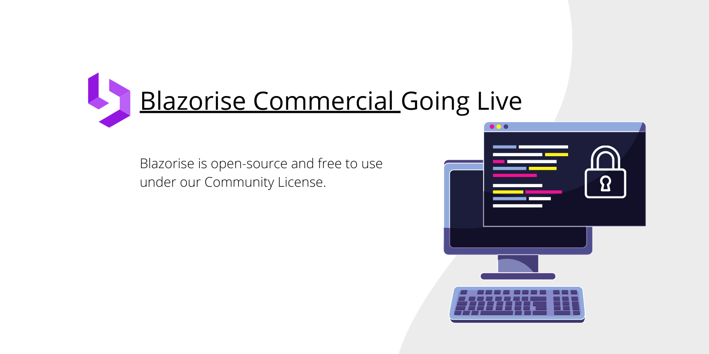

# Blazorise Commercial going live

Since our last announcement about coming Blazorise licensing changes, we got some very positive comments from the community. As stated in our previous post, Blazorise will stay completely free for all, except for organizations that are exceeding $1M in annual revenue. This change was needed so that Blazorise could continue to grow and implement new features in a healthy and stable environment.

For the last couple of weeks, we worked hard to make it happen and to bring the new Blazorise Commercial web up and running. And today the day has finally come to release it and make it live. Our new commercial web can be reached on blazorise.com/commercial. In there you can find all the licensing and pricing information, and you can reach us via the contact form if you need any additional information.

Fun fact: The new web is done completely in Blazorise ;)

Our work doesn’t stop here. We still continue to work as hard as before and soon we will bring a new support forum for commercial Blazorise developers, and also more free themes and templates all completely free with Professional and Enterprise license.

And, as a final note, it is now the perfect time to support all our developers by buying a Blazorise commercial license.

Stay tuned and see you next time!
