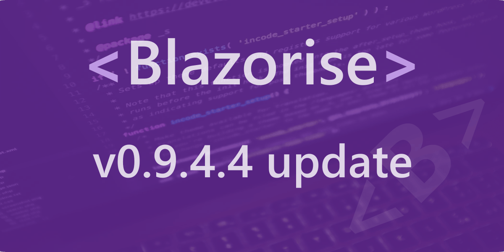

# v0.9.4 - patch 4 release notes

## Change Log

- [#2800](https://github.com/Megabit/Blazorise/issues/2800): Upgrade 0.9.4.1 to 0.9.4.2 causes app to hang (something to do with ShowPager="true"?
- [#2809](https://github.com/Megabit/Blazorise/issues/2809): Blazorise DataGrid dynamic column is not removed on DataGrid reload
- [#2841](https://github.com/Megabit/Blazorise/issues/2841): TimePicker can not be disabled
- [#2843](https://github.com/Megabit/Blazorise/issues/2843): Invalid border-radius on components inside Addons
- [#2824](https://github.com/Megabit/Blazorise/issues/2824): Setting NumericEdit value from code behind shows more decimals than set in Decimals
- [#2814](https://github.com/Megabit/Blazorise/issues/2814): Slider ignores ReadOnly setting
- [#2832](https://github.com/Megabit/Blazorise/issues/2832): Carousel with only one slide: Slide change (incl. Autoplay) not working after upgrade to 0.9.4.3
- [#2860](https://github.com/Megabit/Blazorise/issues/2860): DataGrid : MultiSelect Bug on Firefox
- [#2868](https://github.com/Megabit/Blazorise/pull/2868): Add Polish language resources(PR)
- [#2742](https://github.com/Megabit/Blazorise/issues/2742): Steps Content

## Support

Megabit Ltd, a small organization based in Croatia, maintains the open-source component library Blazorise. We strongly believe in the open-source ecosystem, so we're giving it away for free through our Blazorise Community licenses.

If you want to help the project and are already a part of a large organization, please consider purchasing a commercial license to help us become a sustainable business. Then we'll be able to continue working on Blazorise.

With a commercial license, you get premium forum support as well as access to our private repositories and community-licensed themes. To learn more, visit us at Blazorise Commercial.
