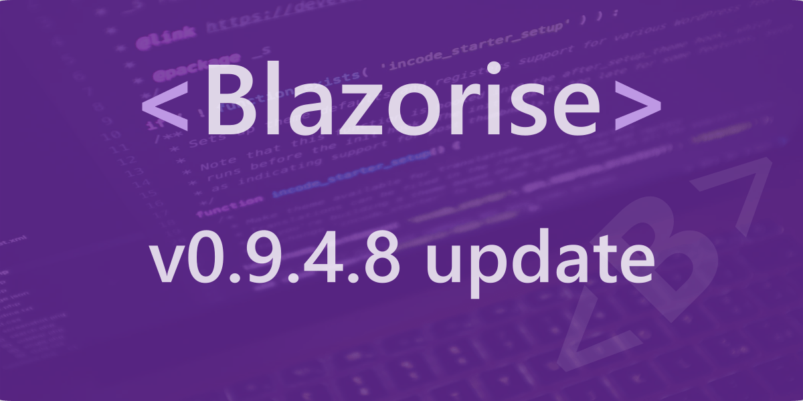

# v0.9.4 - patch 8 release notes

## Change Log

- [#3054](https://github.com/Megabit/Blazorise/issues/3054): DataGrid: Object Type shows no TextEdit when in edit mode
- [#3037](https://github.com/Megabit/Blazorise/issues/3037): DisposeAsync() causes Dispose() to not be called
- [#3110](https://github.com/Megabit/Blazorise/issues/3110): Update 0.9.4.x to .NET 6

## Support

Megabit Ltd, a small organization based in Croatia, maintains the open-source component library Blazorise. We strongly believe in the open-source ecosystem, so we're giving it away for free through our Blazorise Community licenses.

If you want to help the project and are already a part of a large organization, please consider purchasing a commercial license to help us become a sustainable business. Then we'll be able to continue working on Blazorise.

With a commercial license, you get premium forum support as well as access to our private repositories and community-licensed themes. To learn more, visit us at Blazorise Commercial.
