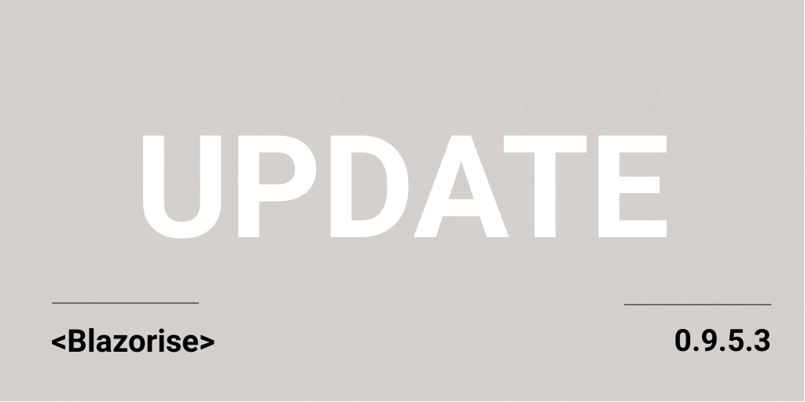

# Update for the 0.9.5 release - patch 3

The new update fixes most of the problems on the DataGrid component. We also bring the new localizations, with the help of @@ItsTahaRehman.

## Change Log

- [#3149](https://github.com/Megabit/Blazorise/issues/3149): Problem in PopupClosing Event of Datagrid.
- [#3192](https://github.com/Megabit/Blazorise/issues/3192): DataGridMultiSelectColumn produces DataGridSelectReason.RowClick.
- [#3194](https://github.com/Megabit/Blazorise/issues/3194): DataGridMaxHeigh Missing in DataGrid FixedHeaderDataGridHeight ignored on Virtualize=true.
- [#3207](https://github.com/Megabit/Blazorise/issues/3207): Documentation - Docs/Components/Selects/SelectPage.razor could use more detail.
- [#1705](https://github.com/Megabit/Blazorise/issues/1705): Datagrid - Unselect child data grid.
- [#3233](https://github.com/Megabit/Blazorise/issues/3233): Datagrid SelectedRows not Resetting/Clearing as expected.
- [#3205 (PR)](https://github.com/Megabit/Blazorise/pull/3205): Added czech translations for components

## Support

Megabit Ltd, a small organization based in Croatia, maintains the open-source component library Blazorise. We strongly believe in the open-source ecosystem, so we're giving it away for free through our Blazorise Community licenses.

If you want to help the project and are already a part of a large organization, please consider purchasing a commercial license to help us become a sustainable business. Then we'll be able to continue working on Blazorise.

With a commercial license, you get premium forum support as well as access to our private repositories and community-licensed themes. To learn more, visit us at Blazorise Commercial.
