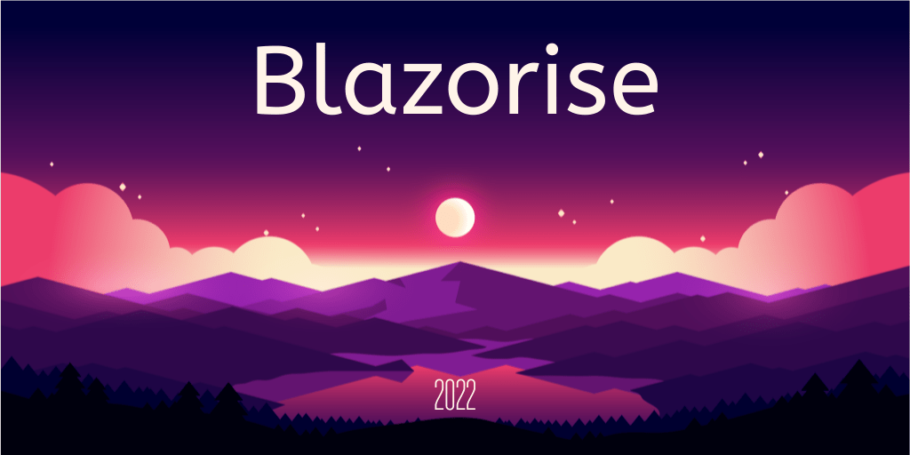

# Announcing 2022 Blazorise Plans and Pricing Updates

The foundational belief at the heart of Blazorise is as apparent today as the day we started it all: We believe that your APP workflow can always be made faster, smoother, and more straightforward.

Along with this relentless drive to improve the Blazorise product, we've also seen some fundamental changes in what our customers need from us. Originally, Blazorise was a product designed for individual developers; as usage grew, we had more and more teams and larger businesses and enterprises using Blazorise to collaborate across functions, organizational boundaries, and the entire Blazorise component API lifecycle.

Starting from June 2021, we at Blazorise started offering commercial licenses for businesses; a lot has changed since. We released two major versions, added many new components, and made many improvements while actively fixing issues, giving community and customer support, and working on the final Blazorise 1.0 version.

Running a business is not an easy task, especially if you're starting alone and when you don't have a clue what to expect in the future. And most of all, what do your customers expect from you. When we were planning to add commercial support, to be honest, we weren't fully prepared for the needs of our customers and use cases of Blazorise in enterprise systems. However, six months later, we have a much clearer picture.

Today, we're announcing a new structure for our Blazorise plans and pricing that's more precisely aligned with our customer's requirements, the offerings we've built, and the roadmap features and capabilities that we're working on around the clock to develop for you.

## What is the new Blazorise license for 2022?

But first, we want to be clear about one thing: we will continue to offer the popular free version of Blazorise, and we're always working on updating and improving it.

That said, here's a quick summary of the updated structure, with new plans and prices:

Again, alongside these new plans, we will continue to offer the free version of Blazorise.

## How will the new Blazorise license pricing impact me?

If you're an individual, a small company, freelancer, and not commercially using Blazorise, you are not affected, and you can continue to use Blazorise.

If you're a business, a large company, or are commercially using Blazorise; you must be aware of some changes.

## When will the new changes be in effect?

The new Blazorise license model is starting to effect from February 1st, 2022. Until then, you can purchase Blazorise licenses as of current terms.

## What should you do now?

If you're a customer of ours, we know how overwhelming licensing changes like this can be, so we're working hard to ensure that the new structure and evolution of Blazorise license pricing works for your business. In the coming months, you can expect that we will contact you to discuss the upcoming Blazorise licensing changes and get moving on, ensuring you're getting the most from your investment. But, for now, you can begin thinking about the above and which Term you may wish to choose!
