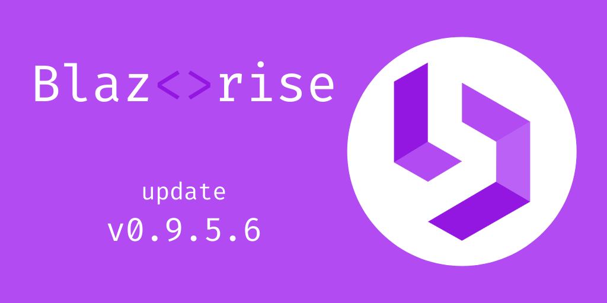

# Update for the 0.9.5 release - patch 6

We got busy working on the final v1.0, but the current version is still getting some love. Here you can see all the most critical issues fixed since the last minor release.

Please update your projects and let us know if any problems arise.

## Change Log

- [#3318](https://github.com/Megabit/Blazorise/issues/3318): DataGrid "Cannot create an abstract class" when UseValidation=true
- [#3414](https://github.com/Megabit/Blazorise/issues/3414): Datagrid: Investigate Save/Cancel btns inline edit mode
- [#3442](https://github.com/Megabit/Blazorise/issues/3442): DataGrid: ArgumentNullException on select all
- [#3386](https://github.com/Megabit/Blazorise/issues/3386): DataGrid: Sync SelectedRows to children components
- [#3452](https://github.com/Megabit/Blazorise/issues/3452): TableRow: Draggable="true" not working
- [#3480](https://github.com/Megabit/Blazorise/issues/3480): Datagrid: selection stops working

## Support

Megabit Ltd, a small organization based in Croatia, maintains the open-source component library Blazorise. We strongly believe in the open-source ecosystem, so we're giving it away for free through our Blazorise Community licenses.

If you want to help the project and are already a part of a large organization, please consider purchasing a commercial license to help us become a sustainable business. Then we'll be able to continue working on Blazorise.

With a commercial license, you get premium forum support as well as access to our private repositories and community-licensed themes. To learn more, visit us at Blazorise Commercial.
