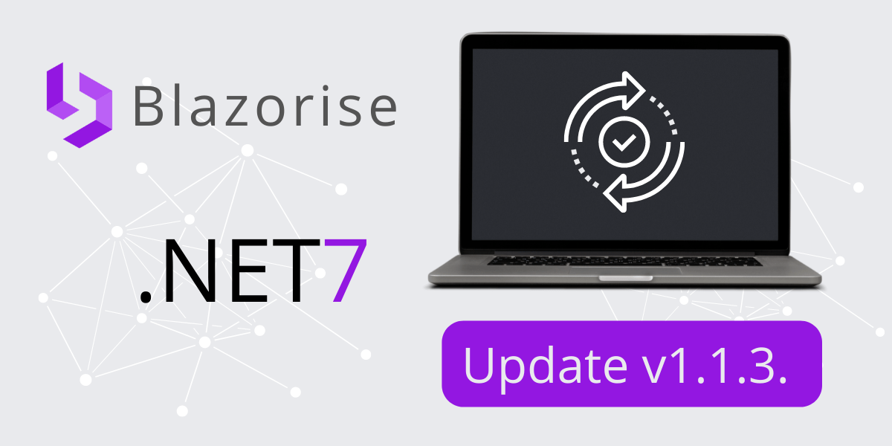

# <Text Style="text-decoration: line-through;">Maintenance</Text> Release: Blazorise 1.1.3

This Blazorise version was supposed to be just a minor maintenance release. Instead, we got a few relatively large features and announcements.

## .NET 7 Support

For a start, Blazorise now fully supports the final .NET 7 version. We believe .NET 7 is the best way to proceed with Blazor development. The number of new improvements, features, and fixes is astounding, not to mention significant performance improvements.

To update your projects to the latest version please read the official blog from the DotNet Blazor.

## Blazorise Templates

We worked hard and are proud to finally bring Blazorise project templates to the Blazorise community. Our developer David has done a great job making it come to life. The new Blazorise Templates have support for several Blazor hosting types, WebAssembly, and Servers. It also supports the choice of .NET version, color theme, and many more.

To learn more about the new tmplates look at our Blazorise Templates page.

## Blazorise Specifications

Last but not least. We have started a new subsection in our documentation named Specifications. The purpose of new pages is to describe in detail how our most complex components work and how they behave when supplied with different parameters. New pages for our users and ourselves will be a string reference point for components' behavior that will help us all in the long run.

At the moment, we have only one page for Autocomplete component. The next step is covering DataGrid, our most complex component. And after that, we will regularly add new pages based on the feedback from our community.

To learn more about the new tmplates look at our Blazorise Specification pages.

## And Now a Real Maintenance Release

We released Blazorise 1.1.2 just a few weeks ago with a small array of bug fixes, but those nasty bugs are always lurking.

This new Blazorise 1.1.3 is a hotfix release to solve this and a few other minor issues that were fixed in the meantime. Blazorise 1.1.2 is a recommended upgrade for all Blazorise 1.1 and Blazorise 1.1.2 users.

For a detailed overview of the changes that 1.1.2 included and which are also part of this new release, please read the 1.1.x support notes.

## Changes

Here are the main changes since 1.1.2-stable:

- [#4213](https://github.com/Megabit/Blazorise/issues/4213): FileEdit breakes files from 1.0.6 to 1.1.1
- [#4216](https://github.com/Megabit/Blazorise/issues/4216): DatePicker breaks on mobile
- [#4224](https://github.com/Megabit/Blazorise/issues/4224): FilePicker 1.1.2 dropzone Ignoring .msi Files
- [#4249](https://github.com/Megabit/Blazorise/pull/4249): Fix Debounce
- [#4261](https://github.com/Megabit/Blazorise/pull/4261): Corrected two dutch translation which made no sense
- [#4245](https://github.com/Megabit/Blazorise/issues/4245): Autocomplete - SelectedValueChanged fired automatically when typed in text equals the text in dropdown
- [#4263](https://github.com/Megabit/Blazorise/issues/4263): FilePicker documentation issue
- [#4254](https://github.com/Megabit/Blazorise/issues/4254): Memory leak in ThemeCache
- [#4267](https://github.com/Megabit/Blazorise/issues/4267): Create new Reference documentation
- [#4239](https://github.com/Megabit/Blazorise/issues/4239): Missing documentation of SortField of DataGridColumn
- [#4227](https://github.com/Megabit/Blazorise/issues/4227): BarDropdown should inherit BarItem Disabled parameter

## Known incompatibilities

As of now, there are no known incompatibilities with the previous Blazorise 1.1.x releases. We encourage all users to upgrade to 1.1.3.

If you experience any unexpected behavior change in your projects after upgrading to 1.1.3, please file an issue on GitHub.

## Support

Megabit Ltd, a small organization based in Croatia, maintains the open-source component library Blazorise. We strongly believe in the open-source ecosystem, so we're giving it away for free through our Blazorise Community licenses.

If you want to help the project and are already a part of a large organization, please consider purchasing a commercial license to help us become a sustainable business. Then we'll be able to continue working on Blazorise.

With a commercial license, you get premium forum support as well as access to our private repositories and community-licensed themes. To learn more, visit us at Blazorise Commercial.
