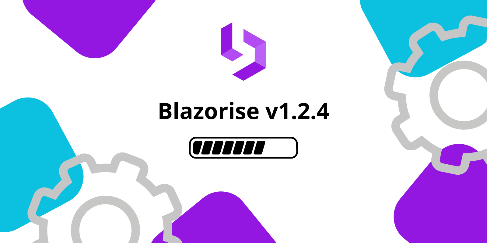

# Maintenance release: Blazorise 1.2.4

Welcome to the maintenance release of Blazorise v1.2.4!

This release includes a number of important bug fixes and performance improvements that will enhance your overall user experience. Below is a detailed list of the changes we made:

For a detailed overview of the bug fixes from the last version, read the 1.2 support notes.

## Changes

Here are the main changes since 1.2.0:

- [#4772](https://github.com/Megabit/Blazorise/issues/4772): Autocomplete does not fully reset when clicking out and back in
- [#4787](https://github.com/Megabit/Blazorise/issues/4787): Datagrid FluentValidationHandler support unavailable or undocumented
- [#4777](https://github.com/Megabit/Blazorise/issues/4777): Fullscreen Modal does not render background correctly if content higher than screen size
- [#4786](https://github.com/Megabit/Blazorise/issues/4786): TimePicker does not fire TimeChanged event
- [#4768](https://github.com/Megabit/Blazorise/issues/4768): Tailwind Demo: CSS issue
- [#4780](https://github.com/Megabit/Blazorise/issues/4780): Theme options seem to be ignored in Tailwind
- [#4800](https://github.com/Megabit/Blazorise/issues/4800): Fix Tailwind dark theme colors

We are grateful to our community for their continuous feedback and suggestions. It helps us make Blazorise better for everyone. Feel free to let us know if you encounter any issues or if there's anything you'd like to see in future releases.

## Known incompatibilities

As of now, there are no known incompatibilities with the previous Blazorise 1.2.x releases. We encourage all users to upgrade to 1.2.4.

If you experience any unexpected behavior change in your projects after upgrading to 1.2.4, please file an issue on GitHub.

## Commercial Support

Blazorise, an open-source component library, is maintained by Megabit Ltd, a small organization based in Croatia. We are strong advocates of the open-source ecosystem, which is why we offer Blazorise through our Community licenses at no cost. However, if you are part of a large organization and would like to support the project, we suggest purchasing a commercial license to help us maintain a sustainable business. This will enable us to continue developing Blazorise.

With a commercial license, you will have access to premium forum support, private repositories and community-licensed themes. To learn more about commercial licenses, please visit our website at Blazorise Commercial.
