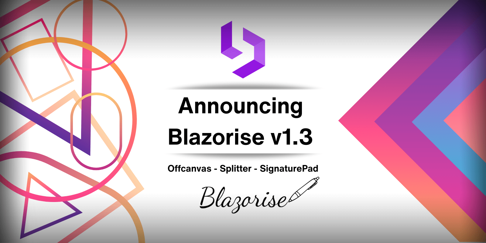

# Announcing Blazorise 1.3

Greetings to our amazing developer community! We're thrilled to announce the latest and greatest version of Blazorise – version 1.3.

It has been far too long since the last major version, but given the number of new features included in this release, it has been well worth the wait.

Dive in to learn about the new components, enhancements, and features we've added to assist you in creating even better web applications!

## Blazorise 1.3 Highlights 💡

Here's a summary of what’s new in this release:

- Offcanvas Component: Now offers dynamic appearance from top, bottom, left, or right of the screen. Comprising three main elements (Offcanvas, OffcanvasHeader, OffcanvasBody), it enhances the responsive design for both desktop and mobile.
- Splitter Component: Craft resizable panels with new functionalities including GutterSize, MinSize, MaxSize, and more.
- Signature Pad: Collect digital signatures effortlessly.
- Charts.Annotation: Draw Lines and Boxes over the Charts.
- DataGrid Enhancements: New FilterMode for dynamic column-based filtering.
- Improved parameters for DataGridSelectColumn.
- CancellableRowChange and SavedRowItem improvements.
- New ApplySorting method for programmatic column sorting.
- Predefined column filtering with FilterMethod.
- Expandable row groups with ExpandGroups and CollapseGroups.
- New ClearFilter overload.
- New HeaderGroupCaption to group multiple column headers.

TreeView: Observable collections.

Utilities: CSS Grid, Text Size, List Styles, ...

## Upgrade an existing project 👨‍🔧

To upgrade an existing Blazorise applications from 1.2.x to 1.3:

- Update all Blazorise.* package references to 1.3.

You should now be able to use Blazorise without any breaking changes to the API.

## Good to Know

Before we continue we need to make sure that you're familiar with some behaviour changes in this release.

DataGrid : The data collection no longer automatically updates upon mutating the collection, for example, by using methods like Add or Remove.

While this feature was good to have by default, the way it was implemented, was a general performance hit on DataGrid usage, even if it wasn't in the interest of the consumer to use it.

As such we now recommended the following, either:

- Invoke gridRef.Reload(); when you're done mutating your collection;
- Have your data be observable by using any implementation of the INotifyCollectionChanged, like the ObservableCollection. The example below ilustrates this.

Please visit, observable data docs for more information.

## New Features & Enhancements 🚀

First and foremost, Blazorise 1.3 fully supports the new .NET 8 SDK. It is currently using the most recent preview 7.

Generally the .NET 8 should be safe, and it should behave similarly to .NET 6 and .NET 7, but be aware we will consider this release of Blazorise with .NET 8 as an alpha until the final .NET 8 SDK version is released.

Plase try it, and if you find any issue please report it on our GitHub pages.

The new Offcanvas component offers the flexibility to appear, or slide from the top, bottom, left, or right of your screen, making it highly adaptable to a variety of design contexts. This makes it a perfect fit for both desktop and mobile layouts, allowing you to create responsive designs with ease.

We believe the Offcanvas component will offer our developers a new level of versatility when crafting unique user interfaces, making it easier to manage additional content or navigation in a user-friendly and accessible way.

We're thrilled to announce the introduction of a new Splitter component in the latest update of Blazorise. This interactive and flexible layout component provides a way to create resizable panels in your application.

GutterSize: Controls the width of the draggable area between sections, allowing users to adjust the relative sizes of the sections.

MinSize: Specifies the minimum size to which a section can be resized, ensuring the usability and readability of content in each section.

MaxSize: Specifies the maximum size to which a section can be resized, ensuring the usability and readability of content in each section.

and more

🏆 We would like to express our sincere thanks to smfields, a dedicated member of our community, who initially developed this feature. He has generously granted us the rights to include it in Blazorise, enabling all users of our library to benefit from this versatile component.

We look forward to seeing the creative ways in which you'll incorporate this new feature into your projects!

The usage of new Splitter component can be see on Splitter page.

The SignaturePad is a crucial component in Blazorise that enables users to sign and submit documents electronically. With this update, developers can now capture and store signatures in a secure and reliable manner, ensuring the authenticity and integrity of the documents.

This component will make it easier for developers to create applications that require the collection of digital signatures, saving time and effort for both the users and the developers. We hope this update will be beneficial to our users and help them create more efficient and effective applications.

The usage of new SignaturePad component can be see on SignaturePad page.

We have added localization support to the MessageProvider. This update will allow developers to create applications that can support multiple languages and locales.

The MessageProvider is a vital component in Blazorise that enables the display of notifications, alerts, and other messages to users. With the added localization support, developers can now customize the messages displayed to users based on their preferred language and locale.

This innovative extension is based on the powerful chartjs-plugin-annotation and offers a new level of flexibility and functionality for your chart visualizations.

The Charts Annotation extension lets you draw lines, boxes, points, labels, polygons, and ellipses directly on the chart area, adding context and enhancing data visualization. This feature is versatile and can be used in conjunction with line, bar, scatter, and bubble charts, providing meaningful insights for your data sets.

Whether you're using linear, logarithmic, time, or category scales, you'll find the annotations provide a new dimension to your charts. However, please note that annotations will not work on charts that do not have two or more axes, including pie, radar, and polar area charts.

This new extension is a significant step towards making Blazorise's charting features more comprehensive and versatile. We encourage you to experiment with these new capabilities to see how they can add depth to your data visualizations. As always, we look forward to hearing your feedback!

There are so many new features, APIs, and other improvements on the DataGrid component that is hard to keep track of all of them. Explaining them is not as easy task so we're going to be as short as possible.

There is now a new FilterMode option that allows you to specify a new Filter Mode. By setting the FilterMode to the new DataGridFilterMode.Menu, the DataGrid will now show a filter icon by each column allowing your users to dinamically customize the filter to apply on per column basis.

Please visit, datagrid filtering docs to find a new example showcasing this feature.

You are now able to use pre defined filtering on a per-column basis by specifying FilterMethod on DataGridColumn.

Added a new ClearFilter overload. You are now able to clear the filter on specific columns.

The DataGridNumericColumn now renders a numeric filter input & applies the corresponding specific numeric configuration you've assigned it.

The new HeaderGroupCaption feature for the DataGrid component is something we are eager to share. With the help of this feature, you can combine several DataGrid column headers under a single, comprehensive caption.

This is particularly helpful when you need to group related columns under a single heading for easier understanding and organization. For instance, you could put columns like "Price," "Discount," and "Total Cost" under a header group titled "Financial Details" in a DataGrid that displays product details.

With this improvement, you can better structure your data and give users more information. By enabling more intuitive navigation through the DataGrid, grouping column headers using HeaderGroupCaption greatly improves the readability of complicated grids.

Please visit, DataGrid Header Group docs to find a new example showcasing this feature.

The DataGridSelectColumn will now enable you to provide new parameters so you can quickly render a select structure. Similarly to how a regular SelectList works, you can define new parameters, Data, ValueField, and TextField that will help to danamically bind the underline select element.

Please visit, DataGridSelectColumn docs to find a new example showcasing this feature.

We've modified the callback CancellableRowChange argument in the RowInserting, RowUpdating, and RowRemoving callbacks to now provide both an OldItem and NewItem properties.

OldItem will replace the regular existing Item as it's easier to understand what it represents.

Item is now marked as obsolete and will be removed in a future release.

NewItem is a deep clone of the item that's being inserted or updated with the updated edit values.

The existing .Values; dictionary will still exist, but this allows you to promptly get a mapped TItem without having to write your own mapping code from the Dictionary.

Introduced a new ApplySorting() method that allows you to programatically define the columns that you'd like the grid to be sorted on.

🏆 This features was contributed by danm-de.

Please visit, datagrid sorting docs for more information.

Introduced ExpandGroups() and CollapseGroups() methods that allows you to programatically expand or collapse specific groups.

These new methods provide you with more control over how the data is presented and viewed, allowing you to tailor the user experience to specific usage scenarios and user preferences.

Introduced a new RowOverlayTemplate that allows you to render an overlay with adittional information on top of the row. This feature is partically useful when you wish to provide more context about the data being presented to the user.

Please visit, Row Overlay docs for more information.

A new RequiredIndicator parameter was introduced. By enabling this parameter. The label will display a a required indicator by appending a relevant class which by default will render an asterix by the label with the theme's danger color. Which you can of course override the css class to your liking.

We have added a new Checkbox parameter to the DropdownItem so you may now render dropdown items with checkboxes. You can also track the state of each one by binding to the new Checked and CheckedChanged parameters.

Introduced a new SelectionMode parameter, which allows the selection of a new Checkbox mode, that will set the DropdownList into a multiple selection mode. You can track the state of the selection by binding to the new SelectedValues and SelectedValuesChanged parameters.

🏆 With the contribution by our community member JTtheGeek, we now have a RemoveNode() method that allows you to remove a node from the TreeView if it's found.

It is also possible to make node children collections observable (retrieved by GetChildNodes() / GetChildNodesAsync() ) and any changes to them should be reflected on the UI.

On top of it, you can also make use of IsDisabled() callback method to disable each node dynamically.

We have added a new FreeTypingNotFoundTemplate parameter so you may provide a custom template when the user types in a value that is not found in the data source and FreeTyping is enabled.

This is useful when you want to provide a message for the user related to an item that's not in the data source. For example, presenting the following message for the Singapore text that's not in the data source: Add "Singapore"?

We have added a new AutocompleteTagContext parameter so you may customize tags to your liking when using Autocomplete multiple selection mode.

We've added EventCallbacks for the events that we currently listen to in the Autocomplete, these are called when the Autocomplete finishes handling the corresponding event.

- SearchTextChanged
- SearchKeyDown
- SearchFocus
- SearchBlur

In this release, we've added a significant enhancement to the Blazorise Video player. Users now have the ability to define multiple sources for a single video, each with different qualities. This includes options for 576p, 720p, and 1080p. The chosen video file, hosted at a unique URL for each quality, will load based on the user's preference or network conditions. By default, the player is set to display the video in 720p. This new feature offers users a more tailored and efficient video viewing experience by adapting to their specific needs and conditions.

We've migrated the underlying library that takes care of dynamically "anchor position" the dropdown menu according to the UI constraints. It has been migrated from Popper to the newer Floating UI library.
    Behaviour should remain unchanged and your dropdown menus should still be cleverly positioned!

Added a new PositionStrategy parameter, that allows you to set the positioning strategy for your dropdown. Please read Floating UI Strategy for more details on how it can affect the positioning of your dropdown.

Added a new DropdownMenuTargetId parameter, that allows you to set a custom anchor element id for the dropdown menu. This is useful when you want the dropdown menu to be anchored from a different element than the toggle button.

Fixed an issue where in some certain cases, if buttons existed inside the Dropdown the menu positioning would not be handled correctly.

We've added support for IValidatableObject. This new feature enhances the flexibility and robustness of your form validation processes. By implementing the IValidatableObject interface in your models, you can now provide custom validation logic that is more complex and situation-specific than what can be achieved with simple data annotation validation.

This interface includes the Validate method, which you can override to define your custom validation rules. This method is automatically invoked when performing model validation, ensuring that your custom rules are adhered to. This feature is useful when the validity of a property's value is dependent on another property's value, or when an intricate validation process is required.

The CSS Grid is a two-dimensional layout model, comprised of 12 columns and up to 6 rows, providing a robust structure for building complex layouts. This structure allows developers to craft visually appealing and responsive designs that will adapt seamlessly across various devices and screen sizes.

One of the standout features is its built-in responsiveness with mobile breakpoints. This ensures that the layout will automatically adjust to provide an optimal viewing experience on different devices, from large desktop monitors down to mobile phones. The alignment and positioning within the grid have been carefully designed to offer a straightforward yet powerful way to arrange your components.

We believe this new grid system will offer our developers more control and creativity in crafting layouts, making it easier to produce stunning, responsive designs. We encourage you to explore this new feature and as always, your feedback is most welcome.

The ListStyleImage parameter allows you to define the marker images for list items. This gives you more flexibility and creativity in styling your lists, enhancing your user interface by going beyond the traditional bullet points or numerical markers. You can now use custom images to highlight or differentiate individual list items. It takes a string as its value, which should be Base64 encoded string that represents an image, or a URL of the image you wish to use as your list marker. Please note that the image URL must be enclosed in url() and the image should ideally be a small, suitable size for use as a list marker. The example can be found on Typography pages.

The TextSize enum provides predefined sizes from extra small to extra large, as well as supporting various heading sizes from Heading1 (largest) to Heading6 (smallest). The example can be found on Typography pages.

## Wrap Up

This release is packed with features, enhancements, and improvements, all aimed at making your Blazorise experience richer and more efficient. We're always striving to make Blazorise the best it can be, and we couldn't do it without your feedback and support.

Thank you for being a part of our journey. We eagerly await to see the fantastic applications you craft using these new features!

Happy coding! 🎉🚀
