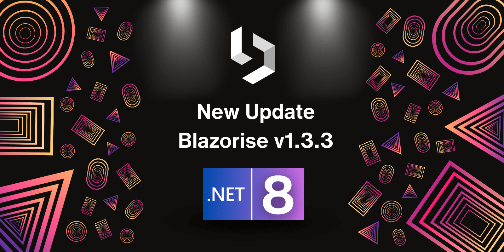

# Maintenance release: Blazorise 1.3.3

We are pleased to announce the release of Blazorise 1.3.3. This maintenance release focuses on enhancing the overall stability and performance of the Blazorise framework. Key updates include migration to .NET 8, fixes for DatePicker validation, and improvements in DataGrid pagination handling.

## What's New in 1.3.3

Blazorise 1.3.3 has been updated to be fully compatible with .NET 8. This ensures improved performance, security, and the latest features from the .NET framework. Developers migrating from older versions of .NET should refer to the .NET 8 migration documentation for a seamless transition.

Resolved an issue where the DatePicker validation messages were not displaying as expected. Validation messages for DatePicker controls will now appear correctly, providing users with necessary feedback on their input.

Addressed a bug in the DataGrid component where pagination was not properly handled during the ReadData event. Pagination within DataGrid is now more efficient, ensuring accurate data display and interaction for large datasets.

## Detailed list of changes

- [#4998](https://github.com/Megabit/Blazorise/pull/4998): Migrating to .NET 8
- [#4578](https://github.com/Megabit/Blazorise/issues/4578): DropdownToggle Outline attribute not working
- [#5103](https://github.com/Megabit/Blazorise/pull/5103): DataGridSelectColumn | Rework internal setting
- [#4994](https://github.com/Megabit/Blazorise/issues/4994): [Bug]: Snackbar: fixed position on mobile
- [#5120](https://github.com/Megabit/Blazorise/issues/5120): FieldLabel RequiredIndicator not shown in Tailwind
- [#5114](https://github.com/Megabit/Blazorise/issues/5114): ToggleIconVisible not working for DropdownToggle in Tailwind
- [#5105](https://github.com/Megabit/Blazorise/issues/5105): [Bug]: Slider values in html are based on Culture
- [#3802](https://github.com/Megabit/Blazorise/issues/3802): ValidationError (message) within Addons not showing up
- [#5121](https://github.com/Megabit/Blazorise/issues/5121): DatePicker Validation not showing
- [#5132](https://github.com/Megabit/Blazorise/issues/5132): [Bug]: SignaturePad: Repeating Images When Used in Mobile Device Dimensions
- [#5116](https://github.com/Megabit/Blazorise/issues/5116): DataGrid ReadData not handling pagination properly
- [#5137](https://github.com/Megabit/Blazorise/issues/5137): MessageProvider: Change russian localization

## Feedback

Your feedback and contributions are what make the Blazorise community thrive. Please continue sharing your experiences, bug reports, and feature requests. Every input helps shape Blazorise for the better.

## Known incompatibilities

As of now, there are no known incompatibilities with the previous Blazorise 1.3.x releases. We encourage all users to upgrade to 1.3.3.

If you experience any unexpected behavior change in your projects after upgrading to 1.3.3, please file an issue on GitHub.

## Commercial Support

Blazorise, an open-source component library, is maintained by Megabit Ltd, a small organization based in Croatia. We are strong advocates of the open-source ecosystem, which is why we offer Blazorise through our Community licenses at no cost. However, if you are part of a large organization and would like to support the project, we suggest purchasing a commercial license to help us maintain a sustainable business. This will enable us to continue developing Blazorise.

With a commercial license, you will have access to premium forum support, private repositories and community-licensed themes. To learn more about commercial licenses, please visit our website at Blazorise Commercial.
