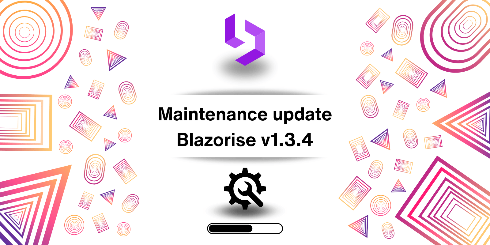

# Maintenance release: Blazorise 1.3.4

This maintenance release focuses on enhancing the overall stability and performance of the Blazorise framework.

## Detailed list of changes

- [#5145](https://github.com/Megabit/Blazorise/issues/5145): VirtualizeOption not working with fixed height
- [#5173](https://github.com/Megabit/Blazorise/issues/5173): [Bug]: TimePicker default display value Null (instead of an empty string)
- [#5181](https://github.com/Megabit/Blazorise/issues/5181): [Bug]: Tailwind Small Size Modal
- [#5185](https://github.com/Megabit/Blazorise/issues/5185): [Bug]: DropdownList in Checkbox mode does not update selection when SelectedValues changes
- [#5184](https://github.com/Megabit/Blazorise/issues/5184): DataGrid clone not working

## Feedback

Your feedback and contributions are what make the Blazorise community thrive. Please continue sharing your experiences, bug reports, and feature requests. Every input helps shape Blazorise for the better.

## Known incompatibilities

As of now, there are no known incompatibilities with the previous Blazorise 1.3.x releases. We encourage all users to upgrade to 1.3.4.

If you experience any unexpected behavior change in your projects after upgrading to 1.3.4, please file an issue on GitHub.

## Commercial Support

Blazorise, an open-source component library, is maintained by Megabit Ltd, a small organization based in Croatia. We are strong advocates of the open-source ecosystem, which is why we offer Blazorise through our Community licenses at no cost. However, if you are part of a large organization and would like to support the project, we suggest purchasing a commercial license to help us maintain a sustainable business. This will enable us to continue developing Blazorise.

With a commercial license, you will have access to premium forum support, private repositories and community-licensed themes. To learn more about commercial licenses, please visit our website at Blazorise Commercial.
