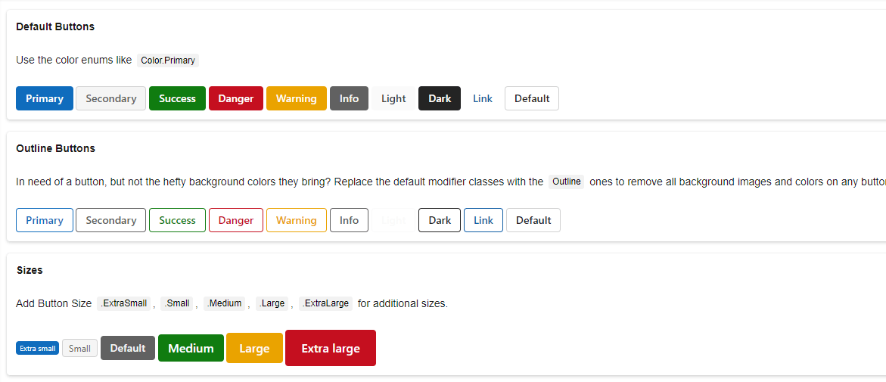
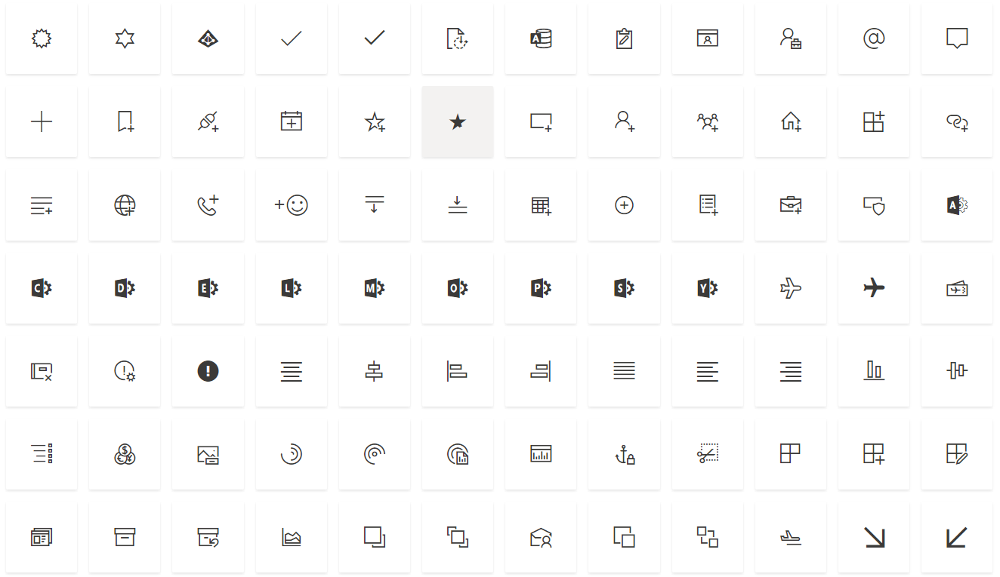
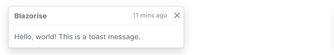
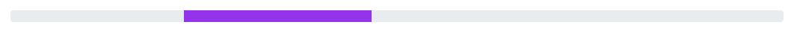
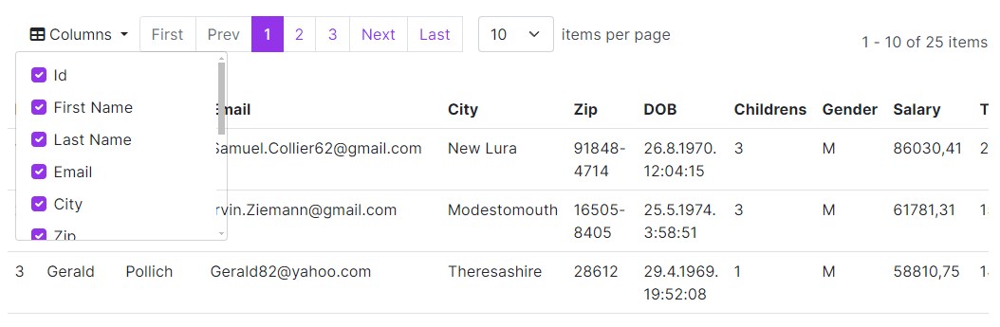
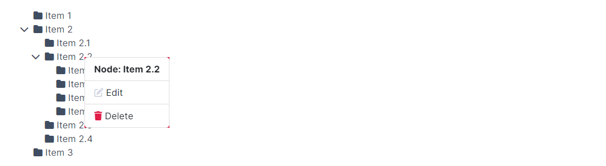

# Announcing Blazorise 1.5 - Dubrovnik

We're pleased to announce the release of Blazorise version 1.5, codename [Dubrovnik](https://en.wikipedia.org/wiki/Dubrovnik "Link to Dubrovnik wikipedia"), bringing with it new features, improvements, and important upgrades aimed at enhancing your development experience. This update reflects our ongoing efforts to refine and expand the Blazorise toolkit in response to the needs of our developer community.

This release introduces a range of new features and enhancements designed to support the creation of dynamic, efficient, and visually appealing applications. We've also focused on addressing and resolving issues reported in previous versions to ensure a more stable and reliable foundation for your projects.

We continue to offer active support for our commercial users, aiming to provide the necessary assistance to utilize Blazorise 1.5 effectively in your development projects.

Discover what's new in this update and how to upgrade your existing projects to leverage the enhanced capabilities of Blazorise 1.5.

## Key Blazorise 1.5 Highlights 💡

Here's a summary of what's new in this release:

- **Fluent UI 2**: Adoption of CSS provider based on the Microsoft Fluent 2 design system.
- **Toast Component**: New component for displaying push notifications with ease.
- **Progress Bar**: Introduction of an indeterminate state for more dynamic UI feedback.
- **Accordion Components**: Dedicated components for a more flexible and efficient accordion implementation.
- **Font Awesome Update**: Enhanced iconography with Font Awesome v6.x integration.
- **Extended Breakpoints**: Introduction of XXL (QuadHD) size for superior control on larger screens.
- **AntDesign Update**: Transition to the latest 4.x version of AntDesign, enhancing UI capabilities.

## Upgrading from 1.4.x to 1.5 👨‍🔧

Upgrade your Blazorise application seamlessly with the following steps:

Update all **Blazorise.*** package references to **1.5**.

Enjoy the latest features without any breaking changes to the API.

## New Features & Enhancements 🚀

### Fluent UI 2 Provider

The introduction of the new **Blazorise Fluent 2** provider stands as the highlight of this release, marking a significant milestone in our ongoing development efforts. Achieving this milestone wasn't easy in any way. It demanded three months of dedicated effort to bring it forward.

Based on the Microsoft [Fluent 2 design system](https://fluent2.microsoft.design/ "Link to Fluent 2 design system"), this provider's integration across all Blazorise components has been a significant focus. Our team dedicated considerable resources to this effort, ensuring seamless user interface consistency and modernity.

In doing so, we addressed the need for integrating a plethora of previously absent functionalities from the native Fluent Design specifications:

**Extended Theme Colors**: Additional theme colors, such as secondary, success, and info, were introduced, broadening the palette for better UI customization and visual appeal.

**Extra Sizes**: We've added more size options, offering greater control over the spacing and scaling of components to fit a wide range of design needs.

**Advanced Utilities**: Integrating utilities for flex, grid, and typography further empowers developers to craft responsive and aesthetically pleasing layouts easily.

To learn more about integrating the Blazorise Fluent provider into your project follow the [Blazorise Fluent 2 Usage Guide](docs/usage/fluent2 "Link to Blazorise Fluent 2 Usage Guide page") page.

### Fluent Icons

Along with the Blazorise Fluent provider, we also made a lot of work in the new **Blazorise.Icons.FluentUI** package, featuring a new collection of icons derived from the Microsoft Fluent Icons library. This addition enriches the variety of icons available for your projects.

### Font Awesome Additions

Furthermore, we've integrated the most recent icons from the Font Awesome **v6** branch, significantly expanding the selection of icon names at your disposal.

With this update, we've also adjusted how Font Awesome icons are utilized. The **Blazorise.Icons.FontAwesome** package now encompasses all icons from both the **v5.x**, and **v6.x** branches of Font Awesome. This modification was necessary due to the lack of a Content Delivery Network (CDN) for the **v6.x** icons. By incorporating these icons directly into Blazorise, we offer a direct path to leverage them in your projects. Should you prefer using your own CDN, that option remains available as an alternative.

It's important to note that following the integration of **FontAWesome v6.x**, certain icons from the **v5.x** collection may not function as expected. We recommend updating your CSS link to the latest **v6.x** version to ensure optimal compatibility and performance.

### Toast component

We're excited to announce the addition of the Toast component in Blazorise 1.5. Designed to mimic the appearance of push notifications often seen on desktop and mobile devices, Toasts provide short-lived alerts to users. Thanks to their construction using flexbox, positioning and aligning them is straightforward and hassle-free.

For guidance on utilizing this new component, please refer to the example provided on the [Toast](docs/components/toast "Link to Toast page") page.

### Progress Bar: Indeterminate State

The [Progress Bar component](docs/components/progress "Link to Progress Bar component") has been enriched with the addition of an **Indeterminate** state. This feature is specifically designed to represent operations whose end time is not determinable, offering a dynamic way to signify that a process is actively underway but its duration remains uncertain. This enhancement significantly boosts the user interface by introducing a visual representation for tasks that are currently in progress.

### Dedicated Accordion components

The Accordion functionality has been enhanced with the introduction of dedicated components.

- `AccordionHeader`, and
- `AccordionHeader`, and
- `AccordionBody`

This change aims to improve the performance and flexibility of accordions within applications. It addresses previous limitations by replacing the use of the Collapse component which were too strongly attached to the Accordion component.

The Collapse will still continue to work, but in the future you should expect it to be completelly removed from the Accordion.

### AntDesign upgrade to latest 4.24 version

In the current update, we've upgraded the AntDesign provider to the latest **AntDesign 4.24** version. Previously, we were working with the earlier **4.0** version of AntDesign, which didn't fully exploit the potential of this framework.

Although we aim to migrate to the newer AntDesign 5.1 version in a forthcoming Blazorise release, this upgrade to 4.24 addresses many of the challenges we faced during the development of Blazorise 1.5.

### Enhancements to DataGrid

#### 1. State Management

A new feature has been added for the efficient management of DataGrid states, allowing the saving and loading of DataGrid states as needed through a centralized API. Utilize the newly introduced `LoadState` and `GetState` methods for managing the DataGrid's state efficiently.

For practical applications of this feature, refer to the [DataGrid State Management](docs/extensions/datagrid/features/state-management "Link to DataGrid State Management") page.

#### 2. PreventRowClick

We've implemented enhancements to **TableRowCell**, introducing the ability to halt default actions and stop propagation of events upon cell clicks, through **ClickPreventDefault** and **ClickStopPropagation** functionalities. This update also addresses and resolves previous issues with the DataGrid's **PreventRowClick** feature not functioning as intended.

#### 3. Column Chooser

The introduction of the Column Chooser feature, activated by setting **ColumnChooser** to true, empowers users to dynamically show or hide columns within the DataGrid, enhancing the customization and flexibility of data presentation.

#### 4. Aggregate Template for DataGrid Columns

The **AggregateTemplate** parameter has been added to the DataGridColumn. This enhancement resolves a functionality gap, previously making it impossible to assign an aggregate template to both **DataGridColumn** and **DataGridMultiSelectColumn**.

### Show Tooltips on Rating

The **Rating** component has been updated to allow the display of additional information. Through the implementation of the `GetTooltip` callback, tooltips can now be shown, providing users with insights into the rating value being represented.

For a details example of this feature, refer to the [Rating component](docs/components/rating "Link to Rating component") page.

### DropdownList

Added a new Parameter `DisabledItem`. By defining this, you can set the disabled items from the supplied data source.

### Autocomplete

We've reworked the `Autocomplete` `SelectionMode.Checkbox` so it more closely follows the standard look of the checkboxes across the application.

### Responsive font sizes

Adjusting font sizes for multiple screen sizes can be challenging. That's why we have made it possible to define different sizes for different screen sizes. This is made possible with out flexible "fluent-based" utilities.

Defining the font size follows the same pattern as all out fluent-based utilties, eg. `TextSize="TextSize.IsLarge.OnMobile.IsSmall.OnDesktop"`.

### Validation API

To make it easier to customize Blazorise behavior, we have exposed some internal `Validation`, and `Validations` component APIs and made them public. This will enable more customization to your forms and make it possible to implement new validation methods.

### New Breakpoints

We have introduced new XXL Breakpoints(QuadHD alias) that is supposed to be used on extra large screens, like 2K and above. This will enable more fine control over what can be visible on screen for thos large screens.

### Bar menu toggle bahavior

We've recently introduced an exciting update with the addition of the **BarMenuToggleBehavior** feature. This new functionality comes with a default setting, `BarMenuToggleBehavior.AllowMultipleMenus`, designed to enhance user interaction by allowing all toggled menus to remain open concurrently. This setting is particularly useful for users who wish to multitask or compare content across different menus without the hassle of reopening them.

For those who prefer a more streamlined navigation experience, there's the option to switch the setting to `BarMenuToggleBehavior.AllowSingleMenu`. This alternative configuration ensures that only one menu can be open at a time, promoting a focused and clutter-free interface. This flexibility in menu behavior customization allows developers to tailor the navigation experience to the specific needs and preferences of their users, enhancing usability and user satisfaction.

### RichTextEdit

As with many other features in this release we have updated internals of RichTextEdit to work with the latest version of [Quill JS](https://github.com/quilljs/quill "Link to Quill JS") library. This update means there will be less security risks that were reported by using an older version.

We also made dynamic loading of RichTextEdit JavaScript files obsolete, and made it work similar to all other Blazorise components. JavaScript files are now loaded as a JS module.

### TreeView context menu

You can now identify when a user performs a right-click on a node within the **TreeView**. Utilizing the  `NodeContextMenu` event callback allows for the detection of the specific node clicked and the mouse coordinates, enabling the display of your custom context menu.

### Wrap Up

In conclusion, the release of Blazorise 1.5 represents a significant step forward in our mission to provide a comprehensive and robust development toolkit. We're confident that the new features, enhancements, and fixes included in this update will contribute positively to your development projects, making them more dynamic, efficient, and visually appealing.

We encourage all users to upgrade to this latest version to take full advantage of the improvements and to ensure your projects benefit from the latest advancements in the Blazorise toolkit. As always, we value your feedback and are here to support you through the upgrade process and beyond. For detailed instructions on upgrading and for more information on the new features, please refer to the documentation and release notes available on our website.

Thank you for your continued support and for being a part of the Blazorise community. We look forward to seeing the amazing applications you'll create with Blazorise 1.5 and are excited to continue supporting your development journey with future updates and enhancements. Happy coding!
