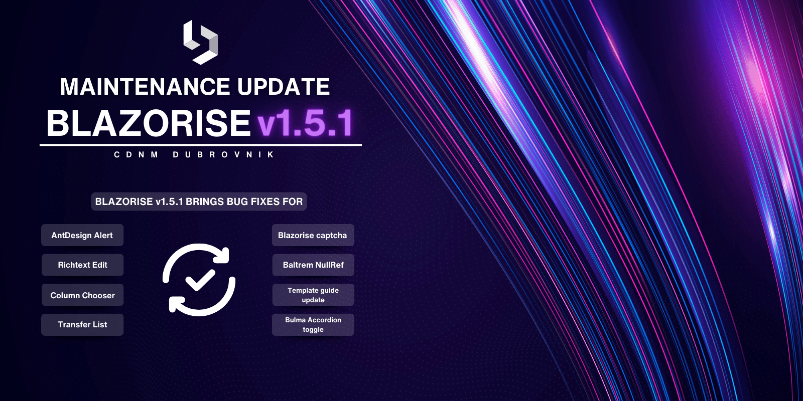

# Maintenance release: Blazorise 1.5.1

The latest maintenance update for Blazorise is dedicated to enhancing the development experience through crucial bug fixes and updates, without introducing new features. This release targets improvements in component functionality, security, and usability, focusing on refining the framework for a smoother development process.

## What's New in 1.5.1

Corrected a problem that required the pager to be visible for the Column Chooser to show.

Corrected the resizing issue when loading an image via fromUrl in the SignaturePad component.

Resolved the issue where ElementId was applied to the hidden input instead of the visible input.

## Detailed list of changes

- [#5377](https://github.com/Megabit/Blazorise/issues/5377): [Bug]: AntDesign Alert component seems to render differently with 1.5
- [#5376](https://github.com/Megabit/Blazorise/issues/5376): [Bug]: Richtext edit no longer works in 1.5
- [#5391](https://github.com/Megabit/Blazorise/issues/5391): Update template guide
- [#5381](https://github.com/Megabit/Blazorise/issues/5381): [Bug]: Column Chooser should show without requiring the pager to be visible.
- [#5382](https://github.com/Megabit/Blazorise/issues/5382): Allow Column Chooser button to be aligned horizontally
- [#5396](https://github.com/Megabit/Blazorise/issues/5396): [Bug]: TransferList
- [#5394](https://github.com/Megabit/Blazorise/issues/5394): Contact Us & Help Us Improve Pages | Add Blazorise Captcha
- [#5406](https://github.com/Megabit/Blazorise/issues/5406): [Bug]: Blazorise BarItem NullReferenceException
- [#5412](https://github.com/Megabit/Blazorise/issues/5412): [Bug]: Bulma Accordion toggle is just a normal button
- [#5410](https://github.com/Megabit/Blazorise/issues/5410): [Blog] explain how to override Fluent design tokens
- [#5419](https://github.com/Megabit/Blazorise/pull/5419): DataGridColumn: Fix Displayable updating
- [#5411](https://github.com/Megabit/Blazorise/issues/5411): [Bug]: SignaturePad - fromUrl - Resizing image
- [#5398](https://github.com/Megabit/Blazorise/issues/5398): [Bug]: Selected Row does not change when Rapid Editing
- [#5418](https://github.com/Megabit/Blazorise/issues/5418): DatePicker: ElementId is applied to hidden input, not visible input.
- [#5388](https://github.com/Megabit/Blazorise/issues/5388): [Bug]: SelectList binded selected values not working properly when they contain commas

## Feedback

Your feedback and contributions are what make the Blazorise community thrive. Please continue sharing your experiences, bug reports, and feature requests. Every input helps shape Blazorise for the better.

## Known incompatibilities

As of now, there are no known incompatibilities with the previous Blazorise 1.5.x releases. We encourage all users to upgrade to 1.5.1.

If you experience any unexpected behavior change in your projects after upgrading to 1.5.1, please file an issue on GitHub.

## Commercial Support

Blazorise, an open-source component library, is maintained by Megabit Ltd, a small organization based in Croatia. We are strong advocates of the open-source ecosystem, which is why we offer Blazorise through our Community licenses at no cost. However, if you are part of a large organization and would like to support the project, we suggest purchasing a commercial license to help us maintain a sustainable business. This will enable us to continue developing Blazorise.

With a commercial license, you will have access to premium forum support, private repositories and community-licensed themes. To learn more about commercial licenses, please visit our website at Blazorise Commercial.
