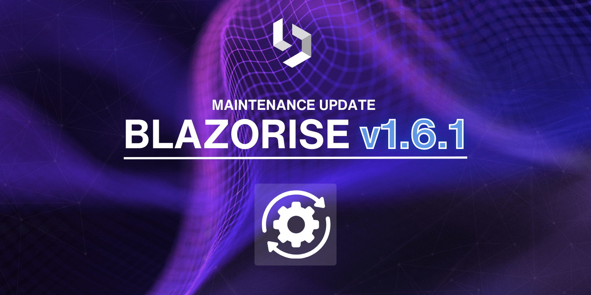

# Maintenance release: Blazorise 1.6.1

One month ago we have released Blazorise 1.6 which came with many new features and improvements. Today we are pleased to announce the release of version 1.6.1, which includes important bug fixes and enhancements. This release focuses on improving stability and addressing key issues identified by our user community. We are grateful for the feedback and contributions that have helped us make Blazorise better with each update.

## Major Improvements in 1.6.1

Fixed an issue where the FileEdit button text displayed the selected file name after selection. The fix was present only on Bootstrap 5, and the issue was fixed by changing the HTML structure of the FileEdit component. The button text now correctly displays the selected file name after selection.

Addressed the issue of disabling row clicks on the DataGrid's multi-selection checkbox. The solution involves using ClickStopPropagation to prevent click events from propagating when clicking near the checkbox. When the checkbox is actually clicked, the OnMultiSelectCheckClicked event is used to manually invoke HandleClick. To maintain the necessary functionality, a multiSelectPreventRowClick option was added to prevent triggering the DetailRow, while allowing other actions to continue as expected.

Resolved issues with Autocomplete when used alongside Cropper. The problem was that cropper events were not properly disposed of, leading to conflicts with input elements that were listening for + and - keys. We have reported the issue to the Cropper team, who then fixed it. The Blazorise was subsequently updated to incorporate this fix.

## Additional Improvements

Along with the major fixes, we have addressed several other bugs and made minor improvements to enhance the overall user experience and functionality of Blazorise. We appreciate your patience and continuous support as we work to make Blazorise better with each update.

We encourage you to update to version 1.6.1 to benefit from these fixes and improvements. As always, please report any issues or provide feedback to help us continue improving.

- [#5639](https://github.com/Megabit/Blazorise/issues/5639): [Bug]: FileEdit button text shows selected file name after selection
- [#5647](https://github.com/Megabit/Blazorise/issues/5647): [Bug]: NullReferenceException thrown in BaseChart::LimitDataSets method
- [#5614](https://github.com/Megabit/Blazorise/issues/5614): [Bug]: headergroupcaption and displayable not working properly together
- [#5631](https://github.com/Megabit/Blazorise/issues/5631): TransferList binding to Items
- [#5679](https://github.com/Megabit/Blazorise/issues/5679): [Bug]: Cannot seem to disable the detail row click on the datagrid multi selection checkbox
- [#5677](https://github.com/Megabit/Blazorise/issues/5677): [Bug]: Autocomplete issues when Cropper is used
- [#5692](https://github.com/Megabit/Blazorise/pull/5692): Remove validator APIs that are not supported

## Feedback

Your feedback is essential to us, and we appreciate your continued support and contributions to Blazorise. If you have any questions, suggestions, or feedback, please feel free to reach out to us on.

## Known incompatibilities

As of now, there are no known incompatibilities with the previous Blazorise 1.5.x releases. We encourage all users to upgrade to 1.6.1.

If you experience any unexpected behavior change in your projects after upgrading to 1.6.1, please file an issue on GitHub.

## Commercial Support

Blazorise, as an open-source project, relies on the support and contributions of our user community. We offer commercial licenses to help fund the ongoing development and maintenance of Blazorise. Your support is essential to ensuring the continued growth and success of Blazorise.

With a commercial license, you will have access to premium forum support, private repositories and community-licensed themes. To learn more about commercial licenses, please visit our website at Blazorise Commercial.
