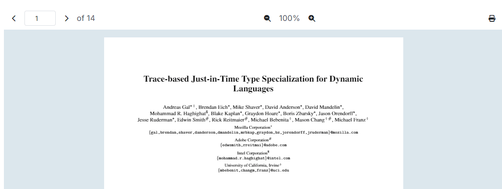
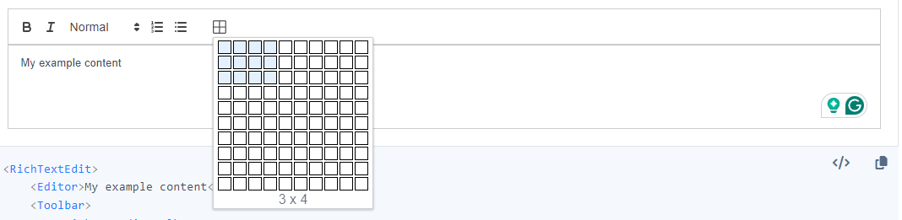
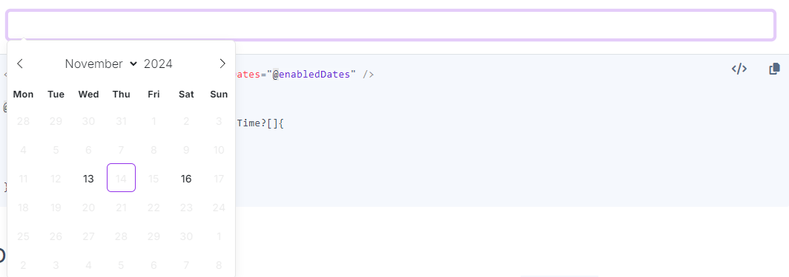

# Announcing Blazorise 1.7 - Kornati

Welcome to the Blazorise 1.7 release, packed with exciting new features, optimizations, and support for the latest .NET framework. Dive into the highlights below to explore how Blazorise 1.7 can enhance your applications.

## Key Blazorise 1.7 Highlights 💡

Here's a summary of what's new in this release:

- **.NET 9 Support**: Blazorise 1.7 now fully supports .NET 9, enabling compatibility with the latest features, improved performance, and security benefits.
- **New PdfViewer Component**: Easily render PDF documents with the new PdfViewer component, including zoom and navigation options. Ideal for integrating document viewing into your apps.
- **New Skeleton Component:** Provide loading placeholders to enhance user experience, with a customizable Skeleton component for seamless integration and improved perceived performance.
- **RichTextEdit Table Support (Experimental):** Support for tables is now available in the RichTextEdit component through a community-developed module, enhancing your text-editing capabilities.
- **Object Fit:** flexible options for element scaling and positioning.
- **SelectedCell API:** listen to the cell selection changes while navigating through DataGrid.
- **Chart:** Tooltip callbacks
- **Optimizations**: Optimized the internals of of Blazorise.

Dive into each section for a comprehensive overview of these features and learn how they can enhance your projects. We value your feedback and encourage you to share your thoughts as we continue to refine and improve Blazorise.

## Upgrading from 1.6.x to 1.7 👨‍🔧

Upgrade your Blazorise application seamlessly with the following steps:

Update all **Blazorise.*** package references to **1.7**.

Blazorise should now work withut any major breaking change to the API, but there are some necessary changes that we had to do to make Blazorise better. Continue reading the Migration section for more details.

## Migration Notes 🛠

A few API changes and behavior updates have been introduced in Blazorise 1.7 to improve consistency and functionality. Here’s a summary:

**Video Component API Changes**

- `Seeking`: event changed from `Func<Task>` to `Func<double, Task>`
- `Seeked`: event changed from `Func<Task>` to `Func<double, Task>`

**BarItem Behavior Change**

- BarItem no longer has `cursor: pointer` as the default behavior. This aligns with UX best practices, particularly for disabled items. Buttons and links within BarItem will still show the pointer cursor as before.

**ChartTooltips Tooltips renamed**

- The option under the `ChartPlugins.ChartTooltips.Tooltips` had a typo. We had to rename it to the `ChartPlugins.ChartTooltips.Tooltip`.

## New Features & Enhancements 🚀

### .NET 9 Support

Blazorise now fully supports .NET 9. This update ensures compatibility with the latest .NET version, allowing you to leverage the newest features and enhancements in your Blazor applications. By upgrading to .NET 9, you can take advantage of improved performance, security, and productivity benefits, while maintaining seamless integration with Blazorise components and utilities.

### Autocomplete

Previously, the Autocomplete component had a limitation in handling repeated text values. With this update, Autocomplete now supports repeated text entries, allowing you to include multiple items with the same display text. Note that while texts can be repeated, the values must still be unique to ensure proper functionality. This enhancement adds flexibility when working with datasets that include duplicate display names.

### Object Fit Utility

The ObjectFit utility is designed to give developers precise control over how elements fit within their containers. With options like Default, None, Contain, Cover, Fill, and Scale, you can adapt content to fit within various containers while preserving or adjusting the aspect ratio. Additionally, a fluent interface, IFluentObjectFit, is provided for easier configuration and application of these styles. This utility ensures responsive design and performance improvements, making it easier to achieve consistent and adaptable layouts across different devices and screen sizes.

This utility is especially useful for HTML replaced element such as img, video, iframe.

Be sure to update your projects to incorporate these new capabilities and refer to the updated documentation for guidance on implementation.

### Video Improvements

#### Disable Fullscreen Mode

Added `DoubleClickToFullscreen` parameter to the Video component. This parameter allows you to enable or disable the fullscreen mode when the video is double-clicked.

#### Set Playback Rate

Added `SetPlaybackRate` method to the Video component. This method allows you to manually set the playback rate of the video. This can be useful if you want to speed up or slow down the video playback.

#### Controls Delay

Added `ControlsDelay` parameter to the Video component. This parameter allows you to define the delay in milliseconds while media playback is progressing without user activity to indicate an idle state and hide controls.

### Tooltip Delay

Added an option to delay the tooltip show and hide events with the new `ShowDelay`, and `HideDelay` parameters. This can be useful if you want to prevent the tooltip from showing immediately after the trigger event.

Along with the options to define delay on each individual Tooltip, we have also added a global options to define the delay for all tooltips. This can be done by setting the `TooltipOptions` property in the `.AddBlazorise()` during the application start process.

### New Table FixedColumnsPositionSync Parameter

The new `FixedColumnsPositionSync` parameter in the Table component enables ongoing synchronization of fixed columns. This feature is particularly useful when adding new columns dynamically, as it recalculates the column positions to maintain the layout integrity. By keeping columns aligned, this parameter helps ensure a consistent and visually cohesive table structure, even as content changes.

### DataGrid

#### New Between Filter Method

Now available on number and date columns when the Filter Mode is set to Menu. The `DataGridColumnFilterMethod.Between` method enables filtering by a range of values, improving precision and flexibility.

The filtering mechanism was reworked such that SearchValue can now contain a range of values. This allows for more advanced filtering options, such as filtering by a range of dates or numbers. The new `DataGridColumnFilterMethod.Between` option enables you to filter data based on a range of values, providing greater flexibility and precision in your filtering criteria.

#### New Parameter FixedColumnsPositionSync

Added `FixedColumnsPositionSync` parameter. This parameter allows you to keep synchronizing the fixed columns positions. This is useful when you want to be adding new columns dynamically, and the columns need to be recalculated.

#### SelectedCell API

Added `SelectedCell` and `SelectedCellChanged` parameters, you can now listen to the cell selection changes when the `Datagrid.NavigationMode` is set to `NavigationMode.Cell`

#### DataGridDateColumn

Replaced the rendered `DateEdit` component by a `DatePicker`. This change provides you with improved flexibility over the limitations of the `DateEdit`. You will find new `DatePicker` parameters in the `DataGridDateColumn` to further customize how your date behaves.

#### Column Text Styling

Added `TextTransform`, `TextDecoration`, `TextWeight`, `TextOverflow`, and `TextSize` parameters to the `DataGridColumn` component. This will allow you to easily style the text in the DataGrid.

All the new text styling parameters are also available for headers, filter, and aggregate cells of the DataGrid.

#### New SortComparer Parameter

Added `SortComparer` parameter. This parameter allows you to provide a custom comparer for sorting items in a column using custom logic. Note that this comparer can only be used with in-memory data sources.

#### Undeprecate CellClass and CellStyle

After our community has convinced us that these parameters are still useful, we have decided to undeprecate them. We have undeprecated the `CellClass` and `CellStyle` parameters in the `DataGridColumn` component. These parameters allow you to define the class and style for the cell based on the cell item value.

### TreeView Virtualization

With the new virtualization capability, the TreeView component efficiently manages large datasets by only rendering nodes currently in view. This improvement is especially useful for applications with extensive hierarchical structures, as it minimizes memory usage and reduces load times, resulting in faster interaction and smoother scrolling.

By limiting the number of rendered DOM elements, TreeView virtualization not only enhances performance but also improves the overall user experience, making navigation through large node structures more responsive and manageable.

### New PdfViewer Component

We are excited to introduce the new PdfViewer component in version 1.7. This component provides a powerful and flexible solution for rendering PDF documents within your application. With this release, you can now easily integrate PDF viewing capabilities directly into your projects, using a simple and intuitive API. The PdfViewer supports a variety of features, including zooming and page navigation, and can be used both standalone or in conjunction with other components like PdfViewerToolbar.

In this initial release, the PdfViewer supports read-only mode, allowing users to view and navigate through PDF files. We are planning to add text selection and other interactive features in future updates.

For detailed usage instructions and integration examples, please visit the PdfViewer documentation.

### New RouterTabs Component

We are excited to introduce the new RouterTabs component! Once set up, this component automatically generates tabs for each page that the user navigates to, streamlining tabbed navigation across your application.

For further details and setup instructions, check out the RouterTabs Documentation.

### Updated Icons

All icons have been updated to use `public const string` instead of `public static readonly string`. While this change does not affect how icons are used, it makes the code cleaner and more readable. Additionally, this update enables the use of named icons within attributes, providing greater flexibility in customization.

FontAwesome icons have also been upgraded to version 6.6.0, bringing new icons and fixes to some existing ones. This enhancement ensures that your applications have access to the latest icon options and improvements.

This change was made by our community member mtbayley. We are grateful for his contribution and we are looking forward to more contributions from him.

### RichTextEdit Table Support

Implementing table support in the RichTextEdit component presented unexpected challenges. Initially, we anticipated a straightforward addition, but upon further investigation, we found that table support in RichTextEdit remains minimal and largely experimental.

To address these limitations, we explored alternative solutions and identified a community-developed table module that, while unofficial, provided a workable option. By integrating this module into Blazorise's RichTextEdit, we were able to achieve a functional outcome for table support.

Since this module is unofficial, we have marked table support in RichTextEdit as experimental. This designation will remain until Quill.js releases an official table module.

### Text Decoration Utility

The latest update introduces flexible text decoration options in Blazorise. You can now easily apply underline, line-through, and overline styles to text, or remove decorations altogether with the none option. These enhancements allow for more refined text styling and improved design flexibility in your applications.

For more details and examples, visit the Text Decoration documentation.

### Radio Group Button Colors

You can now customize the color of RadioGroup buttons by setting the `Color` property on the `Radio` component.

This feature allows for easy differentiation between options within the RadioGroup, enhancing the visual appeal of your forms and providing a more tailored user experience.

### Charts Tooltip Callbacks

The new `Callbacks` parameter in `ChartTooltip` options enables you to define custom callbacks for tooltips. This can be particularly useful when you want to customize tooltip content or appearance based on specific data points.

Please note that this feature is experimental. The callbacks work by converting a C# lambda into a JavaScript function, which is then passed to Chart.js. Since the JavaScript function cannot directly access the C# context, extra care is needed when using this feature.

### ToastProvider Improvements

The ToastProvider component, a versatile helper for displaying alerts and notifications, has received valuable enhancements. It now includes options to handle `Opening` and `Closing` events, allowing you to perform specific actions before a toast is shown or hidden.

These improvements make the ToastProvider even more flexible, providing greater control over notification timing and behavior within your applications.

### Skeleton

The new Skeleton component enhances user experience by providing loading placeholders for components or pages. These placeholders visually indicate that content is loading or temporarily unavailable, helping manage user expectations and improve perceived performance. The Skeleton component is highly customizable, allowing you to seamlessly integrate it into your projects for a polished, professional appearance.

For more information on how to use the Skeleton component and customize loading placeholders, refer to the Skeleton documentation.

### Improved Flex Utilities

Our Fluent Flex utilities have been enhanced to allow for more responsive and adaptable layouts. Previously, defining breakpoint-specific flex rules was not supported, making it challenging to set distinct flex behavior across breakpoints. With this update, you can now define flex rules separately for each breakpoint and specify the order of flex rules, giving you finer control over layout responsiveness and flexibility.

### BarItem Cursor Default Behavior

Previously, hovering over the BarItem displayed a pointer cursor by default. However, this behavior led to issues with disabled buttons, where a standard cursor is more appropriate and better aligns with UX principles.

Buttons and links inside the BarItem will still show the pointer cursor as before. If you have a div inside a BarItem, the default cursor behavior has been updated to reflect these UX improvements.

### New DatePicker EnabledDates

The `EnabledDates` property in the DatePicker component allows you to specify a set of selectable dates, restricting users to choose only from these predefined dates. This feature is especially useful when limiting date selections to specific, valid options, enhancing date selection control in your applications.

### DropZone Reordering

The `Reordered` callback has been added to the `DropZone` component. This callback triggers whenever items within the `DropZone` are reordered, allowing you to perform additional actions in response to item reordering. This enhancement adds flexibility for managing dynamic lists and collections within your application.

## Blazorise Optimizations

### Refactored Class Providers

Blazorise has undergone substantial internal optimizations to make it even more adaptable for customizations. While these changes may not be immediately visible, they bring powerful benefits if you’re implementing a custom CSS provider or design system.

Specifically, we’ve updated the signatures of many `IClassProvider` methods to accept extra attributes. This adjustment grants each CSS provider greater control over how class names are assigned and rendered, offering more flexibility for unique design implementations.

### Strongly Typed JS Interop API

In line with our ongoing efforts to streamline code and enhance performance, we’ve introduced a new strongly typed JS interop API. This API provides a type-safe, intuitive approach for interacting with JavaScript directly from C#, simplifying work with JavaScript objects and functions in Blazor applications.

This enhancement improves code readability and maintainability while enabling safer testing and debugging, resulting in a more robust development experience with Blazorise.

## Final Notes

The Blazorise 1.7 release, packed with innovative features, performance improvements, and new components, represents a significant step forward for developers working with Blazor applications. From enhanced control over UI components to new utilities that streamline functionality, this update provides greater flexibility and customization to meet your development needs.

As always, your feedback is invaluable in guiding future Blazorise development. We encourage you to try out the new features and let us know your thoughts. Thank you for your continued support and enthusiasm for Blazorise, and we look forward to bringing you even more enhancements in future updates!
