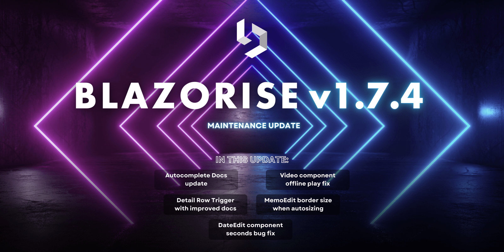

# Maintenance release: Blazorise 1.7.4

We are excited to announce the release of Blazorise 1.7.4, bringing improvements, fixes, and better documentation for a smoother development experience. This release focuses on refining existing components and enhancing documentation to support developers using Blazorise.

## What's New in 1.7.4

Resolved an issue where DateEdit was not working properly with seconds, improving date-time precision.

The border size is now considered when auto-sizing the MemoEdit component, ensuring a better fit.

## Additional Improvements

Along with the major fixes, we have addressed several other bugs and made minor improvements to enhance the overall user experience and functionality of Blazorise. We appreciate your patience and continuous support as we work to make Blazorise better with each update.

We encourage you to update to version 1.7.4 to benefit from these fixes and improvements. As always, please report any issues or provide feedback to help us continue improving.

- [#4826](https://github.com/Megabit/Blazorise/issues/4826): Autocomplete Docs : Provide ReadData + Virtualize example
- [#5928](https://github.com/Megabit/Blazorise/issues/5928): Video component for offline play
- [#4745](https://github.com/Megabit/Blazorise/issues/4745): Detail Row Trigger : Better docs with common cases
- [#5953](https://github.com/Megabit/Blazorise/issues/5953): DateEdit doesn't work with seconds
- [#5952](https://github.com/Megabit/Blazorise/pull/5952): MemoEdit: include border size when autosizing

## Feedback

Your feedback is essential to us, and we appreciate your continued support and contributions to Blazorise. If you have any questions, suggestions, or feedback, please feel free to reach out to us on.

## Known incompatibilities

As of now, there are no known incompatibilities with the previous Blazorise 1.6.x releases. We encourage all users to upgrade to 1.7.4.

If you experience any unexpected behavior change in your projects after upgrading to 1.7.4, please file an issue on GitHub.

## Commercial Support

Blazorise, as an open-source project, relies on the support and contributions of our user community. We offer commercial licenses to help fund the ongoing development and maintenance of Blazorise. Your support is essential to ensuring the continued growth and success of Blazorise.

With a commercial license, you will have access to premium forum support, private repositories and community-licensed themes. To learn more about commercial licenses, please visit our website at Blazorise Commercial.
