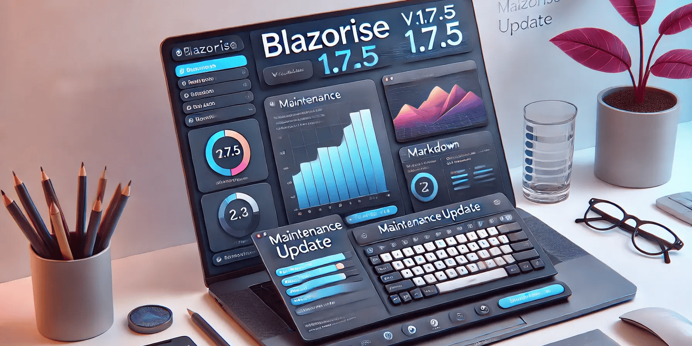

# Maintenance release: Blazorise 1.7.5

Blazorise 1.7.5 is a maintenance release focusing on bug fixes and refinements to improve stability and functionality across various components.

This release addresses key issues related to the DataGrid, Markdown, Video, and Navbar (BarToggler) components, ensuring a smoother development experience. Notable improvements include enhanced Markdown file upload handling, better DataGrid cell focus behavior, and fixes for the Seeking event in the Video component. Additionally, several UI inconsistencies affecting FluentUI, Tailwind, and Bulma frameworks have been resolved. Read on for the full list of changes.

## Key Highlights in 1.7.5

Managing uploaded files in the Markdown component is now more efficient. With the newly merged uploaded files callback, developers can seamlessly process multiple file uploads without unnecessary complexities. This change enhances the Markdown editing experience by reducing errors and improving user workflow.

A long-standing issue in the DataGrid where cancelling a cell edit would not restore focus has been fixed. Now, when a user cancels an edit, the focus properly returns to the relevant cell, ensuring a more intuitive and user-friendly interaction.

## Fix for Video Component Seeking Event

The Seeking event in the Video component was previously unreliable, leading to issues when users attempted to scrub through video content. This has been fixed, allowing seamless seeking behavior and better control over video playback.

We encourage you to update to version 1.7.5 to benefit from these fixes and improvements. As always, please report any issues or provide feedback to help us continue improving.

## Changelog

- [#4932](https://github.com/Megabit/Blazorise/issues/4932): DataGridCheckColumn does not use Theme.ColorOptions.Primary
- [#5970](https://github.com/Megabit/Blazorise/issues/5970): Seeking event not firing properly on video component
- [#5961](https://github.com/Megabit/Blazorise/issues/5961): [Bug]: Markdown ImageUploadChanged throws exception and has "odd" behavior
- [#5981](https://github.com/Megabit/Blazorise/issues/5981): [Bug]: BarToggler is not set for FluentUI Dark mode
- [#5881](https://github.com/Megabit/Blazorise/issues/5881): [Bug]: BarToggler not showing up (present in official Tailwind Demo app)
- [#5985](https://github.com/Megabit/Blazorise/issues/5985): [Bug]: BarToggler is not centered
- [#5919](https://github.com/Megabit/Blazorise/issues/5919): [Bug]: Bulma + Tailwind - Missing hamburger/collapse icon for sidebar
- [#5977](https://github.com/Megabit/Blazorise/issues/5977): Markdown: merge uploaded files callback
- [#5979](https://github.com/Megabit/Blazorise/issues/5979): DataGrid: New rows created when BatchEdit enabled, is not cancelable
- [#5978](https://github.com/Megabit/Blazorise/issues/5978): DataGrid: when cell editing is cancelled the focus must return to the cell

## Feedback

Your feedback is essential to us, and we appreciate your continued support and contributions to Blazorise. If you have any questions, suggestions, or feedback, please feel free to reach out to us on.

## Known incompatibilities

As of now, there are no known incompatibilities with the previous Blazorise 1.6.x releases. We encourage all users to upgrade to 1.7.5.

If you experience any unexpected behavior change in your projects after upgrading to 1.7.5, please file an issue on GitHub.

## Commercial Support

Blazorise is an open-source project that thrives on community contributions and support. To sustain ongoing development and improvements, we offer commercial licenses that provide additional benefits while ensuring the project's long-term success.

With a commercial license, you gain access to premium forum support, private repositories, and exclusive community-licensed themes. Your support directly contributes to the enhancement of Blazorise and ensures its continuous growth.

To explore commercial licensing options, visit our website at Blazorise Commercial.
