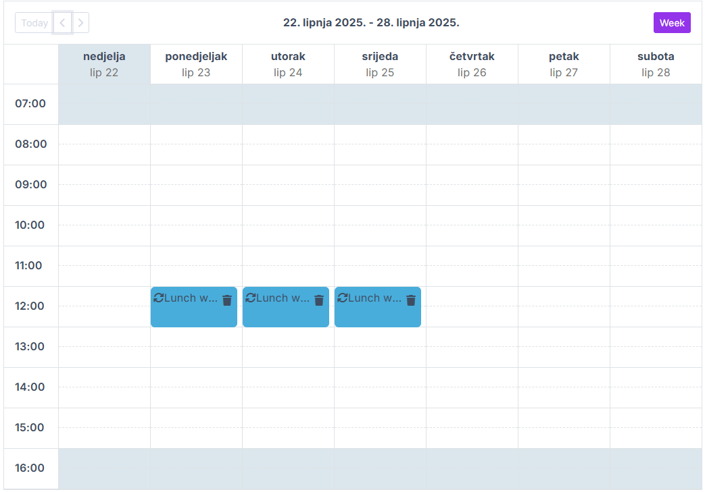
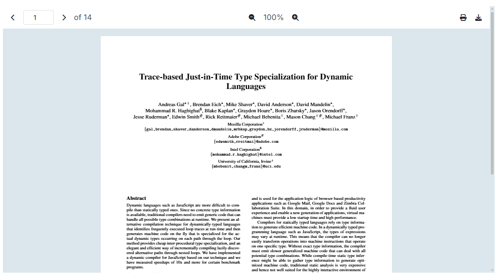
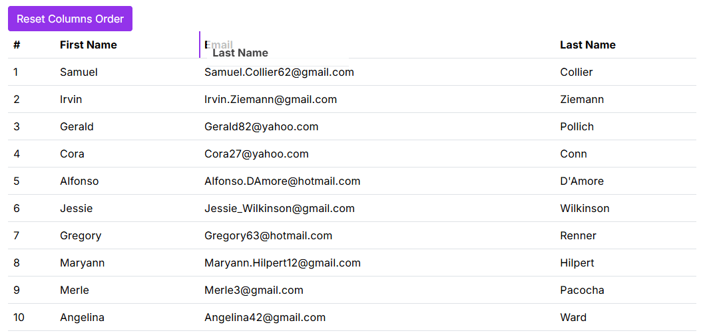

# Announcing Blazorise 1.8 - Lokrum

When we released Blazorise 1.7, we promised that the next version would be a major one, 2.0. However, we realized that we still have a lot of work to do before releasing Blazorise 2.0, so we decided to release version 1.8 with some exciting new features and improvements in the meantime.

Blazorise 1.8, codenamed **Lokrum** after the beautiful island in Croatia, is a significant update that brings a host of new features, enhancements, and optimizations to the framework. This release focuses on improving the developer experience, enhancing performance, and expanding the capabilities of Blazorise components.

## Key Blazorise 1.8 Highlights 💡

Here's a summary of what's new in this release:

- **Scheduler**: A powerful new component for comprehensive event scheduling.
- **DataGrid**: Enhanced column reordering and batch editing capabilities.
- **Chart Plugins**: Improved lifecycle for better performance.
- **MessageService**: New Choices method for streamlined user interaction.

Dive deeper below to discover the full potential of these features.

## Upgrading from 1.7.x to 1.8 👨‍🔧

To smoothly upgrade your application, follow these simple steps:

Update all **Blazorise.*** package references to **1.8**.

Blazorise should now work without any major breaking changes to the API.

## New Features & Enhancements 🚀

### Scheduler Component

The most significant addition in this release is the `Scheduler` component. This powerful new component allows you to create and manage events in a calendar-like interface, making it ideal for applications that require scheduling functionality.

We built it fully using Blazorise core elements, without any dependencies on third-party libraries, making it easy to customize and extend to fit your specific needs. In the end, we succeeded in creating a fully functional scheduler component that is both powerful and flexible.

As expected, it offers various types of views (Day, Week, Month, etc.), editing features, drag-and-drop, recurring events, and more. We have no doubt it will become a valuable addition to your Blazorise toolkit.

You can see it in action in the [Scheduler documentation](docs/extensions/scheduler "Link to Scheduler") pages.

### PdfViewer Component Enhancements

The `PdfViewer` component has received several enhancements in this release, making it more powerful and user-friendly.

#### PrintRequested Event

Thanks to community contributor [11bthornton](https://github.com/11bthornton "Link to 11bthornton"), the component now supports the `PrintRequested` event callback, which triggers when the user requests to print the PDF document. It is a small but significant improvement that enhances the user experience.

#### Download Feature

`PdfViewer` now includes built-in support for downloading the displayed PDF document. When enabled, a download button appears in the viewer toolbar, allowing users to save the PDF to their device. It supports both direct file URLs and base64-encoded data sources.

#### Toolbar Localization

The `PdfViewer` component is now fully localized, allowing you to customize the toolbar text based on the current culture. This is particularly useful for applications that need to support multiple languages, ensuring accessibility and usability for all users.

### DataGrid Enhancements

As always, we have made improvements to the `DataGrid` component, one of the most popular components in Blazorise. This time we focused on enhancing batch editing capabilities, adding new features, and improving the overall user experience.

#### The New Method Overload

Introduced the `Task New( TItem newItem )` overload method, enabling the programmatic addition of new items to the batch edit collection when batch editing is enabled. This ensures that newly added items are tracked as **unsaved changes**, allowing them to be persisted upon saving or discarded upon cancellation.

#### Default Select Filter

New parameters `FilterDefaultItemText`, `FilterDefaultItemValue`, `FilterDefaultItemDisabled`, and `FilterDefaultItemHidden` allow customizing the default item shown in filter dropdowns of `DataGridSelectColumn`. This gives developers more control over filter presentation and improves user experience when working with dropdown filters.

#### EditState for EditTemplate

The `EditTemplate` of `DataGridColumn` now includes an `EditState` argument. This allows you to determine the current edit state of the row, enabling customization of the template based on whether the row is in edit mode or not.

#### Add Caption to DataGrid

Based on our work with `TableCaption`, the `DataGrid` now supports a `Caption` property. This can be used to provide additional context about the displayed data, which is especially useful for accessibility. The caption is rendered as a `caption` element, improving the grid's semantic structure.

You can see it in action in our new [DataGrid Accessibility](docs/extensions/datagrid/features/accessibility "Link to DataGrid Accessibility") section.

#### GroupSeparator for Numeric Columns

The `DataGridNumericColumn` component now includes a `GroupSeparator` parameter. This allows you to specify a custom group separator for numeric columns, enhancing the readability of large numbers by grouping digits in a more user-friendly way.

#### Reordering Columns

The `DataGrid` component now supports reordering columns by dragging and dropping them. By simply enabling the `Reorderable` parameter on the `DataGridColumn`, users can rearrange columns to their preferred order. This feature enhances user experience by allowing customization of the grid layout according to user preferences.

On top of that, we have also added a `ResetDisplayOrder` method to the `DataGrid` component, which allows you to reset the column order to the default state. This can be useful in scenarios where you want to provide users with the option to revert any changes made to the column order.

### DatePicker Enhancements

#### Week Numbers

The `DatePicker` component now includes a `ShowWeekNumbers` parameter. When enabled, the calendar displays ISO week numbers alongside each row. This can be helpful for planning or referencing by week.

#### Calendar Buttons

The `DatePicker` component now includes a `ShowTodayButton` parameter, and a `ShowClearButton` parameter. When enabled, these buttons appear on the calendar, allowing users to quickly select the current date or clear the selected date, respectively. This enhances usability and provides a more intuitive experience for users interacting with the date picker.

### Chart Enhancements

#### Optimized Plugins Lifecycle

This release introduces a major optimization to the Chart plugin system by centralizing shared logic and lifecycle handling within the ChartPlugin base class. By moving common properties, initialization, and disposal routines into a unified location, the update significantly reduces duplicated code across individual plugins and simplifies their overall structure. This change also enhances how plugins are connected to BaseChart, resulting in cleaner integration and more reliable async event handling between charts and their plugins.

The refactoring addresses longstanding pain points related to plugin lifecycle management and ensures that disposal and initialization are consistently handled. This unified approach not only improves maintainability but also helps prevent potential bugs across all plugins.

As part of this effort, it was also noted that some plugins, such as the Streaming plugin, may require implementations of methods like `OnParametersSetAsync` to ensure all configuration parameters are properly updated during the component lifecycle.

#### Renamed Chart Options

We had a wrongly named option on the `DoughnutChartOptions`, and `PieChartOptions` classes. The `CutoutPercentage` property has been renamed to `Cutout`. This change aligns with the Chart.js documentation and ensures consistency across the API. Since the field was already wrongly named, this change should not break any existing code. However, if you were using the `CutoutPercentage` property, you will need to update your code to use the new `Cutout` property.

To make it more flexible we have also made it an `object` type, so you can use it as a percentage or a number. This change allows you to specify the cutout value in either pixels or as a percentage of the chart's radius, providing greater flexibility in how you configure your charts.

#### Chart Zoom Plugin

We have introduced new set of APIs for the `ChartZoom` plugin. The new API are `Zoomed`, `SetZoomLevel`, and `GetZoomLevel`, and `ResetZoomLevel`. These new APIs provide a more intuitive and flexible way to manage zoom levels in your charts. The `Zoomed` event is triggered when the chart is zoomed, allowing you to respond to zoom changes in real-time. The `SetZoomLevel` method allows you to programmatically set the zoom level of the chart, while the `GetZoomLevel` method allows you to retrieve the current zoom level. Finally, the `ResetZoomLevel` method allows you to reset the zoom level of the chart to its original state.

The `ChartZoom` plugin has been updated to support the latest `chartjs-plugin-zoom.js` version. It is recommended to update your references to use new `https://cdn.jsdelivr.net/npm/chartjs-plugin-zoom@2.2.0/dist/chartjs-plugin-zoom.min.js` to ensure compatibility with the latest features and bug fixes.

### Autocomplete Disabled Items

The `Autocomplete` component now supports disabling specific items in the suggestion list. You can provide a function to determine which items should be inactive, preventing users from selecting them. This is helpful in cases where some options shouldn't be available for interaction.

### RichTextEdit Enhancements

#### Export Semantic HTML

The `RichTextEdit` component now includes an `GetHtmlAsync` overload that allows you to export the current content as semantic HTML. This is particularly useful for applications that require clean and structured HTML output, such as when saving or sharing content.

#### Image and Video Resizing

We've introduced a new resizing feature for images and videos within the `RichTextEdit` component. Users can now directly resize multimedia content within the editor, enhancing flexibility and providing a smoother editing experience. This functionality can be conveniently enabled or disabled via the `UseResize` parameter, allowing easy customization to meet your project's specific needs.

For comprehensive guidance, including usage instructions and integration examples, please refer to our [RichTextEdit documentation](docs/extensions/richtextedit).

### Some Other Improvements Worth Mentioning

#### RouterTabs Localization Support

`RouterTabs` now supports localization, allowing dynamic tab titles based on the current culture. Titles can be set via resource files or other localization strategies, ensuring consistency with the app's language settings.

#### Cropper Component Enhancements

The `Cropper` component has been enhanced with the `ImageLoadingFailed` event, which triggers when an image fails to load. This event provides a way to handle errors and display a custom message or image in place of the failed image.

#### Customizable TimePicker Increments

The `TimePicker` component now supports `HourIncrement` and `MinuteIncrement` parameters. These allow you to customize the step intervals shown in the time selection dropdown.

#### Table Caption

The `Table` component now has a `TableCaption` child component, allowing you to add a caption to the table. This caption can be used to provide additional context or information about the data being displayed in the table. The `caption` element is usually used for accesibility purposes, and it is recommended to use it when the table contains a lot of data or when the table is complex.

#### Flex Basis Utilities

We have introduced a new new `Flex.Basis` utiities that will help more easily set the flex-basis property in your app without the need to write custom CSS. The new utilities are `Flex.Basis.Auto`, `Flex.Basis.Full`, and `Flex.Basis.Is0`.

#### Multiple Highlights for Highlighter Component

The `Highlighter` component now supports highlighting multiple phrases within the same text using the new `HighlightedTexts` parameter. This enhancement allows developers to pass a list of strings to be highlighted simultaneously, replacing the previous limitation of only a single `HighlightedText`. The update enables more dynamic and flexible highlighting scenarios, such as multi-word search, filtering, and complex keyword matching, all with minimal changes to existing implementations.

#### Choices on MessageService

The `MessageService` now supports the `Choices` method, allowing you to display a list of options in a message dialog. This feature is useful for scenarios where you want to present users with multiple choices and handle their selection accordingly.

#### Culture-specific overloads for Text Localization

The `ITextLocalizer` interface now includes overloads for the `GetString` method that accept a `CultureInfo` parameter. The `CultureInfo` parameter can be used to specify the desired culture for localization, enabling you to retrieve strings that are tailored to the user's language and region. This is particularly useful in scenarios where you need to support multiple languages or regions within your application.

### Contribution from Community

#### Steps Lazy Loading

The `Steps` component now supports lazy loading, and is working simillar to our [Tabs](docs/components/tab "Link to Tabs") component. This means that the content of each step is only loaded when the step is activated, which can improve performance and reduce initial load times for applications with many steps or complex content.

This feature was contributed by " Title="Link to brhinescot">brhinescot, and we appreciate their contribution to the Blazorise community.

You can see it in action in the [Steps documentation](docs/components/step "Link to Steps").

## Final Notes

We are thrilled to bring you Blazorise 1.8 with so many new features and improvements. This release reflects our commitment to continuously enhancing the framework based on community feedback and evolving application needs.

As always, we encourage you to upgrade, explore the new components and enhancements, and share your feedback with us. Your contributions, bug reports, and feature suggestions drive Blazorise forward and help make it the best it can be for everyone.

We greatly value community contributions. If you're interested in contributing, reporting issues, or suggesting features, visit our [GitHub repository](https://github.com/Megabit/Blazorise "GitHub Repository") and join the discussions.

Looking ahead, we are continuing work on Blazorise 2.0, which will introduce even more powerful features and architectural improvements. Stay tuned for previews and announcements in the coming months.

Once again, thank you for your continued support, feedback, and enthusiasm. Together, we're building an even stronger Blazor ecosystem.
