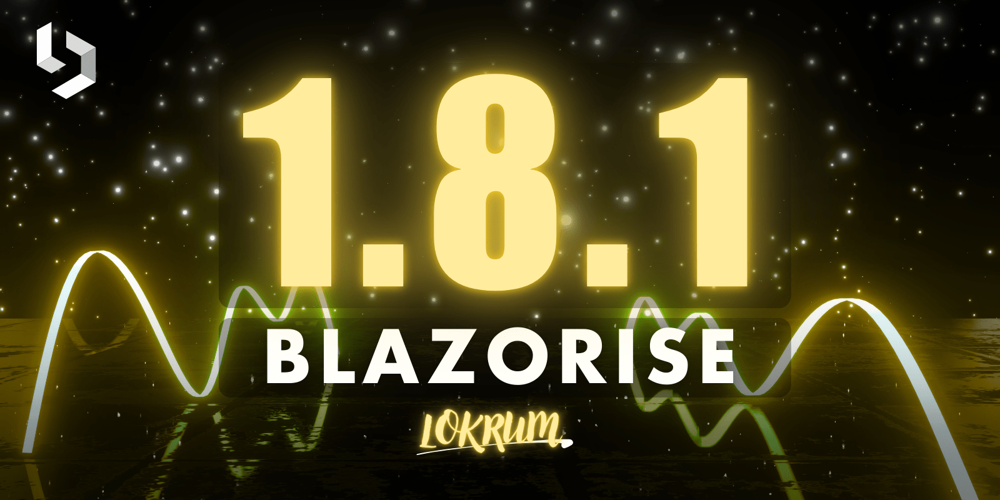

# Blazorise 1.8.1 – Maintenance Release

Blazorise 1.8.1 is now available! This maintenance release focuses on resolving key issues and delivering refinements that improve overall stability, consistency, and usability across the framework.

Although primarily a maintenance update, version 1.8.1 introduces meaningful improvements to components such as Bar, Badge, PdfViewer, and DataGrid, ensuring a smoother developer experience and more polished UI behavior.

## Key Highlights in 1.8.1

Several critical bugs have been fixed, including issues with Divider styling, PdfViewer worker loading, and Badge close button colors. Additionally, exceptions in Splitter and ChartZoom components have been resolved, leading to a more stable runtime experience.

The DataGrid now correctly passes updated objects in the RowUpdated event, ensuring proper synchronization with your data source. The grouping drop area has also been visually improved by removing unnecessary light background styling. Meanwhile, the Bar can now be collapsed externally, and BarDropdownItem supports a new CustomMatch parameter for better navigation scenarios.

The JSRichTextEditModule is now overridable, offering greater extensibility. We also added a dedicated unit test setup for Charts, helping ensure reliability and easier contributions moving forward.

## Full Changelog

- [#6164](https://github.com/Megabit/Blazorise/issues/6164): Divider styling not complete
- [#6166](https://github.com/Megabit/Blazorise/issues/6166): JSDisconnectedException in Splitter on circuit disconnect
- [#6173](https://github.com/Megabit/Blazorise/issues/6173): BarDropdownItem: add CustomMatch parameter
- [#6175](https://github.com/Megabit/Blazorise/issues/6175): Notification service example not showing options
- [#6177](https://github.com/Megabit/Blazorise/issues/6177): Possibility to collapse Bar from outside component
- [#6180](https://github.com/Megabit/Blazorise/issues/6180): Badge close button does not inherit correct theme color
- [#6184](https://github.com/Megabit/Blazorise/issues/6184): Exception by invoking 'NotifyZoomLevel' in ChartZoom
- [#6187](https://github.com/Megabit/Blazorise/issues/6187): PdfViewer loads pdf.worker.min.mjs from wrong location
- [#6178](https://github.com/Megabit/Blazorise/issues/6178): RowUpdated event passes cloned object, preventing updates
- [#6199](https://github.com/Megabit/Blazorise/issues/6199): Make JSRichTextEditModule overridable, remove sealed keyword
- [#6198](https://github.com/Megabit/Blazorise/issues/6198): Add unit tests setup for Charts
- [#6196](https://github.com/Megabit/Blazorise/issues/6196): Outline style support for Info icon
- [#6197](https://github.com/Megabit/Blazorise/issues/6197): Remove light background from DataGrid grouping drop area

## Feedback

Your feedback is essential to us, and we appreciate your continued support and contributions to Blazorise. If you have any questions, suggestions, or feedback, please feel free to reach out to us on.

## Known incompatibilities

As of now, there are no known incompatibilities with the previous Blazorise 1.7.x releases. We encourage all users to upgrade to 1.8.1.

If you experience any unexpected behavior change in your projects after upgrading to 1.8.1, please file an issue on GitHub.

## Commercial Support

Blazorise is an open-source project that thrives on community contributions and support. To sustain ongoing development and improvements, we offer commercial licenses that provide additional benefits while ensuring the project's long-term success.

With a commercial license, you gain access to premium forum support, private repositories, and exclusive community-licensed themes. Your support directly contributes to the enhancement of Blazorise and ensures its continuous growth.

To explore commercial licensing options, visit our website at Blazorise Commercial.
