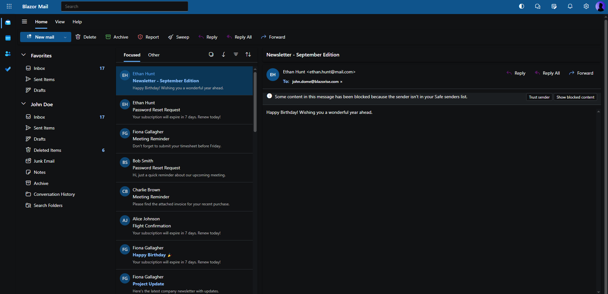

# Blazorise 1.8.2 – Maintenance Release (with extras!)

Blazorise 1.8.2 is now available! While this is primarily a maintenance release, we decided to go a bit further than usual: alongside targeted fixes, we shipped several **critical improvements** and a couple of **new APIs** to immediately benefit real-world apps. This isn't something we typically do in a patch release, but we felt these updates were stable, safe, and genuinely useful-so you can take advantage of them right away.

## What's New in 1.8.2

Here are the most notable additions and improvements:

### FluentUI Dark Theme

Added a **dark theme** for FluentUI, including tuned color tokens for comfortable contrast and consistent styling across components.

The dark palette covers surfaces, typography, and accent tokens so core components (DataGrid, Modal, Sidebar, Dropdown, Button, Tabs, etc.) look consistent out of the box. It also respects your existing light/dark toggling approach, so if you already switch color schemes at the app level, FluentUI will follow suit.

### RichTextEdit Plug-in Registration Control

Only register additional plug-ins if explicitly specified in options-giving you finer control over payload and behavior.

### DatePicker Initial Time Values

Added the ability to set the **initial hour** and **minute** values, making time-sensitive scenarios easier out of the box.

The initial time is applied when the control first renders (or when it's cleared), helping users jump straight to the intended time instead of scrolling from midnight. This is especially helpful for scheduling apps, calendar inputs, and any workflow where a common start time (e.g., 09:00) is expected.

### DataGrid Numeric Filtering Fix

Numeric columns now default to **equals** instead of **contains** when filtering. This matches user expectations and avoids false positives (for example, filtering for `10` will no longer match `210`).

## Experimening

### Blazorise Outlook Clone

We've also been experimenting with **Blazorise FluentUI** by building a small **Outlook clone**. It's a fun demo that shows how far you can go with the Blazorise FluentUI provider-layout, navigation, and productivity UX all in one place.

If you're curious, check out the source code here: [github.com/Megabit/BlazoriseOutlookClone](https://github.com/Megabit/BlazoriseOutlookClone).

## Full changelog

Everything that went into 1.8.2:

- [#6209](https://github.com/Megabit/Blazorise/pull/6209): RichTextEdit: Only register additional plug-ins if specified in options
- [#6213](https://github.com/Megabit/Blazorise/issues/6213): Add the ability to set initial value of the hour and minute element of the DatePicker
- [#6215](https://github.com/Megabit/Blazorise/pull/6215): FluentUI: add dark theme colors
- [#6140](https://github.com/Megabit/Blazorise/issues/6140): [Bug]: Filtering DataGrid numeric column value defaults to contains instead of equals

## Upgrading

This is a drop-in update within the **1.8.x** line. There are no breaking changes expected for typical setups. As always, review the items above if you rely on specific behaviors (e.g., RichTextEdit plug-in registration or DataGrid filtering defaults).

## Thank you & commercial support

Blazorise thrives on community support. If you or your company relies on Blazorise, consider our **commercial licenses**-they help fund ongoing development while providing extra benefits like priority support, access to private repositories, and community-licensed themes.

Explore licensing options here: [Blazorise Commercial](https://blazorise.com/commercial). Your support directly accelerates Blazorise development.
