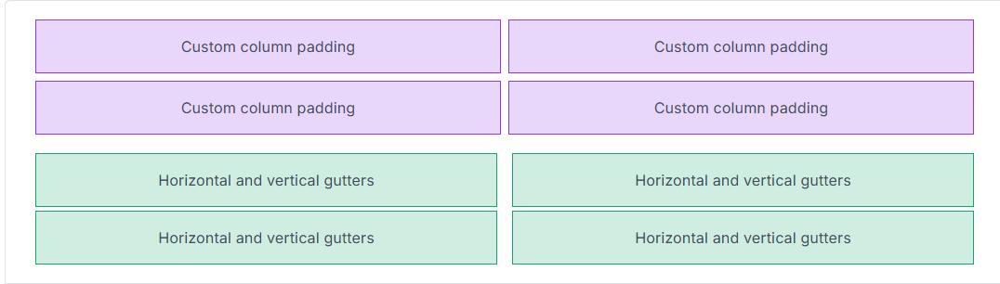
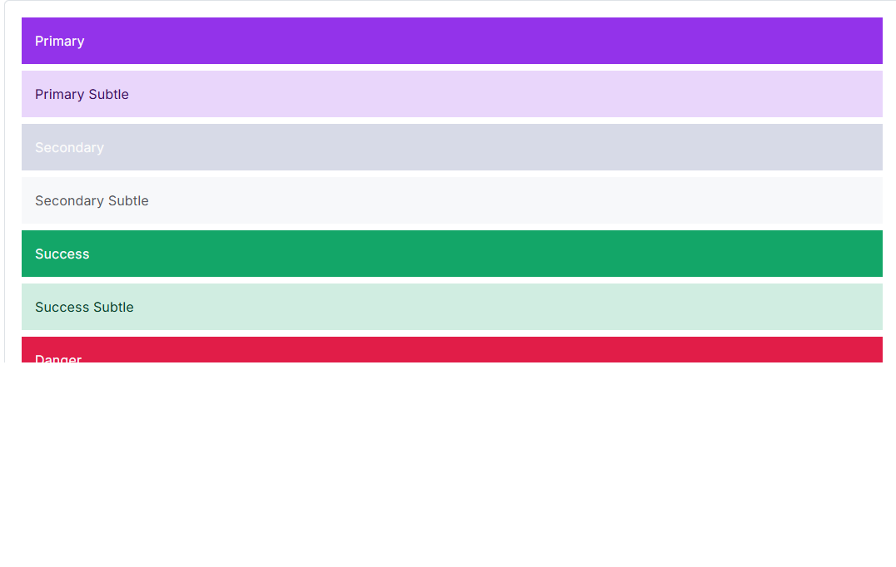
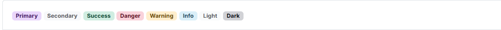
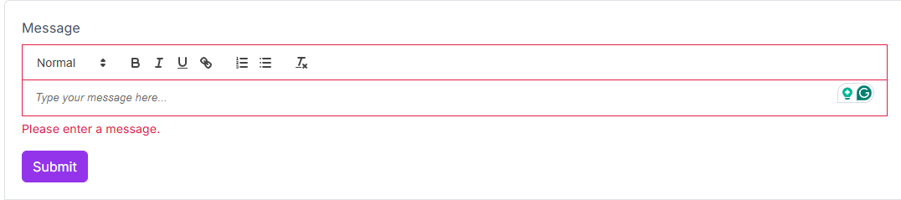
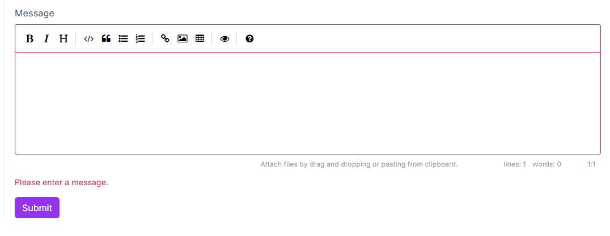

# Blazorise 2.0 - Release Notes

When we released Blazorise 1.8, we promised that the next version would be a major one, 2.0.

Blazorise 2.0, codenamed **Velebit** after the majestic mountain range in Croatia, is a significant update that brings a host of new features, enhancements, and optimizations to the framework. This release focuses on improving the developer experience, enhancing performance, and expanding the capabilities of Blazorise components.

The codename **Velebit** represents the largest and most foundational step in Blazorise’s evolution so far. Named after Croatia’s most significant mountain range, it symbolizes strength, stability, and a solid backbone, qualities that define this major 2.0 release.

## Key Blazorise 2.0 Highlights 💡

Below is an overview of the most important additions and changes in this release:

- **Blazorise Migration CLI**: a command-line tool to analyze, preview, and apply Blazorise 2.0 migration changes.
- **Blazorise Analyzer**: compile-time diagnostics that detect breaking changes and provide actionable upgrade guidance.
- **MCP Server**: AI-powered documentation and API access.
- **.NET 6 and .NET 7**: framework support has been removed.
- **Unified Input API**: all input components now follow the standard `Value`, `ValueChanged`, and `ValueExpression` pattern for consistent data binding.
- **Renamed Input Components**: components such as `TextEdit`, `DateEdit`, and `FileEdit` have been renamed to `TextInput`, `DateInput`, and `FileInput`.
- **Extended Color Variants**: expanded Background and TextColor utility options.
- **FluentUI Theme Generator**: dynamically generate and customize FluentUI themes.
- **Autocomplete Validation Refactor**: validation behavior is now aligned with other input components.
- **Accessibility Improvements**: enhancements across inputs, layouts, and providers.
- **Tailwind CSS v4**: upgraded to the latest major version.

Explore the sections below to learn more about each feature and how they elevate your Blazorise experience.

> 💡 **Upgrading from 1.8.x?**  
> Review the migration notes and use the Blazorise Migration CLI to ensure a smooth and safe upgrade.  
> 👉 Migration guide: [news/migration/200](news/migration/200)  
> 👉 Migration CLI docs: [docs/migration](docs/migration)  
> 👉 Analyzer docs: [docs/analyzer](docs/analyzer)

## New Tools and Migration

Blazorise 2.0 introduces a number of small breaking and behavioral changes. Before diving into the details, it’s important to highlight the new tooling designed specifically to make upgrading to 2.0 safer and more approachable.

To support a smooth transition, we strongly recommend using both the **Blazorise Analyzer** and the **Blazorise Migration CLI** when upgrading to Blazorise 2.0.

For teams that prefer or require a fully manual upgrade process, refer to the [migration guide](news/migration/200), which contains a comprehensive list of all API changes and behavioral differences introduced in 2.0.

### Blazorise Analyzer

**Blazorise.Analyzers** is a new NuGet package designed to make upgrading and maintaining Blazorise projects safer, faster, and more predictable. Once installed, the analyzer inspects your Blazor projects at compile time and detects API inconsistencies introduced in version 2.0.

Instead of discovering breaking changes at runtime, developers receive immediate feedback directly in their IDE and build output. The analyzer reports clear, actionable compile-time warnings and errors when it detects renamed components, changed parameters, or usage of deprecated APIs.

Each diagnostic provides precise guidance on what has changed and how to update your code to the new API, significantly reducing guesswork during migration. This is especially valuable for larger codebases, where manual audits would otherwise be time-consuming and error-prone.

By shifting upgrade validation to compile time, **Blazorise.Analyzers** acts as a built-in upgrade assistant—helping teams adopt the new major version with confidence while keeping development workflows efficient and predictable.

For a complete upgrade experience, pair the analyzer diagnostics with the Migration CLI and review the migration notes for manual changes and behavioral differences.

### Blazorise Migration CLI

The **Blazorise Migration CLI** is a command-line tool designed to upgrade existing Blazorise 1.x projects in a safe, reviewable, and predictable manner.

The migrator analyzes your solution or project, reports the required changes, and can apply them automatically when you are ready. All modifications can be previewed in advance using a dry-run mode, and optional backups ensure you can safely roll back if needed.

A recommended workflow is to:
1. Analyze your solution
2. Review the reported migration changes
3. Preview file updates using `--dry-run`
4. Apply the migration with backups enabled

For full usage instructions, examples, and available command options, see the [Migration CLI documentation](docs/migration).

While the migrator automates many breaking changes, some updates require manual review. The [migration notes](news/migration/200) document behavioral changes, removed APIs, and upgrade considerations that cannot be applied automatically.

### MCP Server

An MCP (Model Context Protocol) server is now available to enable AI tools to access Blazorise documentation and code examples directly in a structured and up-to-date format.

Instead of relying on incomplete or outdated model knowledge, MCP-compatible clients can query the same documentation developers use—down to individual pages and example snippets—at the moment a question is asked.

For developers, this results in more accurate AI-assisted guidance, fewer hallucinated APIs, and answers that reflect the current state of the framework. As AI-assisted development becomes increasingly common, the MCP server helps ensure that Blazorise integrations remain reliable, trustworthy, and fully aligned with the official documentation.

## New Features and Changes

### Removed .NET 6 and .NET 7 Support

Support for **.NET 6** and **.NET 7** has been removed in Blazorise 2.0. Both frameworks have reached the end of their respective LTS and STS lifecycles, and continuing to support them would increasingly limit the evolution of the framework.

While it would have been possible to keep these targets for a little longer, they already constrained Blazorise to older APIs and prevented the adoption of newer Blazor and .NET capabilities. Maintaining compatibility with outdated frameworks would make future features significantly harder—or in some cases impossible—to implement.

Support for **.NET 8** remains in place. However, once .NET 8 reaches the end of its LTS lifecycle (expected in late 2026), it will also be removed. From that point forward, Blazorise will target **.NET 9 and later** only.

This change unlocks access to the latest Blazor platform features and allows us to continue improving Blazorise with modern, performant, and future-proof capabilities.

### Unified Input API

Blazorise 2.0 introduces a fully **unified input API** across all form components. Every input now consistently uses the standard `Value`, `ValueChanged`, and `ValueExpression` parameters, making data binding predictable and significantly simplifying form development.

This alignment removes long-standing inconsistencies between input components and enables more intuitive patterns when working with forms, validation, and custom inputs.

**Before (1.8.x):**

```razor
<TextEdit @bind-Text="@Username" />
<DateEdit @bind-Date="@SelectedDate" />
<Check @bind-Checked="@IsChecked" />
```

**After (2.0):**

```razor
<TextInput @bind-Value="@Username" />
<DateInput @bind-Value="@SelectedDate" />
<Check @bind-Value="@IsChecked" />
```

By standardizing how values are bound, Blazorise 2.0 makes forms easier to reason about, easier to refactor, and more consistent across the entire component library.

### Heading Aliases

New component aliases are now available for both `Heading` and `DisplayHeading`, simplifying usage and improving markup readability.

You can use `Heading1` through `Heading6` as direct equivalents to `<Heading Size="HeadingSize.Is1">` through `<Heading Size="HeadingSize.Is6">`, and `DisplayHeading1` through `DisplayHeading4` as equivalents to `<DisplayHeading Size="DisplayHeadingSize.Is1">` through `<DisplayHeading Size="DisplayHeadingSize.Is4">`.

These aliases make it easier to write semantically clear headings without explicitly specifying size parameters, resulting in cleaner and more expressive markup.

### Gutters Utilities

A new **Gutter** system allows you to control horizontal and vertical spacing between columns and rows directly on `Row` and `Fields` components.

The gutter behavior follows the Bootstrap 5 model and works consistently across all providers, including Bootstrap, Tailwind, and Bulma. Gutters can be applied per axis (`OnX`, `OnY`) or on both axes simultaneously, with full support for responsive values.



For more details and usage examples, see the official [Gutters Utilities documentation](docs/helpers/utilities/gutters "Gutters Utilities").

### Radio Component Updates

Radio components now use a simplified and unified binding model. The legacy `Checked`, `CheckedChanged`, and `CheckedExpression` APIs have been removed in favor of the standard `Value`, `ValueChanged`, and `ValueExpression` pattern.

`RadioGroup<TValue>` is now the primary binding surface, while each `Radio<TValue>` defines its option through the `Value` parameter. A radio is selected when its value matches the bound value of the group, resulting in cleaner markup, predictable value parsing, and consistent validation behavior.

Migration is straightforward: replace `Checked*` APIs with their `Value*` counterparts and ensure each radio defines an explicit option value. Standalone boolean radios are still supported but are discouraged in favor of grouped, value-based usage.

**Before:**

```razor
<RadioGroup TValue="string" @bind-Value="Selected">
    <Radio Checked="true">A</Radio>
    <Radio Checked="false">B</Radio>
</RadioGroup>
```

**After:**

```razor
<RadioGroup TValue="string" @bind-Value="Selected">
    <Radio Value="A">A</Radio>
    <Radio Value="B">B</Radio>
</RadioGroup>
```

This brings Radio components fully in line with the unified input model introduced across the framework, making them easier to reason about and more consistent with other form inputs.

### Extended Color Variants

Color plays a key role in user interface design, conveying hierarchy, meaning, and accessibility. Extended color variants make it possible to fine-tune tones and introduce greater visual depth across your UI.

Enumerations such as `Background` and `TextColor` now support **nested variants** for subtle and emphasized shades. Previously limited to base colors like `Background.Success` or `TextColor.Danger`, you can now use variants such as `Background.Success.Subtle` or `TextColor.Success.Emphasis`. This aligns Blazorise utilities with modern design systems like Bootstrap 5.3 and FluentUI.



This system is powered by the `IEnumerationNameBuilder` infrastructure, which standardizes how enumeration values map to CSS class names across providers. For example, Bootstrap automatically generates classes such as `bg-success-subtle` or `text-success-emphasis`. The implementation is fully backward-compatible, ensuring a smooth upgrade path for existing applications.

You can explore the full range of extended color variants in the [Colors documentation](docs/helpers/colors "Link to Colors documentation").

### Badge Subtle

The `Badge` component has been enhanced with a new **Subtle** color mode. This introduces lighter, less saturated background tones—ideal for modern, minimalist interfaces or secondary indicators where softer emphasis is preferred.

By setting the `Subtle` parameter to `true`, badges automatically adopt muted color variants that blend naturally into the surrounding UI while maintaining clarity and readability. Subtle badges pair especially well with extended color variants, enabling more refined and theme-consistent designs.



Examples of subtle badges can be found in the updated [Badge documentation](docs/components/badge "Link to Badge documentation").

### FluentUI Theme Generator

The new **FluentUI Theme Generator** makes it easy to build and customize themes based on Microsoft’s Fluent Design System. It allows quick configuration of colors, typography, and surface elements to create professional, cohesive Fluent-inspired interfaces.

The generator strikes a balance between flexibility and fidelity to the FluentUI aesthetic, giving developers control over visual customization while preserving consistent design principles across all Blazorise components.

### Charts

#### Chart.js v4

Chart support has been fully updated to **Chart.js v4**, with significant improvements to how chart assets are managed and loaded.

All Chart.js–related static files are now handled and loaded dynamically by Blazorise. This means you no longer need to manually include `<script>` references, and any existing Chart.js scripts should be removed from `App.razor`, `_Host.cshtml`, or `index.html`.

The following script references are no longer required and should be removed:

```html
<script src="https://cdnjs.cloudflare.com/ajax/libs/Chart.js/3.7.1/chart.min.js"></script>
<script src="https://cdn.jsdelivr.net/npm/luxon@1.28.1"></script>
<script src="https://cdn.jsdelivr.net/npm/chartjs-adapter-luxon@1.0.0"></script>
<script src="https://cdn.jsdelivr.net/npm/chartjs-plugin-streaming@2.0.0"></script>
<script src="https://cdn.jsdelivr.net/npm/chartjs-plugin-datalabels@2.0.0"></script>
<script src="https://cdn.jsdelivr.net/npm/chartjs-plugin-annotation@2.2.1"></script>
<script src="https://cdn.jsdelivr.net/npm/hammerjs@2.0.8"></script>
<script src="https://cdn.jsdelivr.net/npm/chartjs-plugin-zoom@2.2.0/dist/chartjs-plugin-zoom.min.js"></script>
```

In addition, all chart configuration options have been updated to align with the **Chart.js 4.x API**.

This change simplifies setup, reduces the risk of version mismatches, and ensures a more predictable charting experience across all hosting models.

#### Custom Named Axes

Charts now support custom named axes through the `ChartScales` configuration.

A new `AdditionalAxes` option allows you to define any number of extra axes in addition to the standard `X` and `Y` axes. This enables more advanced scenarios such as multiple value scales, mixed chart types, and fine-grained control over axis behavior and layout.

### Validation

#### Revalidation Support

Revalidation has been a long-standing request. Previously, the complexity of input and validation internals made it difficult to safely introduce this capability. With the Input component APIs now significantly simplified, it became possible to extend the validation system in a more flexible and predictable way.

Manual revalidation allows you to explicitly re-run validation logic for inputs when your UI or business rules change. This makes it easier to fine-tune validation behavior and react to state changes that aren’t directly triggered by user input.

Revalidation can be triggered on a single `Validation` component or applied in batch using the `Validations` component.

For usage details and examples, see the official [Validation Component documentation](docs/components/validation "Validation Component").

#### Autocomplete Validation Refactor

`Autocomplete` now participates in the standard validation pipeline by inheriting from `BaseInputComponent` and no longer relies on its built-in validation wrapper. As a result, it behaves consistently with other input components and must be wrapped in a `Validation` component.

This change also resolves issues where validation errors were displayed on the search input instead of the overall control. In multiple selection mode, validation now operates on `SelectedValues`, `SelectedValuesChanged`, and `SelectedValuesExpression`, ensuring that selected items are validated as a single logical value.

To improve clarity, the `MinLength` parameter was renamed to `MinSearchLength`, reflecting that it applies to the search input length rather than data annotation validation.

#### RichTextEdit Validation Refactor

`RichTextEdit` has been updated to inherit from `BaseInputComponent` and now fully supports validation, bringing it in line with other input components.

The editor now uses `Value` / `@bind-Value` for HTML content, applies validation styling at the root level, and validates against the editor’s plain-text representation. This ensures that visually empty content—such as a blank paragraph—is correctly treated as empty for validation purposes.



External `Value` updates are safely synchronized with **Quill**, while internal typing avoids unnecessary DOM re-renders that could disrupt caret positioning. Read-only behavior now correctly respects both `ReadOnly` and `Disabled` states.

Documentation and demos have been updated to use `Value` / `@bind-Value`, and a new RichTextEdit validation example has been added. Additional tests were introduced to cover validation behavior, including bUnit JS interop support and supporting test infrastructure.

### Offcanvas Provider

With the help of community member [Nex-Code](https://github.com/Nex-Code), we now have an `OffcanvasProvider` component, which mirrors the structure and usage of or existing `ModalProvider` component.

Big thanks to the [Nex-Code](https://github.com/Nex-Code) for helping us with this component.

You can see it in action in [Offcanvas Provider](docs/services/offcanvas-provider "Offcanvas Provider") documentation page.

### Full Markdown Input Support

The Markdown editor now behaves much more like other form inputs in Blazorise. It fully participates in form validation and shows validation feedback directly on the editor UI, so users can immediately see when the field is valid or has errors.



Common input behaviors are now supported on the actual editor surface. Settings like read-only and disabled work as expected, custom styling and CSS classes apply to what users see, and any additional HTML attributes are carried through properly.

Focusing the Markdown editor has also been improved, so keyboard users and form flows can move focus to the editor reliably. Overall, the Markdown component should feel more consistent with the rest of the Blazorise input components in real-world forms.

### Modal Parameters Centralized

This release adjusts the Modal API by moving the `Centered`, `Scrollable`, and `Size` parameters from `ModalContent` up to `Modal`. ModalContent now derives these values from its parent and refreshes its classes whenever the modal-level settings change, so existing layouts and providers continue to render correctly while the configuration is centralized. All internal usages, demo pages, and documentation examples have been updated to set these options on Modal, and the FluentUI2 modal implementation now relies on the modal parameters directly. The migration analyzer has been extended to flag the removed ModalContent parameters and guide users to the new Modal equivalents.

### Fluent Sizing Enhancements

Fluent sizing now supports viewport units and CSS variables, making it easy to express responsive widths and heights with `Vw`, `Vh`, and `Var` alongside the existing `Px`, `Rem`, `Em`, and `Ch` helpers. Min/max constraints can be chained directly on style-based sizing, including unit-only calls when you want to define limits without a base size.

Inline style output is cleaner and more consistent, with spacing between rules handled at append time instead of parsing, reducing overhead while keeping the formatting predictable. This ensures generated styles read well and remain stable across concatenations.

Documentation now includes a dedicated [Fluent Sizing page](docs/helpers/utilities/fluent-sizing) with multiple examples covering predefined sizes, style- based sizing, and CSS-variable-driven values, and it's surfaced in navigation and search for easier discovery.

### Intent-based coloring

Blazorise 2.0 adds a new `Intent` parameter across components that previously accepted `Color`, giving you a clearer, semantic way to express primary/secondary/success/etc while keeping existing `Color` usage fully compatible. You can start using `Intent` immediately without changing your current styles.

`Color.Link` remains supported for backward compatibility but is now treated as button/alert-only; using it elsewhere will surface an IDE warning so you can catch it early. This keeps existing `Button` and `Alert` behavior intact while guiding you to more consistent coloring on other components.

### Tailwind 4 Upgrade

Blazorise.Tailwind has moved to the latest Tailwind CSS 4.0 release, bringing the new CSS‑first engine and a refreshed build pipeline that leans on the v4 entry format with `@import`, `@utility`, and `@theme` blocks. The upgrade keeps the familiar Blazorise look while giving you faster, cleaner utility generation and modern token-driven theming, with Flowbite still in the mix for rich components.

If you maintain your own Tailwind pipeline, this release is a great moment to mirror the new entry file and include the Blazorise build inputs so your app's utilities and Blazorise styles compile into a single output. Also make sure your safelist is wired in, since Blazorise uses some dynamic classnames that Tailwind won't see through content scanning alone; keeping that list connected ensures nothing disappears at build time.

### Bulma 1 Upgrade

This release updates the **Blazorise.Bulma** provider and demo to align with **Bulma 1.0.4**, bringing the styling baseline up to date and matching Bulma's modern CSS variable system. We revised the vendor Sass imports to include only the non-component utilities we need, trimmed legacy utilities, and adjusted class-provider mappings so spacing and helpers reflect the new utility naming. The upgrade was done to keep the provider compatible with current Bulma behavior, reduce custom overrides, and make future maintenance easier.

We shifted theme generation toward Bulma's native color palette logic instead of hardcoded hover/active/disabled values. Button states, tags, notifications, text helpers, inputs, background helpers, and borders now rely on Bulma's variables for native colors, while custom variants like secondary still get explicit rules. We also implemented Bulma-style palette and “on scheme” calculations so text colors match the contrast-driven behavior users expect from the official Bulma theme.

Along the way we fixed several layout and component issues exposed by the upgrade, including button group/dropdown borders and sizing, radio button groups alignment, and addon sizing in form demos. Breadcrumb active styling now follows Bulma's active color logic, and navbar text contrast uses Bulma's invert variables so backgrounds and text stay in harmony. The result is a cleaner integration that behaves like Bulma out of the box while preserving Blazorise-specific features.

### Typed Classes Customization & Per-Utility Targeting

This release adds typed `Classes` and `Styles` maps for complex components, so you can target wrapper and inner elements (`Self`, `Wrapper`, `Content`, etc.) without relying on fragile CSS selectors. Utility helpers now support per-utility targeting via `OnSelf`/`OnWrapper`, with `UtilityTarget` remaining the default, making it easier to direct spacing and other utilities to the correct element across providers.

The [styling documentation](docs/helpers/utilities/styling) has been expanded with clearer guidance, a `UtilityTarget` example, and a provider support matrix to help users understand which keys apply per component and provider configuration.

### DataGrid Template Contexts

In Blazorise 2.0 we updated DataGrid template contexts for `SortDirectionTemplate`, `DisplayTemplate`, `EmptyCellTemplate`, and `DetailRowTemplate` to use dedicated context objects instead of passing raw items or enums. We did this to make template APIs more consistent and to expose the extra metadata that template authors were repeatedly reaching for via custom lookups or casts.

For users, this means templates can make richer UI decisions with less boilerplate: you now get direct access to the row item plus helpful details like the column, row index, formatted display value, and sort state in one place. The result is simpler template code, fewer fragile casts, and more flexibility when customizing DataGrid visuals.

### DataGrid Grouping State and Change Notifications

Blazorise DataGrid now includes first-class support for grouping state persistence and grouping change notifications. `DataGridState<TItem>` has been extended with `ColumnGroupingStates` so grouped columns can be saved and restored alongside existing grid state, enabling reliable deep-linking and stateful UX scenarios. In addition, a new `GroupingChanged` callback with `DataGridGroupingChangedEventArgs<TItem>` is raised when grouped columns are added or removed, providing current and previous grouped columns plus change metadata, making URL synchronization, analytics, and parent-level state management much easier without render-cycle polling workarounds.

### LoadingIndicator Status

This release adds `SetStatus` to `Blazorise.LoadingIndicator`, letting you push status text and optional progress updates through the service or component so the UI can reflect multi‑step work in real time. IndicatorTemplate now receives a `LoadingIndicatorContext` derived from the current status, making it straightforward to render custom messages (and progress) alongside your spinner while keeping the existing API surface clean and flexible for both local and application‑wide indicators.

### Accessibility Improvements Across Inputs, Layouts, and Providers

This update expands Blazorise accessibility coverage without breaking existing APIs by wiring core input ARIA semantics consistently across all providers and extensions. Input components now expose typed `AriaInvalid` and `AriaDescribedBy` parameters, and the framework automatically falls back to validation and field help metadata when you don't specify them. This means screen readers can reliably announce validation errors and help text, while advanced users can still override ARIA explicitly. Autocomplete and rich text/markdown inputs now propagate these ARIA values to their primary interactive surfaces, and the change is aligned across Bootstrap, Bootstrap5, Bulma, AntDesign, FluentUI2, Material, and Tailwind.

We also brought interactive, non‑input UI elements in line with ARIA expectations across providers: accordions, dropdowns, modals, offcanvas panels, tabs, pagination, toasts, alerts, and validation messages now emit consistent aria-expanded/controls, dialog labeling, live region behavior, and role metadata. These changes improve keyboard and assistive technology behavior while preserving provider-specific rendering. In short, you get a more accessible baseline out of the box, fewer manual ARIA tweaks in app code, and a consistent experience regardless of which UI provider you use.

## Final Notes 🏁

Blazorise 2.0 introduces a consistent, modernized input system and simpler APIs that make form handling easier and more intuitive.
Review your input components and update bindings for a smooth migration.