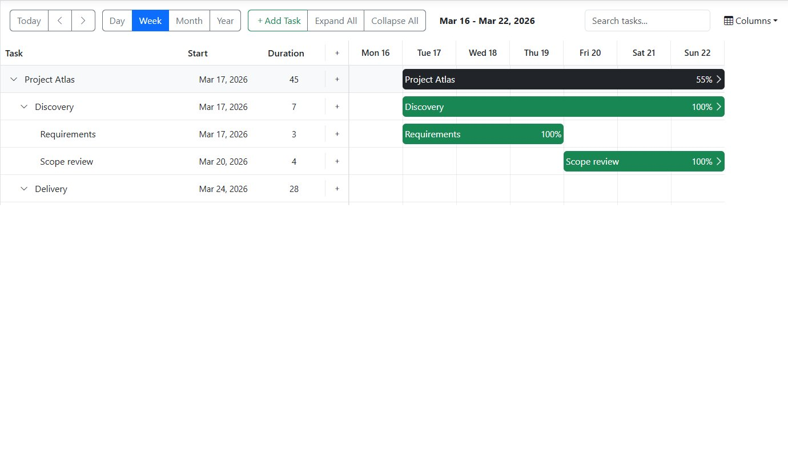

# Blazorise 2.0.3 - Introducing the New Gantt Component

Blazorise **2.0.3** continues to evolve the 2.0 platform with targeted fixes and the introduction of a major new component: **Gantt**.

This release not only resolves several issues around DataGrid filtering and input behavior, but also expands the framework with a highly requested feature designed for complex scheduling and project visualization scenarios.

## Highlights

### New Gantt Component

Blazorise now includes a fully featured [Gantt component](docs/extensions/gantt), bringing powerful project planning and timeline visualization capabilities directly into the framework.

This component was developed as part of the [Blazorise Custom Work program](https://blazorise.com/custom-work "Link to Blazorise Custom Work").

Through this program, companies can sponsor features or request custom development with clearly defined scope and delivery terms. When possible, sponsored work is generalized and contributed back to the core framework.

Thanks to this collaboration, the [Gantt component](docs/extensions/gantt) is now available to the entire community as part of the standard 2.0 release line.

The Gantt component includes a wide range of features, including support for **editing, filtering, hierarchical tree structures, drag-and-drop interactions, and complex node relationships**. It is designed to handle real-world project management scenarios while staying consistent with Blazorise design principles and theming.

This is a significant addition to the component ecosystem and opens the door for more advanced business applications built with Blazorise.

### DataGrid Filtering Improvements

Several issues affecting **DataGrid filtering behavior** have been resolved in this release. These fixes improve consistency when working with custom filters and menu-based filtering modes, ensuring that filter methods are properly recognized and applied.

### MemoInput Behavior Fix in Modal

An issue where `MemoInput` did not correctly respect the `Rows` parameter when used inside a modal has been fixed. This ensures consistent rendering and expected sizing behavior across different layout contexts.

---

Blazorise 2.0.3 continues to improve both the stability and capabilities of the framework, combining targeted fixes with meaningful new functionality.

## Full Changelog

All changes included in **2.0.3**:

- [#6452](https://github.com/Megabit/Blazorise/issues/6452) MemoInput Rows="int" Not Working in Modal
- [#6462](https://github.com/Megabit/Blazorise/issues/6462) DataGridState Column Filter Missing Filter Method
- [#6465](https://github.com/Megabit/Blazorise/issues/6465) CustomFilter behavior with DataGridFilterMode.Menu
- [#6454](https://github.com/Megabit/Blazorise/pull/6454) Gantt component

## Upgrading

Blazorise **2.0.3** is a safe upgrade for all **2.0.x** applications.

Simply update your NuGet packages to version **2.0.3**. No breaking changes or migration steps are required.

## Thank you & commercial support

Blazorise continues to grow thanks to community contributions and customer support. The introduction of the Gantt component highlights how collaboration and custom development efforts can benefit the entire ecosystem.

If your organization needs custom components or features, explore the [Blazorise Custom Work program](https://blazorise.com/custom-work "Link to Blazorise Custom Work").

For commercial licensing and continued support of the project [Blazorise Commercial](https://blazorise.com/pricing "Link to Blazorise Commercial").

Your support helps ensure the continued evolution of Blazorise for modern .NET applications.