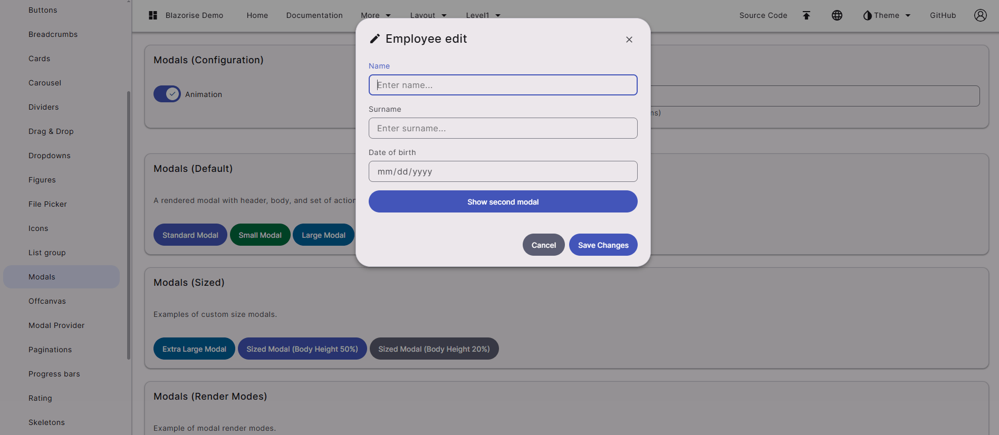
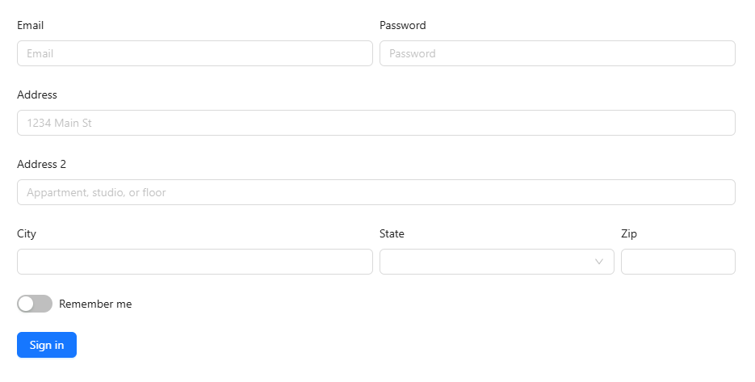
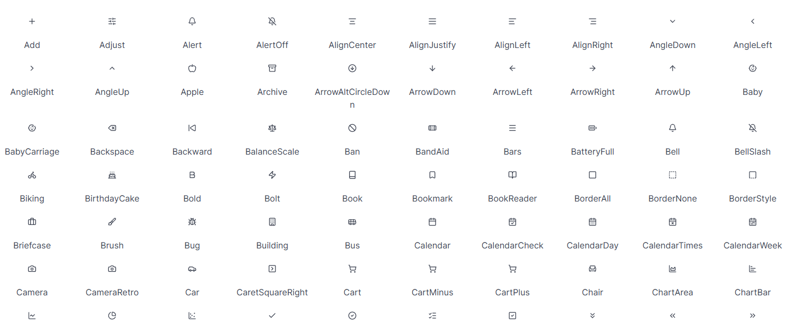
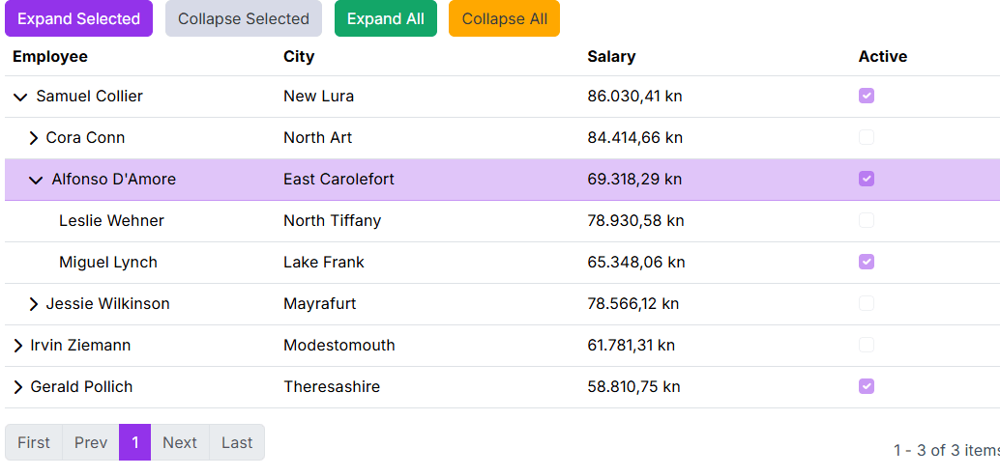
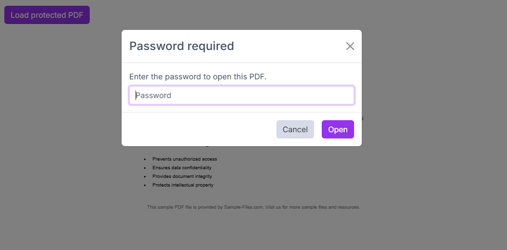
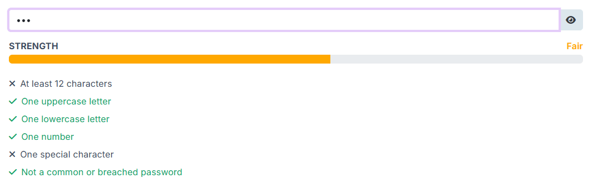
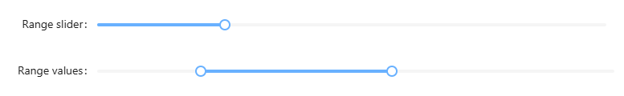
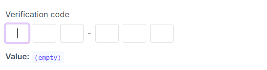

# Blazorise 2.1 - Release Notes

Codenamed **Mosor**, after the Croatian mountain range, Blazorise 2.1 is a major release bringing a wide range of new features, refinements, and performance improvements. This is also **one of the largest releases in Blazorise history**, both in terms of the amount of work delivered and the scope of changes across the framework.

It introduces **new design system providers**, several **new components**, and significant improvements to existing ones, along with deeper alignment to modern UI standards and better long-term maintainability.

## Key Blazorise 2.1 Highlights 💡

Here are some of the most notable additions and updates:

- **Material 3 Provider**: A new design system based on Google's Material 3 guidelines.
- **AntDesign v6 Provider**: Significant modernization of visuals, theming, and component behavior.
- **DataGrid Self Reference**: Display hierarchical data directly within the DataGrid.
- **PdfViewer**: Now supports password-protected PDFs.
- **BarDropdownToggle**: Combines navigation link and dropdown toggle into a single component.
- **PasswordStrength**: Enhanced password input with real-time strength feedback.

## Upgrading from 2.0.x to 2.1 👨‍🔧

Upgrading your application is straightforward:

Update all **Blazorise.*** package references to **2.1**.

```cs
<PackageVersion Include="Blazorise" Version="2.0.4" />
<PackageVersion Include="Blazorise.Bootstrap5" Version="2.0.4" />
```

Change to:

```cs
<PackageVersion Include="Blazorise" Version="2.1.0" />
<PackageVersion Include="Blazorise.Bootstrap5" Version="2.1.0" />
```

Most Blazorise component APIs remain unchanged. However, this release includes minor provider-level breaking changes, particularly for applications relying on the legacy Material or AntDesign implementations, custom provider CSS, or older icon setups.

> Migration notes: [news/migration/210](news/migration/210)

## New Features & Enhancements 🚀

### Material 3 Provider (New)

With this release, Blazorise introduces a **Material 3 design system provider**, adding support for Google's latest design guidelines.



You can see the new Material 3 provider in action in the [Material demo](https://demos.blazorise.com/wasm/material/).

This new provider replaces the legacy **Material CSS framework that was previously built on Bootstrap 4**. That implementation had been unmaintained for several years and had fallen behind both the Blazorise ecosystem and modern design standards. While we initially considered keeping it for compatibility, maintaining it alongside the rest of the framework proved impractical. The new provider ensures a modern, sustainable Material implementation moving forward.

Development originally started using [BeerCSS]() as a foundation. It provided a promising base for quickly experimenting with Material 3 styling and component structure. However, as we began integrating it into real-world applications, its limitations became apparent. Larger applications require consistent layout behavior, predictable spacing, and a broader set of UI components. In practice we encountered issues such as inconsistent placements, spacing differences, and missing components needed for production scenarios.

As a result, Blazorise significantly extends that foundation. The new provider introduces **many custom CSS rules and layout adjustments** to ensure consistent behavior across components, as well as **additional components not present in BeerCSS**. In practice, the Material 3 provider should be considered a **full Blazorise implementation of the Material 3 design system**, rather than a simple wrapper around an external library.

From an API perspective, **all existing Blazorise component APIs remain unchanged**. Applications using Blazorise components will continue to work the same way from a code standpoint. However, if your project relied on **custom CSS targeting the previous Bootstrap-based Material styles**, those overrides will likely need to be updated to match the new structure.

With this release, Blazorise becomes **the first Blazor component library providing a Material 3-compliant design system**, offering a modern visual foundation for building Blazor applications going forward.

### AntDesign v6 Provider (New)

In this update, the **Blazorise.AntDesign** provider has been significantly modernized, aligning it more closely with the structure, styling, and behavior of modern **Ant Design v6**. Large parts of the provider were updated from older **v4**-era assumptions to newer markup, classes, and **CSS variable token-based styling**, resulting in a more accurate Ant Design look and feel across the component library.



You can see the new AntDesign v6 provider in action in the [AntDesign demo](https://demos.blazorise.com/wasm/antdesign/).

The provider now ships the required Ant Design styles directly through Blazorise. Applications should use the bundled `_content/Blazorise.AntDesign/antd.css` file instead of older external Ant Design v4 CDN stylesheets such as `antd.min.css`.

The update includes broad improvements across buttons, sliders, navigation, forms, tables, popups, and responsive layouts. Styling now relies more on native **Ant Design CSS variables** and less on legacy Sass theme maps, making runtime theming more consistent and maintainable. Custom CSS that targets Ant Design v4 selectors, DOM assumptions, or old token names may need review.

Blazorise 2.1 also introduces a native **Blazorise.Icons.AntDesign** package. New AntDesign apps should prefer `.AddAntDesignIcons()` and `_content/Blazorise.Icons.AntDesign/blazorise.icons.antdesign.css` for the current provider-default icon look. Existing apps that intentionally use FontAwesome can keep it, but should review any `FontAwesomeIcons.*` usage or custom FontAwesome class names before switching.

Alongside the visual refresh, this release also delivers many fixes and usability improvements in areas such as validation, overlays, mobile behavior, menus, and component interaction polish.

### Icon Packages (New)

This release introduces two brand new icon packages: **Blazorise.Icons.AntDesign** and **Blazorise.Icons.Lucide**.



Both packages are implemented using **SVG-based icons**, offering improved rendering quality, better scalability, and more flexibility compared to existing icon providers that rely on CSS-based approaches. This makes them more suitable for modern UI scenarios where crisp visuals and customization are important.

These packages expand the available icon options in Blazorise while aligning with widely used icon sets from the Ant Design and Lucide ecosystems.

Usage details and integration examples are available in the updated [docs/extensions/icons](Icons documentation page).

### RichTextEdit Improvements

The **RichTextEdit** component receives several enhancements in this release, with a focus on cleaner pasted content and more flexible editor configuration.

A notable addition is `UseSanitizedPaste`, which enables sanitization of pasted HTML so that only tags supported by the editor are preserved. This is especially useful when users paste content from external sources such as websites, office documents, or other editors, where the resulting markup often contains unsupported or unnecessary elements. By trimming pasted HTML to a supported set of tags, RichTextEdit helps maintain cleaner output, more consistent formatting, and better control over stored content.

We have also added **per-component control over plugin loading**. Previously, plugin configuration was only available at the global level, which made it difficult to tailor editor behavior for different scenarios within the same application. With this release, plugins can now be configured individually for each RichTextEdit instance.

This allows you to keep one editor minimal while enabling a richer plugin set in another, depending on the needs of each form or workflow.

### DataGrid Self Reference

A highly requested feature has finally arrived. DataGrid Self Reference mode allows you to display hierarchical data structures directly within the DataGrid, enabling parent-child relationships from a single data source. Items can reference other items in the same collection (for example via ParentId → Id), allowing you to naturally represent structured data without reshaping or duplicating it.



This makes it possible to build rich hierarchical interfaces similar to a Tree View, but with the full power of a table. You can combine expandable tree-like rows with standard DataGrid capabilities such as sorting, filtering, templating, editing, and paging, delivering both clarity and flexibility in one unified component.

With Self Reference mode, hierarchical data becomes a first-class DataGrid scenario, simplifying implementation while keeping the experience powerful and consistent.

### PdfViewer Password Prompt

The Blazorise `PdfViewer` now allows password-protected PDFs to be opened directly within the app. When an encrypted file is loaded, the viewer detects that a password is required and triggers a password request flow instead of failing silently. By default, this flow uses `ModalService` to show a built-in prompt, allowing end users to enter the password and continue reading the document without leaving the current workflow.



For teams that need custom UX, the feature also includes an extensibility API so developers can handle password requests with their own dialog or interaction pattern, while still using the same secure loading pipeline. We also added prompt validation and localization-ready text support through `PasswordPromptOptions`, so labels and messages can match your app language and style. Full usage examples and API details are available in the [PdfViewer documentation](docs/extensions/pdfviewer).

### PDF Viewer Download Prompt

Downloads from the PDF Viewer now use meaningful file names instead of defaulting to `document.pdf`. The viewer can automatically suggest a name based on the PDF's metadata (such as document title) or the source file name, making it much easier to keep multiple downloads organized.

You can also enable a filename prompt before download so users can review and change the name in place. The prompt is localized, supports validation, and still keeps downloads simple for users who just want to click once and save.

### BarDropdownToggle: Smoother Sidebar Navigation

Sidebar and nested navigation are now smoother thanks to improvements in `BarDropdownToggle`. You can now use it as both a navigation link and a dropdown trigger, so users can follow a route and still expand or collapse child items from the same control. Active-route highlighting now follows link matching rules more reliably, and click handling has been refined so expanding a menu is less likely to trigger unwanted navigation.

Customization has also expanded in a user-facing way. Teams can now control dropdown toggle icon behavior more precisely, including hiding the icon when needed and configuring icon appearance through theme options. In practice, this makes side navigation feel cleaner, more predictable, and easier to align with each app's visual style across supported UI providers.

### PasswordStrength Component (New)

A new component, `PasswordStrength`, has been introduced to help users create stronger passwords in real time. It behaves like a standard text input while adding live strength scoring, rule-by-rule guidance, optional show/hide password toggle, and seamless integration with Blazorise validation flows so error and success feedback appear where users expect them.



`PasswordStrength` is fully localizable and rule-driven, letting you configure requirements such as minimum length, uppercase, lowercase, numbers, special characters, and blocked/common password checks. The component also supports visual customization through dedicated classes and styles APIs, including configurable colors for the toggle button and rule states, and now relies on provider-specific addons validation behavior to ensure consistent rendering across UI providers without leaking provider-incompatible validation classes.

### RangeSlider Component (New)

`RangeSlider` is a new generic input component for selecting numeric ranges using two handles. It is built around a strongly typed `RangeSliderValue<TValue>`, making it easier to work with range values in a clear and type-safe way.



`RangeSlider` includes support for `Min`, `Max`, and `Step`, along with optional **value tooltips** and **accessible handle labels** for improved usability. It also provides configurable behavior for how the two handles interact, including options such as `ClampToOtherHandle` and `AllowEqualValues`, with drag clamping to ensure smooth and predictable interaction while dragging.

The component is fully integrated across supported Blazorise UI providers, with provider-specific styling and renderers, as well as theme color support for consistent visual integration with the rest of your application.

### TransferList Improvements

It is now possible to define **custom Start and End captions**, allowing each side of the transfer list to better reflect the meaning of its contents in your specific workflow. This makes the component clearer in scenarios where the default labels are too generic or do not match the domain language of the application.

We have also introduced **additional parameters for controlling visual and interaction details**, including options for configuring **icon names, icon sizes, and related UI elements**. These additions provide more flexibility when aligning TransferList with your application's design system or when fine-tuning the component for specific usability needs.

Overall, these enhancements make TransferList more adaptable, easier to integrate into custom interfaces, and better suited for applications that require more control over component presentation.

### Field Accessibility Improvements

Accessibility for **Field-based forms** has been improved by automatically associating labels, help text, and validation metadata with the correct controls, reducing manual setup while producing more accessible markup by default.

We added automatic `FieldLabel` linking for standard `Field` layouts, including automatic use of the HTML `for` attribute for labelable controls and `aria-labelledby` for non-labelable controls such as `ColorPicker`, `RadioGroup`, `RichTextEdit`, `Markdown`, and `SignaturePad`. We also introduced explicit `AriaLabelledBy` support and refactored ARIA handling to rely on resolved getters rather than mutable backing state, resulting in more predictable behavior.

To give developers centralized control, this release adds `BlazoriseAccessibilityOptions` under `BlazoriseOptions`, with global switches for automatic `for`, `aria-labelledby`, `aria-invalid`, and `aria-describedby` behavior. These options are **enabled by default**.

Automatic linking works best when a `Field` contains **one primary interactive control**. For custom or ambiguous layouts, explicit `FieldLabel.For` remains available.

### Scheduler Slot Styling

Custom slot styling is now supported in Scheduler through the new `SlotStylingTemplate` parameter. The template receives a `SchedulerSlotContext` with slot details such as `Start`, `End`, `Section`, and a mutable `SchedulerSlotStyling` object, allowing styles and classes to be applied dynamically per slot. This makes it easier to highlight working hours, unavailable periods, special dates, or other scheduler ranges across day, week, work-week, and month views without replacing the built-in slot rendering.

### OneTimeInput Component

Introducing a new component in **Blazorise.Components** for entering **one-time passwords (OTPs), verification codes, and other grouped tokens**.



`OneTimeInput` supports configurable slot counts through `Digits`, as well as custom visual grouping with `Group`, making it easy to adapt the component to different code formats and UX requirements. It also includes automatic focus movement while typing, multi-character paste distribution across slots, and keyboard navigation, providing a smooth and user-friendly input experience.

The component is fully integrated with the standard **Blazorise validation pipeline**, making it straightforward to use in forms that require validation, feedback, and consistent behavior alongside other Blazorise inputs.

### Semantic Form Grouping

Support for **semantic form grouping** has been added in Blazorise by allowing the existing `Field` and `Fields` components to opt into **grouped behavior**. When used in this mode, `FieldLabel` and `FieldsLabel` render a `legend`, making grouped scenarios such as **radio groups, checkbox groups, and multi-input sections** fit naturally into the existing Blazorise form API.

This improves accessibility by integrating grouped labels with the current `aria-labelledby` behavior, allowing related controls to be associated more clearly with their group label. At the same time, `FieldSet` and `Legend` remain available as **standalone native wrappers**, so semantic HTML can still be used directly without inheriting `Field` or `FieldLabel` behavior.

To support these scenarios, `FieldSet` and `Legend` include dedicated class-provider support for **horizontal layouts, validation states, required indicators, and screen reader styling**. This release also adds **documentation, demos, and test coverage** for the new grouped form patterns.

### Responsive Breakpoint Service

A new **shared responsive breakpoint service** is now available, providing a centralized and reusable way to handle runtime breakpoint detection across Blazorise.

Previously, responsive behavior relied on component-specific logic and interop. With this update, breakpoint detection is now standardized, allowing any component to react to viewport changes without duplicating logic. A new `BreakpointObserver` component also enables a declarative approach to rendering content based on active breakpoints.

Breakpoint handling is now aligned with each provider's actual breakpoint definitions instead of shared hardcoded values, ensuring consistent behavior across layouts.

For usage details and examples, see the [BreakpointObserver documentation](docs/components/breakpoint-observer).

## Final Notes

Blazorise 2.1 is one of the most extensive releases we've delivered so far, bringing together new providers, new components, and meaningful improvements across the entire framework.

This release reflects a strong focus on **modernization, consistency, and long-term maintainability**. From the introduction of Material 3 and the AntDesign v6 overhaul, to new building blocks like `RangeSlider` and `OneTimeInput`, and improvements in accessibility and responsive behavior, Blazorise continues to evolve to meet real-world application needs.

As always, we encourage you to review the migration notes, explore the updated documentation, and try out the new features in your projects.

If you need help integrating Blazorise into your application or require custom components and features, you can learn more about our **custom development services** here: [https://blazorise.com/custom-work](https://blazorise.com/custom-work)

Thank you for being part of the Blazorise community ❤️