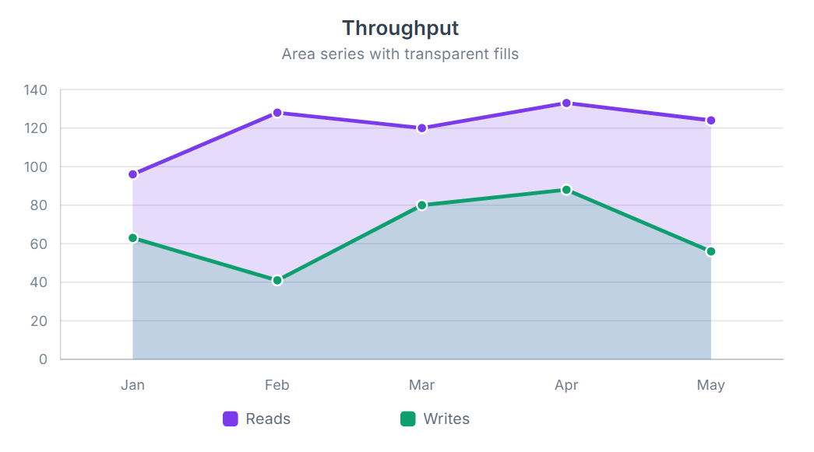
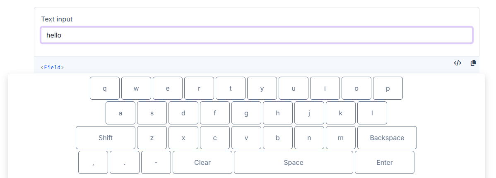
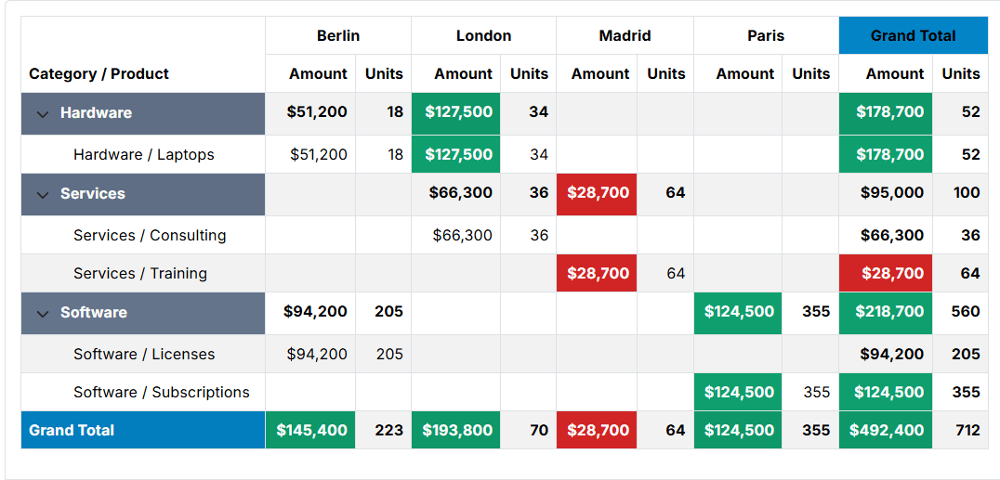
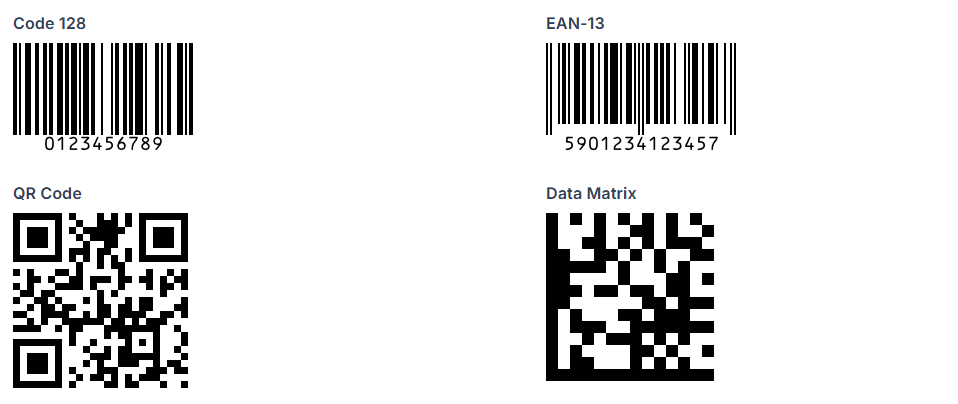
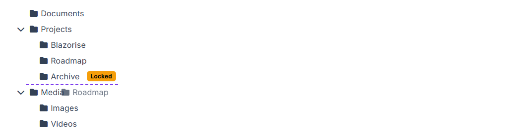

# Blazorise 2.2 - Release Notes

Blazorise 2.2, codenamed **Cetina**, takes its name from one of Croatia's most powerful rivers, originating beneath the country's highest mountain.

This release is one of the most feature-rich updates we've delivered, introducing a new SVG charting engine, a fully integrated on-screen keyboard, and PivotGrid for spreadsheet-style analytics and reporting. Together with improvements across animations, touch interactions, validation, accessibility, and provider integrations, Blazorise 2.2 continues to expand what developers can build with a single, consistent component framework.

## Website and Documentation Refresh

Alongside the framework improvements in Blazorise 2.2, we've also spent time refining the overall experience of our website and documentation.

The most visible change is a redesigned documentation sidebar, which presents information in a more structured and discoverable way. Navigation has been reorganized to make it easier to find components, extensions, guides, and API documentation, while providing more context directly within the menu.

We also simplified the overall site structure by merging the previous **News** and **Blog** sections into a single **Blog** experience, making it easier to browse release announcements, articles, and updates from one place.

The top navigation bar has been streamlined as well. Several text-based links have been replaced with icons, creating a cleaner layout and giving more space to the content itself. At the same time, we revisited the site's color palette and adjusted it with accessibility and contrast in mind, improving readability across both the website and documentation.

Together, these changes make it easier to explore Blazorise, discover available features, and find the information you're looking for.

## Key Blazorise 2.2 Highlights

Here are some of the most notable additions and updates:

- **SVG Charts**: A native SVG charting engine built entirely with C# and Blazor.
- **On-Screen Keyboard**: Touch-friendly virtual keyboard for kiosks, tablets, and accessibility scenarios.
- **PivotGrid**: Spreadsheet-style analytics and reporting directly within Blazor applications.
- **Blazorise Barcode**: Generate linear and 2D barcodes, including QR Code, Data Matrix, PDF417, and more.
- **Gestures**: Built-in swipe, tap, and long-press support for touch-first experiences.
- **Animate Enhancements**: Custom animations, custom easing functions, and layout-aware transitions.
- **TreeView Drag & Drop**: Reorder and reorganize hierarchical data with built-in drag-and-drop support.
- **Bootstrap 5 Bar Refresh**: Closer alignment with native Bootstrap navigation, with improved sidebar layouts, responsiveness, and styling consistency.

## Upgrading from 2.1.x to 2.2

Upgrading your application is simple:

Update all **Blazorise.*** package references to **2.2**.

```cs
<PackageVersion Include="Blazorise" Version="2.1.*" />
<PackageVersion Include="Blazorise.Bootstrap5" Version="2.1.*" />
```

Change to:

```cs
<PackageVersion Include="Blazorise" Version="2.2.0" />
<PackageVersion Include="Blazorise.Bootstrap5" Version="2.2.0" />
```

## New Features & Enhancements

### SVG Charts (New)

Building dashboards, reports, and data-driven applications becomes significantly easier with **SVG Charts**, a fully native charting engine built entirely with C# and Blazor.



The new charting system supports a wide range of chart types, including **line, area, bar, column, pie, doughnut, radar, polar area, scatter, bubble, and mixed charts**. Charts can be configured either declaratively through child components or programmatically through data and options models.

SVG charts include built-in support for features such as titles, legends, tooltips, multiple axes, stacked charts, time axes, custom colors, labels, animations, accessibility metadata, and chart events. SVG Charts also support **annotations, data labels, streaming, trendlines, and zoom/pan** through an extensible plugin system.

Streaming support enables live-updating charts with rolling windows, animated scrolling, reverse direction, and continuous data retention for real-time scenarios.

Documentation and demos were added for all supported chart types and advanced chart features, including animation, plugins, streaming, and custom styling.

See the full documentation: [SVG Charts](docs/extensions/svg-chart)

### On-Screen Keyboard (New)

Applications running on kiosks, tablets, and other touch-based devices can now take advantage of a fully integrated **On-Screen Keyboard** built directly into Blazorise.



The keyboard can be enabled globally through accessibility options or configured per input with `OnScreenKeyboard`, and works across a wide range of components including text inputs, numeric inputs, date and time pickers, memos, DataGrid editors, modals, and validation scenarios. Input targeting can also be customized through `OnScreenKeyboardInputType`.

The feature supports multiple keyboard layouts, configurable sizing, customizable key styling and templates, special-character rows, Shift handling, punctuation keys, and culture-aware numeric input. It also includes more advanced behaviors such as caret insertion, selected-text replacement, Enter-key handling, automatic scroll adjustment, and live composition support for date and time inputs.

The on-screen keyboard has been on our roadmap for years. Before the architectural changes introduced in Blazorise 2.0, implementing it consistently across providers and input types proved far more difficult than expected. Once the input system was refactored, we revisited the idea and were finally able to deliver a solution that works reliably even in more challenging scenarios such as date and time pickers.

The release also includes updated demos, documentation, and extensive test coverage for configuration, validation, DataGrid integration, provider rendering, keyboard layouts, and scrolling behavior.

Explore setup, customization, and usage examples in the [On-Screen Keyboard documentation](docs/components/on-screen-keyboard).

### PivotGrid (New)

When users need to summarize, analyze, and explore large datasets, **PivotGrid** provides a familiar spreadsheet-style reporting experience directly inside Blazor applications.



`PivotGrid` allows records to be grouped by row and column dimensions, calculate aggregate values, and display totals and subtotals in a tabular layout. It supports both **local data binding** and **external data loading**, making it suitable for everything from in-memory datasets to large server-driven reporting scenarios.

The component includes support for **paging, row virtualization, expandable groups, totals and subtotals, runtime field selection, and filtering through a built-in field chooser**. Custom aggregation logic can be implemented through the `Aggregator` API, while templates and styling hooks provide full control over headers, cells, and displayed values.

`PivotGrid` makes it easy to build interactive reports and data summaries without requiring a separate reporting tool. Documentation, demos, and API reference material are included to help you get started quickly.

For setup instructions and examples, see the [PivotGrid documentation](docs/extensions/pivotgrid).

### Barcode (New)

Generating QR codes, shipping labels, inventory tags, and other machine-readable identifiers is now easier with the new **Blazorise.Barcode** extension.



Whether you're generating shipping labels, inventory tags, product identifiers, or QR codes, the component supports many of the most common barcode and QR code formats, including Code 128, EAN, UPC, QR Code, Data Matrix, PDF417, Aztec, and more.

It also provides flexible configuration options such as **rendering mode, symbol sizing, scale, colors, rotation, value display and alignment, and image padding**, allowing precise control over barcode appearance and layout.

Browse supported barcode formats and configuration options in the [Barcode documentation](docs/extensions/barcode).

### Validation Warning Support

Not every validation message should prevent users from continuing. The new **warning validation state** makes it possible to provide guidance and recommendations without treating them as errors.

With `ValidationStatus.Warning` and the `ValidationWarning` component, you can highlight potential issues or recommendations while still letting users continue. This is useful for scenarios like weak password suggestions or optional field guidance where strict validation is not required.

The new `ValidationFeedback` component groups all feedback types (`None`, `Warning`, `Success`, and `Error`) into a single, consistent API, making it easier to manage validation UI.

See the [Validation documentation](docs/components/validation) for warning-state examples.

### TreeView Drag & Drop

TreeView now supports **drag-and-drop reordering**, allowing users to reorganize hierarchical data directly within the interface.



You can enable dragging with `Draggable` and allow reordering with `Reorderable`, including inserting nodes before or after others. Built-in behavior handles moving nodes within **mutable collections** automatically, so basic scenarios work out of the box.

For more control, you can use `CanDragNode` and `CanDropNode` to restrict allowed operations, and `NodeDropped` to fully customize what happens on drop. If not handled, TreeView falls back to its default move logic.

The feature includes clear **visual drop indicators** for inserting before, after, or as a child node, helping users understand where items will be placed.

For drag-and-drop examples, see the [TreeView documentation](docs/components/treeview).

### Gestures, Carousel, and Animation Improvements

Several improvements in this release originated from the same effort to make touch-driven interactions feel more natural in Blazorise.

The journey started with the new **`Gestures`** component, which introduces built-in support for swipe, tap, and long-press interactions. Designed for touch-friendly applications, it provides configurable gesture settings and events while integrating cleanly with existing Blazorise components.

As part of that work, we wanted to bring swipe navigation directly to **Carousel**. The result is the new `Swipeable` parameter, allowing users to navigate slides naturally on touch devices without additional markup. Carousel also gained support for custom indicator, navigation button, and caption templates.

While implementing these features, we identified opportunities to improve the underlying animation system. The **Animate** component has since evolved into a much more capable animation framework, with support for custom animations and easing functions defined in C#, improved visibility-based transitions, and the new `AnimatedSize` mode for layout-aware animations such as drawers, sidebars, and expandable content.

Together, these improvements provide a stronger foundation for building modern, interactive, and touch-friendly user experiences.

Explore animation examples and custom keyframes in the [Animate documentation](docs/extensions/animate). See the [Gestures documentation](docs/components/gestures) for swipe, tap, and long-press examples, and the [Carousel documentation](docs/components/carousel) for customization and touch navigation examples.

### Bootstrap 5 Provider Update

The [Bootstrap 5](docs/usage/bootstrap5) provider has been updated to **Bootstrap 5.3.8**.

This update improves support for newer Bootstrap 5.3 utility classes, including subtle color variants, border utilities, themed badges, alerts, tables, and improved contrast handling. Theming behavior continues to respect `LuminanceThreshold`, while adding additional contrast fallback logic to improve readability where needed.

For Bootstrap-specific guidance, see the [Bootstrap 5 documentation](docs/usage/bootstrap5).

### Bootstrap 5 Bar Improvements

One of the larger provider improvements in this release is a substantial refresh of the **Bootstrap 5 Bar** component. Historically, the component relied on custom layouts, styling, and `b-bar-*` class names to support features that did not map cleanly to Bootstrap's navigation system.

With this release, the Bootstrap 5 Bar has been refactored to align much more closely with **native Bootstrap navigation patterns**. Both vertical and horizontal modes now make greater use of standard Bootstrap structures and class names, improving compatibility with custom Bootstrap themes and making the generated markup easier to customize with standard Bootstrap styles.

Alongside the structural changes, the update includes improvements to sidebar layouts, collapsed navigation, active and hover states, icon alignment, brand and toggler positioning, mobile behavior, and dropdown menu handling. These changes result in a navigation experience that feels more consistent with the rest of the Bootstrap ecosystem while preserving the flexibility expected from Blazorise.

See the [Bar documentation](docs/components/bar) for navigation and layout examples.

## Final Notes

Blazorise 2.2 continues our mission of making modern application development with Blazor more productive, flexible, and enjoyable.

This release introduces several major additions, including a brand-new SVG charting engine, a fully integrated on-screen keyboard, and the new PivotGrid component for reporting and analytics. Alongside these headline features, we've continued to refine the framework through improvements to animations, touch interactions, validation, navigation, accessibility, and provider integrations.

As always, these improvements are driven by real-world usage, community feedback, and the challenges we encounter while building and maintaining Blazor applications ourselves. Every release helps strengthen the foundation of the framework while opening new possibilities for application developers.

We encourage you to explore the updated documentation, try the new components, and let us know what you'd like to see next.

If you need help integrating Blazorise into your applications or require custom components and features tailored to your project, visit our custom development page at https://blazorise.com/custom-work.

Thank you for being part of the Blazorise community and for continuing to support the project.

## Goodbye

That wraps up Blazorise 2.2.

Whether you've been with us since the early releases or are just getting started, we appreciate every bug report, feature request, pull request, discussion, and message. Your feedback continues to shape the direction of the framework and helps us make Blazorise better with every release.

We hope you enjoy everything that Cetina brings to the framework, and we're already looking forward to sharing what's coming next.

Until the next release, happy coding!