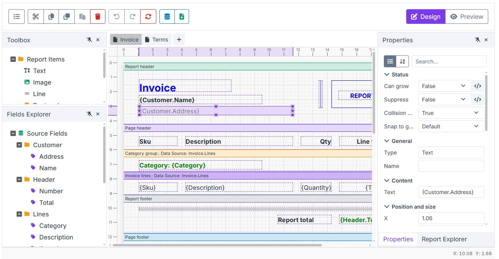
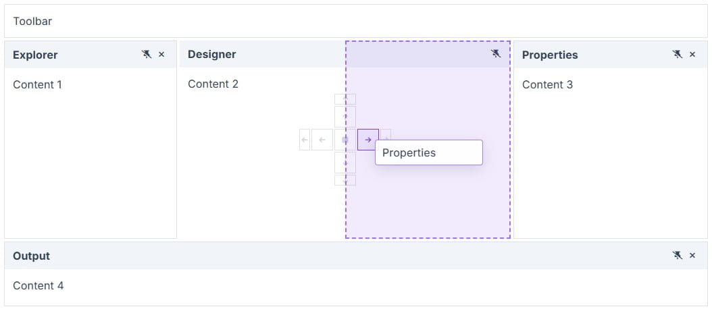
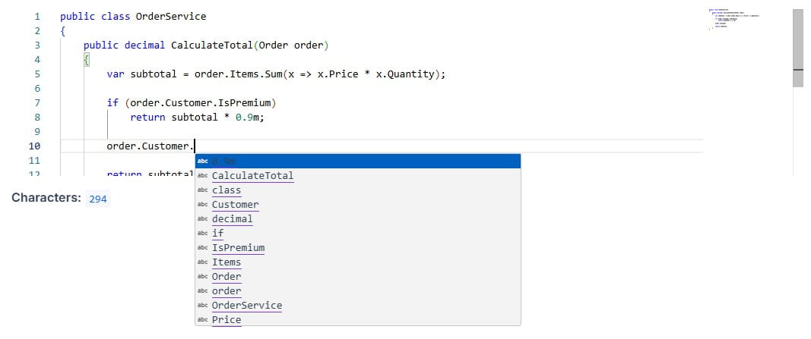
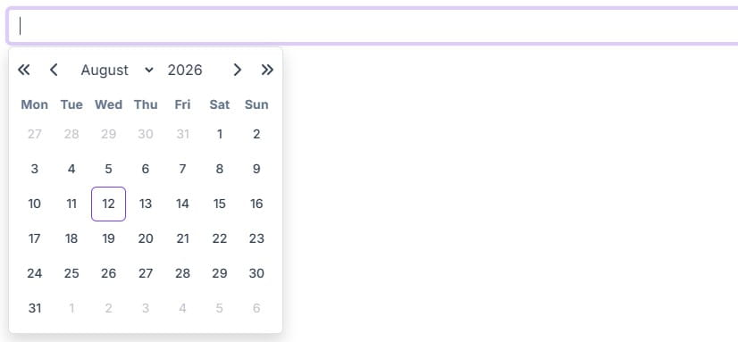
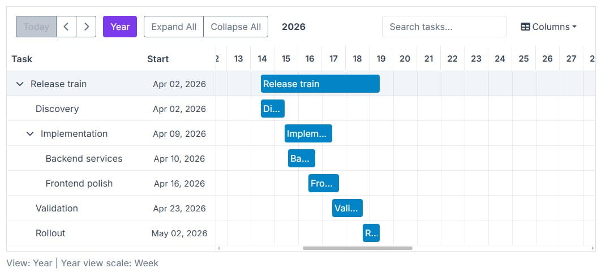

# Blazorise 2.3 - Release Notes

Blazorise 2.3, codenamed **Jadro**, is named after the Jadro River in Solin, Croatia.

This release started with a simple idea: *build a Reporting solution for Blazorise*. Once work began, it quickly became clear that a report designer needed several things that did not yet exist in the framework. Instead of building them only for Reporting, we turned them into reusable components that everyone can use.

That became the main story of Blazorise 2.3. But Reporting is only part of the release. We also added CodeEditor and Resizer, rebuilt DatePicker and TimePicker with Blazor and C#, and continued improving Gantt, Scheduler, PdfViewer, and styling.



## Key Blazorise 2.3 Highlights

Here are some of the most important additions and updates:

- **Reporting**: Visual report designer with multiple data sources and HTML/PDF output.
- **Reporting Building Blocks**: New DockLayout, ContextMenu, PropertyGrid, and PDF generation.
- **CodeEditor**: Source-code and custom language editing for Blazor applications.
- **DatePicker and TimePicker**: Rebuilt in Blazor and C#, removing the Flatpickr dependency.
- **Gantt and Scheduler**: Weekly Gantt timelines, milestones, custom Scheduler fields, and custom appointment editors.
- **Layout and Styling**: A new Resizer component, shorter CSS value syntax, and support for custom CSS colors.

## Upgrading from 2.2.x to 2.3

Update all **Blazorise.*** package references to **2.3**.

```cs
<PackageVersion Include="Blazorise" Version="2.2.*" />
<PackageVersion Include="Blazorise.Bootstrap5" Version="2.2.*" />
```

Change them to:

```cs
<PackageVersion Include="Blazorise" Version="2.3.0" />
<PackageVersion Include="Blazorise.Bootstrap5" Version="2.3.0" />
```

## Reporting and the Components It Needed

Reporting is one of the largest features we have built for Blazorise. The goal was to provide a reporting system that felt like part of the framework, with a visual designer and enough flexibility for common business reports.



Reports use a familiar band-based model and can work with application objects, tabular data, CSV files, and SQL sources. The expression system covers formulas, totals, grouping, and formatting, while reports can be previewed as HTML or PDF.

The designer focuses on the tasks users expect from a visual reporting tool. You can drag fields and report elements onto the page, move and resize them, edit their properties, align items, and undo changes. Report definitions and designer state can also be saved and loaded.

We also spent a lot of time on the parts users don't immediately see, but that matter in real applications. The designer keeps its layout and editing state when switching between Design and Preview, longer operations can be cancelled, older preview results cannot replace newer ones, and larger reports refresh more efficiently. Accessibility, localization, theming, and error handling were also brought in line with the rest of Blazorise.

The [Reporting documentation](docs/extensions/reporting) covers the designer, data sources, expressions, and complete examples.

### DockLayout

The first missing piece was the designer workspace. Reporting needed panels that users could move, resize, group into tabs, hide, and restore.

That work became **DockLayout**, a standalone component for building IDE-style and user-configurable layouts. Applications can create horizontal and vertical splits, dock panes by dragging them, and save the layout so it can be restored later.



DockLayout is used by the Reporting designer, but it can also be used for dashboards, admin tools, editors, and other applications that need a flexible workspace.

More layout and docking examples are available in the [DockLayout documentation](docs/components/dock-layout).

### ContextMenu

The designer also needed context-specific actions for the object being edited, which led to the new **ContextMenu** component.

ContextMenu covers the common menu cases, including nested items, checked items, groups, keyboard navigation, and opening from either a target element or application code. Focus handling, accessibility, and menu positioning are built in, so it behaves like a complete Blazorise component rather than a Reporting-only helper.

For more examples, visit the [ContextMenu documentation](docs/components/context-menu).

### PropertyGrid

Once a report element was selected, users needed a clear way to inspect and change its settings. That became the new **PropertyGrid** component.

PropertyGrid can build editors manually or from a schema, with support for grouping, search, descriptions, templates, and actions. Reporting uses it in the designer, but it can also be used for settings pages, configuration tools, admin screens, and other object-editing scenarios.

Manual and schema-driven setups are covered in the [PropertyGrid documentation](docs/components/property-grid).

### PDF Generation

Reporting also needed PDF preview and export, which led to the new **Blazorise.Pdf** extension.

PDF documents can be created with Razor components or fluent builders. The API covers the main building blocks needed for business documents, including text, images, shapes, and tables, with support for Unicode and custom fonts.

We also spent time making PDF generation safe and reliable for real applications, especially when working with external images and fonts. Reporting uses it for preview and download, but the PDF extension can be used independently anywhere you need to create PDF files.

The [PDF documentation](docs/extensions/pdf) includes setup and document generation examples.

## CodeEditor

The goal behind **CodeEditor** was not only to edit common programming languages. We also wanted it to work for configuration files, formulas, scripts, and languages defined by the application itself.



CodeEditor handles the editor itself, while your application defines the language rules. Applications can add their own completion, diagnostics, formatting, validation, snippets, and syntax rules through strongly typed APIs.

It also supports different value update modes, so changes can be applied immediately, after editing, or with a delay. Multiple editors can run independently on the same page, and pending changes are kept when focus moves or the component is removed.

You can find setup, configuration, and examples in the [CodeEditor documentation](docs/extensions/code-editor).

## DatePicker and TimePicker

We also used this release to completely rewrite **DatePicker** and **TimePicker**.



For years, both components relied on the Flatpickr JavaScript library. It served us well, but it became harder to maintain and limited how much control we had over fixes and new features. We decided to replace it with our own implementation built with Blazor and C#.

The rewrite keeps the existing public APIs and the behavior applications already depend on. At the same time, it gives us direct control over keyboard navigation, accessibility, popup placement, month and week navigation, and provider styling.

The most important benefit is long-term ownership. We can now improve these components without waiting for changes in an external library or working around its limits.

More details and examples are available in the [DatePicker documentation](docs/components/date-picker) and [TimePicker documentation](docs/components/time-picker).

## PdfViewer Continuous Scrolling

To make longer reports and documents easier to read, `PdfViewer` now has a continuous scrolling mode.

Set `Mode="PdfViewerMode.Continuous"` to show all pages in one vertical view. Page tracking and toolbar navigation stay synchronized as the user scrolls.

Configuration and examples are covered in the [PdfViewer documentation](docs/extensions/pdfviewer).

## Resizer

The new **Resizer** component adds a resizable boundary to an existing panel, sidebar, or other element without requiring a full docking layout.

Resizer works with both pointer and keyboard input and can resize one or both sides of a boundary. It can remain invisible or show a provider-specific gutter when users need a clear resize handle.

The [Resizer documentation](docs/components/resizer) shows how to add resizing to existing layouts.

## Planning and Scheduling

We also returned to Gantt and Scheduler, with changes focused on planning detail and application-specific data.

### Gantt Improvements

The **Gantt Year View** can now use weekly columns when a month-based view is too broad. The existing monthly scale remains the default, while `TimelineScale="GanttYearViewTimelineScale.Week"` shows one column per week across the year.



Gantt also supports **milestones** for important dates such as releases, approvals, and deadlines. They can be placed at exact dates and times, styled or templated, and included when the visible timeline range is calculated.

Weekly timelines, milestones, and other examples are available in the [Gantt documentation](docs/extensions/gantt).

### Scheduler Improvements

Scheduler appointments often contain more than the built-in title, dates, and description. The Add/Edit Appointment dialog can now include editors for custom model fields through `SchedulerColumns` and `SchedulerColumn`.

Applications can also replace the editor used for a built-in field while keeping the Scheduler's normal validation, state handling, and save flow. Custom appointment templates and improved background styling make it possible to show those values directly in the calendar.

The [Scheduler documentation](docs/extensions/scheduler) includes examples for custom editors and appointment templates.

## Smaller Improvements

We also made a few smaller improvements to the way styling is handled from C#.

### Fluent CSS Value Shorthands

CSS values can now be written with shorter numeric extension methods:

```razor
<Div Width="20.Rem().Min(12).Max(30)"
     Height="@(Height.Calc( "100vh - 4rem" ))"
     Gap="1.Rem()"
     TextSize="1.25.Rem()" />
```

Existing forms such as `Width.Rem(8)` and `Gap.Rem(1)` remain supported, so applications can adopt the shorter syntax gradually.

### Custom CSS Colors

`Color`, `TextColor`, `Background`, and `BorderColor` now accept custom CSS values in addition to the existing theme colors.

This includes common CSS color formats and CSS variables, either passed as strings or created with the new `CssColor` helpers. The same color values work across regular components, border utilities, and SVG Charts.

## Final Notes

Looking back, Blazorise 2.3 became much larger than we originally planned. That's often how development goes. You start solving one problem, find something missing underneath it, and end up improving more of the framework than expected.

Reporting is the clearest example of that in this release, but the same happened elsewhere. We replaced a dependency we no longer wanted to rely on, added several reusable building blocks, and improved existing components based on problems we found in real applications.

Many of these changes came from community feedback, customer projects, support requests, and our own work with Blazorise. Thank you to everyone who reported issues, suggested features, tested previews, and contributed to the project.

If you need help integrating Blazorise into your application or need a custom component for your project, visit our [custom development services](https://blazorise.com/custom-work).

Thank you for continuing to use and support Blazorise.