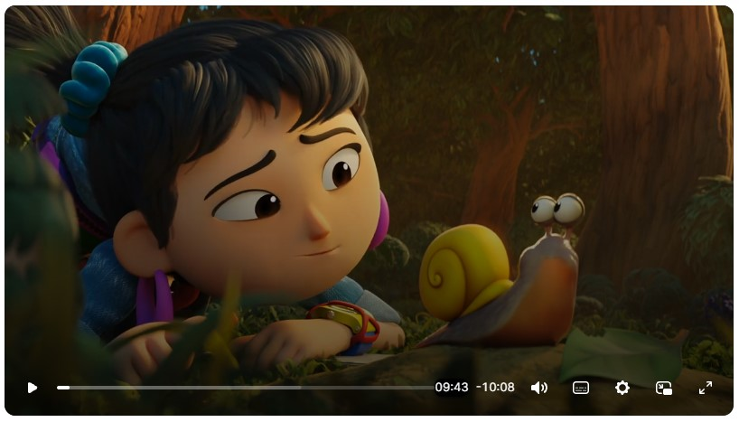
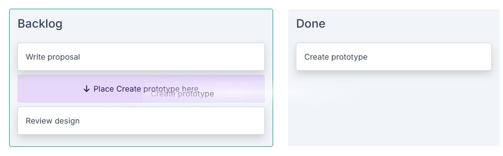

Blazorise 2.4 is codenamed **Jadro**, ...

## Key Blazorise 2.4 Highlights

Here are some of the most important additions and updates:

- **Tooltip**: Rebuilt in Blazor and C#, removing the Tippy.js dependency.

## Upgrading from 2.3.x to 2.4

Update all **Blazorise.*** package references to **2.4**.

```cs
<PackageVersion Include="Blazorise" Version="2.3.*" />
<PackageVersion Include="Blazorise.Bootstrap5" Version="2.3.*" />
```

Change them to:

```cs
<PackageVersion Include="Blazorise" Version="2.4.0" />
<PackageVersion Include="Blazorise.Bootstrap5" Version="2.4.0" />
```

### Video Improvements

The **Video** component has been rebuilt on **Video.js v10**, replacing the previous Plyr-based implementation.



We made the change because video playback has grown beyond simple video files. Applications increasingly need streaming formats and external providers, and Video.js gives us a better base for supporting those scenarios while keeping the Blazorise API familiar.

The new implementation works with regular video and audio files, while adding better support for **HLS, DASH, YouTube, Vimeo, captions, quality selection, playback speed, and DRM-protected streams**. Integrations are loaded only when needed, and player assets are packaged locally to make deployment more predictable, especially for applications with stricter security policies.

We also improved accessibility, localization, cleanup, and handling of multiple players on the same page.

Moving to Video.js gives us more control over where the component goes next and makes it easier to support new streaming formats, providers, and browser capabilities in future releases.

### Addons Validation Feedback

We have finally fixed a long-standing issue with **validation inside Addons**.

Validation messages could previously break the input group layout, push trailing addons onto another line, or cause rounded corners to render incorrectly. Feedback is now linked to each individual input while being displayed below the complete addon group, keeping the layout intact even when multiple inputs have validation messages.

The recommended structure now places `Validation` around each input inside its addon, with messages defined through the input's `Feedback` content.

Existing applications using the old structure can be updated automatically with **Blazorise.Migrator**.

### Tooltip Improvements

**Tooltip** is now fully Blazor-native and no longer depends on **Tippy.js**, continuing our work to remove external JavaScript dependencies where we can provide the same functionality directly in Blazorise.

A new `TooltipContent` fragment also makes tooltips much more flexible. Instead of being limited to simple text, tooltips can now contain rich content built with Blazorise components, typography, and utilities. The existing `Text` parameter remains available when only simple content is needed.

External triggers, themes, delays, interactive content, inline detection, and provider-specific styling continue to work as expected. The `AppendTo` parameter remains for compatibility, but is now obsolete and has no effect.

With the implementation now under our control, Tooltip can continue to improve without relying on an external library.

### SVG Chart Data Dragging

**SVG Charts** can now be used as visual editors, allowing users to change data values directly on the chart.

Instead of adjusting values in a separate form and then checking the result, users can drag values and immediately see how those changes affect the chart. This works well for scenarios such as **forecasting, capacity planning, allocation, and scenario modeling**.

Data dragging works across several chart types, including stacked, point-based, and radial charts. It also supports pointer and keyboard interaction, snapping, cancellation, and read-only controls, giving applications control over how values can be changed.

### MemoInput Improvements

**MemoInput** autosizing now uses native browser capabilities where available, resulting in smoother resizing and more consistent behavior across UI providers.

Older browsers continue to work through a fallback, so existing applications don't lose autosizing support.

We also reduced the JavaScript needed by MemoInput. The optional script used for tab handling is now loaded only when that feature is actually enabled.

### FluentUI2 Visual Refresh

The **FluentUI2** provider has received a visual refresh to more closely follow the upcoming **Fluent v3** design language.

We updated design tokens, sizing, spacing, and interaction states across the provider, with noticeable improvements to buttons, icon buttons, pagination, and navigation elements.

The **Bar** also received a larger rewrite. Horizontal and vertical navigation now use FluentUI2-specific styling instead of relying on shared behavior that was harder to adapt to Fluent's design. This improves responsive and collapsed navigation, nested menus, active and hover states, alignment, badges, and dark mode contrast.

The goal is to make FluentUI2 applications feel more consistent with the direction Microsoft is taking Fluent while keeping the existing Blazorise APIs and Bar features intact.

## Smaller Improvements

### Alternative Text Naming

Image-related components now use a consistent `Text` parameter for alternative text.

Existing parameters such as `CardImage.Alt`, `FigureImage.AlternateText`, `Cropper.Alt`, and `QRCode.Alt` remain available for compatibility but are now obsolete. Existing applications will continue to work, while new code should use `Text`.

We also improved accessibility for **QRCode** and **Cropper**, ensuring the provided text is correctly passed to the rendered image and accessibility attributes.

### DisplayFormat Improvements

`DisplayFormat` now accepts standard **.NET format specifiers** directly, making formatting shorter and easier to read.

You can now use formats such as `C` or `dd.MM.yyyy` without wrapping them in a composite format. Existing formats such as `{0:C}` continue to work, so no changes are required in current applications.

The same formatting behavior is now available across **DataGrid, PivotGrid, and Gantt**.

### Drag & Drop Improvements

Drag & drop placeholders can now show **custom content**, making it easier to give users clear feedback about where an item will be placed while dragging.



We also improved drop targeting around the first item in a zone, making reordering and moving items between drop zones more accurate and predictable.