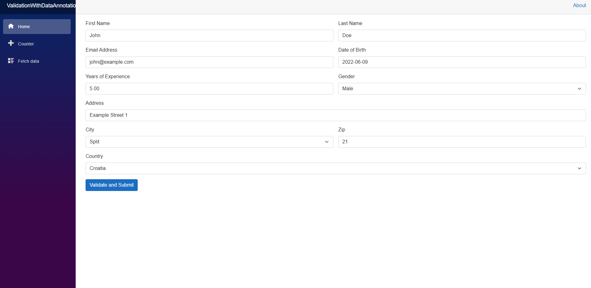
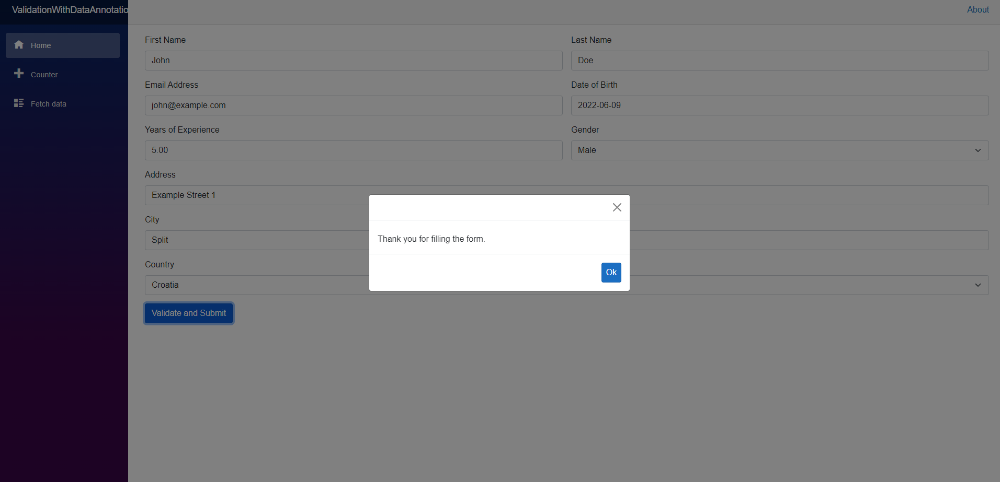

---
title: Blazorise Form Validation With Data Annotations
description: Learn all about how to utilize Blazorise form validation to quickly validate your input fields without the model instance.
permalink: /blog/blazor-form-validation-with-data-annotations
canonical: /blog/blazor-form-validation-with-data-annotations
image-url: img/Blazorise-Form-Validation-With-Data-Annotations.png
image-title: Blazorise Form Validation With Data Annotations: A Beginner's Guide
author-name: Mladen Macanović
author-image: "/assets/img/authors/mladen.png"
posted-on: June 9th, 2022
read-time: 5 min
---

# Blazorise Form Validation With Data Annotations: A Beginner's Guide

Validation is critical for any application to obtain reliable data from the user on any data entry form. The Blazorise UI components includes form validation support that makes use of data annotations. It also allows you to use custom validation handlers and regex patterns to solve complex validation problems. Since data annotations are the most popular way of validating forms we will cover it in this blog, and in one of next blogs we will explain some of the other ways of how to do the validation.

Over 80 responsive and lightweight UI controls are available in the Blazorise Blazor component library for building modern web apps.

In this blog post, we will look at how to use Blazorise Blazor UI components to create an edit form for employee details and apply complex validation using data annotations.

## Prerequisites

It is recommended that you already have a working Blazorise project before we begin. If you don't already have it, you can read our blog post on [How to create a Blazorise WASM application](blog/how-to-create-a-blazorise-application-beginners-guide).

When you have finished with setting the project make sure that you also have the **MessageAlert** defined in the **App.razor**. We will use it to give feedback to the user once we have an error or a successfull form submition.

```html|MessageProviderExample
<Router AppAssembly="@typeof(App).Assembly">
    <Found Context="routeData">
        <RouteView RouteData="@routeData" DefaultLayout="@typeof(MainLayout)" />
        <FocusOnNavigate RouteData="@routeData" Selector="h1" />
    </Found>
    <NotFound>
        <PageTitle>Not found</PageTitle>
        <LayoutView Layout="@typeof(MainLayout)">
            <p role="alert">Sorry, there's nothing at this address.</p>
        </LayoutView>
    </NotFound>
</Router>

<MessageAlert />
```

## Creating the Model

Let's start by creating a new model class file inside the **Model** folder with the name **Employee**.

In this class file, add the class definitions for the Countries and Cities classes with the required properties and methods to generate the appropriate data for the dropdown list.

Refer to the following code example.

```cs|ModelsExample
public class Employee
{
    [Required]
    public string FirstName { get; set; }

    [Required]
    public string LastName { get; set; }

    [Required]
    [EmailAddress]
    public string Email { get; set; }

    [Required]
    public string Gender { get; set; }

    [Required]
    public DateTime? DateOfBirth { get; set; }

    [Required]
    public decimal? YearsOfExperience { get; set; }

    public Address Address { get; set; } = new Address();
}

public class Address
{
    [Required]
    public string Street { get; set; }

    [Required]
    public string City { get; set; }

    [Required]
    public string Zip { get; set; }

    [Required]
    public string Country { get; set; }
}

public class Country
{
    public string Name { get; set; }

    public string Code { get; set; }

    public static IEnumerable<Country> GetCountries()
    {
        return new List<Country>
        {
            new() { Name = "Croatia", Code = "HR" },
            new() { Name = "United Kingdom", Code = "UK" },
            new() { Name = "United States", Code = "US" },
        };
    }
}

public class City
{
    public string Name { get; set; }

    public string Code { get; set; }

    public string CountryCode { get; set; }

    public static IEnumerable<City> GetCities()
    {
        return new List<City>
        {
            new() { Name = "San Francisco", CountryCode = "US", Code="US-101" },
            new() { Name = "Los Angeles", CountryCode = "US", Code="US-102" },
            new() { Name = "Boston", CountryCode = "US", Code="US-103" },
            new() { Name = "Portland", CountryCode = "US", Code="US-104" },
            new() { Name = "Split", CountryCode = "HR", Code="HR-101" },
            new() { Name = "Zagreb", CountryCode = "HR", Code="HR-102" },
            new() { Name = "Dubrovnik", CountryCode = "HR", Code="HR-103" },
            new() { Name = "London", CountryCode = "UK", Code="UK-101" },
            new() { Name = "Glasgow", CountryCode = "UK", Code="UK-102" },
            new() { Name = "Liverpool", CountryCode = "UK", Code="UK-103" }
        };
    }
}

public class Gender
{
    public string Name { get; set; }

    public string Code { get; set; }

    public static IEnumerable<Gender> GetGenders()
    {
        return new List<Gender>
        {
            new() { Name = "Male", Code = "A" },
            new() { Name = "Female", Code = "B" },
            new() { Name = "Non-binary", Code = "C" },
            new() { Name = "Transgender", Code = "D" },
            new() { Name = "Intersex", Code = "E" },
            new() { Name = "I prefer not to say", Code = "F" },
        };
    }
}
```

We've now created the **Employee** class and annotated all of its properties with the **[Required]** attribute.

## Creating the Page form

We will create new form in the **Index.razor** file under the **Pages** folder.

On this page we will structure a fairly simple form structure that represents a form where we will ask for an employee data.

Refer to the following code example.

```html|FormExample
@page "/"
@using ValidationWithDataAnnotations.Models

<Row>
    <Column>
        <Validations @ref="@ValidationsRef" Mode="ValidationMode.Manual" Model="@EmployeeModel" ValidateOnLoad="false">
            <Fields>
                <Validation>
                    <Field ColumnSize="ColumnSize.IsHalf">
                        <FieldLabel>First Name</FieldLabel>
                        <FieldBody>
                            <TextEdit @bind-Text="@EmployeeModel.FirstName">
                                <Feedback>
                                    <ValidationError />
                                </Feedback>
                            </TextEdit>
                        </FieldBody>
                    </Field>
                </Validation>
                <Validation>
                    <Field ColumnSize="ColumnSize.IsHalf">
                        <FieldLabel>Last Name</FieldLabel>
                        <FieldBody>
                            <TextEdit @bind-Text="@EmployeeModel.LastName">
                                <Feedback>
                                    <ValidationError />
                                </Feedback>
                            </TextEdit>
                        </FieldBody>
                    </Field>
                </Validation>
            </Fields>
            <Fields>
                <Validation>
                    <Field ColumnSize="ColumnSize.IsHalf">
                        <FieldLabel>Email Address</FieldLabel>
                        <FieldBody>
                            <TextEdit @bind-Text="@EmployeeModel.Email" Role="TextRole.Email">
                                <Feedback>
                                    <ValidationError />
                                </Feedback>
                            </TextEdit>
                        </FieldBody>
                    </Field>
                </Validation>
                <Validation>
                    <Field ColumnSize="ColumnSize.IsHalf">
                        <FieldLabel>Date of Birth</FieldLabel>
                        <FieldBody>
                            <DatePicker @bind-Date="@EmployeeModel.DateOfBirth">
                                <Feedback>
                                    <ValidationError />
                                </Feedback>
                            </DatePicker>
                        </FieldBody>
                    </Field>
                </Validation>
            </Fields>
            <Fields>
                <Validation>
                    <Field ColumnSize="ColumnSize.IsHalf">
                        <FieldLabel>Years of Experience</FieldLabel>
                        <FieldBody>
                            <NumericPicker @bind-Value="@EmployeeModel.YearsOfExperience">
                                <Feedback>
                                    <ValidationError />
                                </Feedback>
                            </NumericPicker>
                        </FieldBody>
                    </Field>
                </Validation>
                <Validation>
                    <Field ColumnSize="ColumnSize.IsHalf">
                        <FieldLabel>Gender</FieldLabel>
                        <FieldBody>
                            <Select @bind-SelectedValue="@EmployeeModel.Gender">
                                <ChildContent>
                                    <SelectItem TValue="string"></SelectItem>
                                    @foreach ( var g in Gender.GetGenders() )
                                    {
                                        <SelectItem TValue="string" Value="@g.Code">@g.Name</SelectItem>
                                    }
                                </ChildContent>
                                <Feedback>
                                    <ValidationError />
                                </Feedback>
                            </Select>
                        </FieldBody>
                    </Field>
                </Validation>
            </Fields>
            <Validation>
                <Field>
                    <FieldLabel>Address</FieldLabel>
                    <FieldBody>
                        <TextEdit @bind-Text="@EmployeeModel.Address.Street">
                            <Feedback>
                                <ValidationError />
                            </Feedback>
                        </TextEdit>
                    </FieldBody>
                </Field>
            </Validation>
            <Fields>
                <Validation>
                    <Field ColumnSize="ColumnSize.IsHalf">
                        <FieldLabel>City</FieldLabel>
                        <FieldBody>
                            <Select @bind-SelectedValue="@EmployeeModel.Address.City">
                                <ChildContent>
                                    <SelectItem TValue="string"></SelectItem>
                                    @foreach ( var c in City.GetCities() )
                                    {
                                        <SelectItem TValue="string" Value="@c.Code">@c.Name</SelectItem>
                                    }
                                </ChildContent>
                                <Feedback>
                                    <ValidationError />
                                </Feedback>
                            </Select>
                        </FieldBody>
                    </Field>
                </Validation>
                <Validation>
                    <Field ColumnSize="ColumnSize.IsHalf">
                        <FieldLabel>Zip</FieldLabel>
                        <FieldBody>
                            <TextEdit @bind-Text="@EmployeeModel.Address.Zip">
                                <Feedback>
                                    <ValidationError />
                                </Feedback>
                            </TextEdit>
                        </FieldBody>
                    </Field>
                </Validation>
            </Fields>
            <Validation>
                <Field>
                    <FieldLabel>Country</FieldLabel>
                    <FieldBody>
                        <Select @bind-SelectedValue="@EmployeeModel.Address.Country">
                            <ChildContent>
                                <SelectItem TValue="string"></SelectItem>
                                @foreach ( var c in Country.GetCountries() )
                                {
                                    <SelectItem TValue="string" Value="@c.Code">@c.Name</SelectItem>
                                }
                            </ChildContent>
                            <Feedback>
                                <ValidationError />
                            </Feedback>
                        </Select>
                    </FieldBody>
                </Field>
            </Validation>
        </Validations>
        <Button Color="Color.Primary" Clicked="@OnSaveClicked">
            Validate and Submit
        </Button>
    </Column>
</Row>
@code {
    [Inject] IMessageService MessageService { get; set; }

    Validations ValidationsRef { get; set; }

    Employee EmployeeModel { get; set; } = new Employee();

    async Task OnSaveClicked()
    {
        if ( await ValidationsRef.ValidateAll() )
        {
            await MessageService.Info( "Thank you for filling the form." );

            await ValidationsRef.ClearAll();
        }
    }
}
```

## Breakdown


1. We use `<Validations>` component to group all validations under a single submit request.
2. **Model** parameter is used to give **Validations** enough information about the object and attributes that we are validating.
3. **ValidateOnLoad** is set to false so that form is NOT validated when the page is first opened.
4. We place **Feedback** inside of input component. The reason for this structure is that Blazorise will handle the right HTML structure for you when the components are rendered.

## Executing the demo

Launch the application if you have modified it in accordance with all of the code samples.

In the left-hand navigation menu, click the **Home** button. The output will then look like the image below.



Try to partially fill the form and click on the <Strong>Validate and Submit</Strong> button. You should see some of the errors.

If you fill the entire form form and submit you should see the following message.



Thus, we have created the form and included the Blazorise form validation in our Blazor WebAssembly application.

## GitHub Reference

The full source code of the sample from the [ValidationWithDataAnnotations](https://github.com/Megabit/Blazorise-Samples) in Blazor demo on GitHub.

## Conclusion

Thank you for your time! In this blog, we saw how to use Blazorise UI components to create an edit form and easily apply complex validation using data annotations. Try out the steps in this blog post and leave your comments on our Discord community channel.

Download our [Blazorise NuGet](https://www.nuget.org/profiles/Megabit) to try our Blazor components or purchase our [commercial Blazorise web](commercial/) license to gain access to our support forum. To learn more about other available features, please see our online examples and [documentation](docs).

## Related blogs

- [How to create a Blazorise WASM application: A Beginner's Guide](blog/how-to-create-a-blazorise-application-beginners-guide)