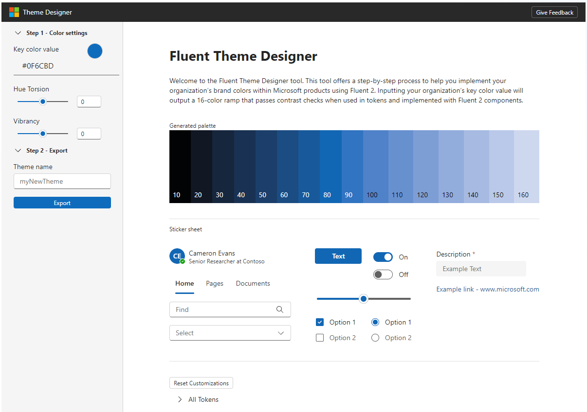
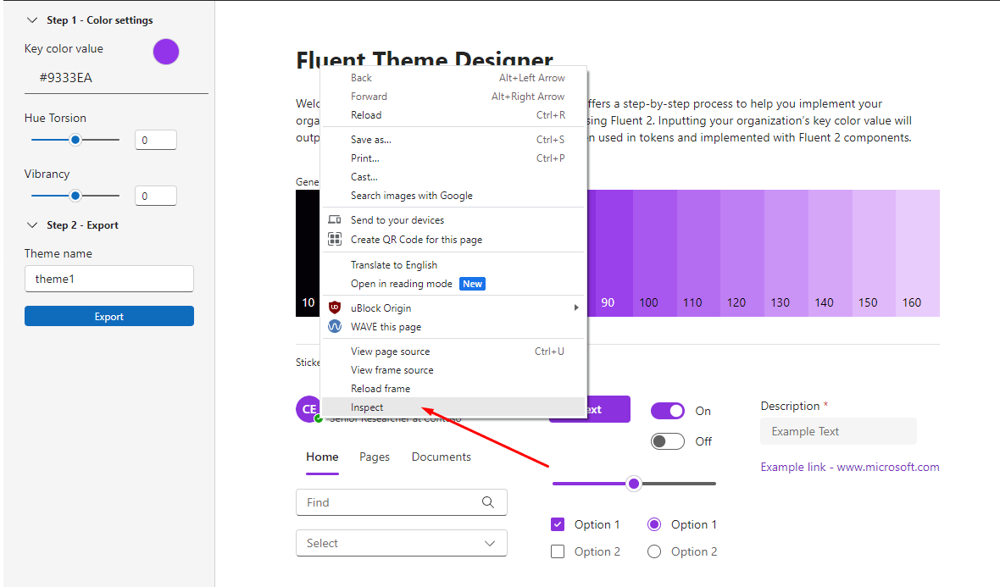
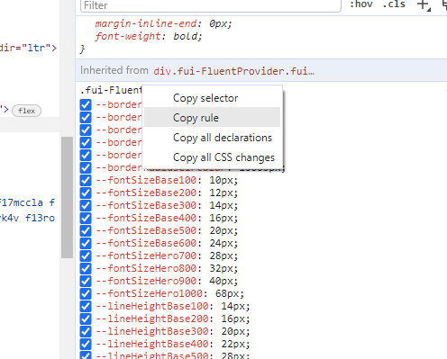

# How to override Fluent design tokens

Creating a visually appealing and user-friendly interface is crucial for any web application. [Microsoft's Fluent Design System](https://fluent2.microsoft.design/) provides a robust framework for creating such interfaces, offering a wide array of design tokens that can be utilized to craft beautiful and intuitive UIs.

However, when it comes to integrating these design tokens into a Blazorise project, the process is not as straightforward as one might hope. In this blog post, we'll guide you through the steps to properly override Fluent design tokens for use in your Blazorise project.

## The Problem

In the current version of Blazorise (v1.5), changing theme settings like those available in other Blazorise CSS providers is not possible.

This limitation was a deliberate choice while developing the new Fluent provider, primarily due to time constraints. The goal was to avoid delaying the release of Blazorise 1.5 and to allocate sufficient time to properly implement the Fluent theme generator in future versions of Blazorise.

## The Solution

While a built-in theme generator for the Blazorise Fluent provider is still in the works, there is a workaround that allows you to manually override Fluent design tokens. The process involves several steps but is generally straightforward.

### 1. Open React Fluent Theme Designer

Start by visiting the [Fluent Theme Designer](https://react.fluentui.dev/?path=/docs/theme-theme-designer--page)  for the React implementation of the Fluent 2 design system.

You'll be presented with the Fluent Theme Designer interface.



### 2. Export The Theme Settings

After customizing the theme colors and settings to your liking, name your theme and then use the browser Developer Tools to inspect the theme generator (we'll use Chrome for our examples). Right-click on the theme generator to open the Developer Tools.



### 3. Copy Design Tokens

Within the Developer Tools, locate the CSS variables containing the design tokens, identifiable by the name `.fui-FluentProvider`.


Right-click on this element and select **Copy rule** to copy the CSS variables to your clipboard.



This will copy the entire content of the CSS variables into the clipboard.

### 4. Apply Rules To Your Project CSS

With the CSS variables copied, navigate to the **wwwroot** directory of your project and find the main CSS file, typically named `app.css` or `site.css`. If this file doesn't exist, create one.

Paste the copied CSS variables into this file, changing the rule name from `.fui-FluentProvider` to `:root` to apply these styles globally across your project.

```html|FluentProviderThemeVariablesExample
:root {
    --borderRadiusNone: 0;
    --borderRadiusSmall: 2px;
    --borderRadiusMedium: 4px;
    --borderRadiusLarge: 6px;
    --borderRadiusXLarge: 8px;
    // other variables
}
```

### 5. Include the CSS

Finally, ensure the CSS file is linked in your project by adding a link to it in your `index.html` or `App.razor` file.

```html|FluentProviderThemeVariables2Example
<link href="site.css" rel="stylesheet" />
```

By following these steps, you can override Fluent design tokens and customize your Blazorise project's appearance with the Fluent design system, enhancing the user experience with a more coherent and visually appealing UI.

Stay tuned for future updates, as the development of a built-in theme generator for the Blazorise Fluent provider will streamline this process further.